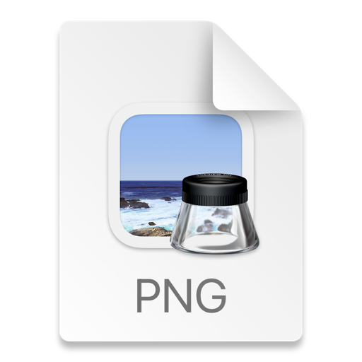
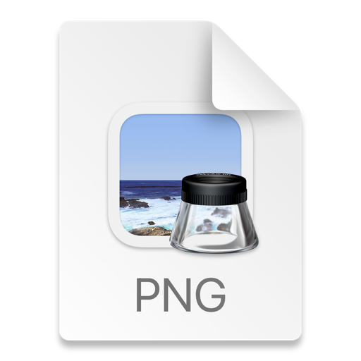

## 1、含义

鲁棒是Robust的音译，也就是健壮和强壮的意思。它也是在异常和危险情况下系统生存的能力。比如说，计算机软件在输入错误、磁盘故障、网络过载或有意攻击情况下，能否不死机、不崩溃，就是该软件的[鲁棒性]。所谓“鲁棒性”，也是指控制系统在一定（结构，大小）的参数摄动下，维持其它某些性能的特性。根据对性能的不同定义，可分为稳定鲁棒性和性能鲁棒性。以闭环系统的鲁棒性作为目标设计得到的固定控制器称为鲁棒控制器。

鲁棒性包括稳定鲁棒性和品质鲁棒性。一个[控制系统]是否具有鲁棒性，是它能否真正实际应用的关键。因此，现代控制系统的设计已将鲁棒性作为一种最重要的设计指标。

AI模型的鲁棒可以理解为模型对数据变化的容忍度。假设数据出现较小偏差，只对模型输出产生较小的影响，则称模型是鲁棒的。 Huber从稳健统计的角度给出了鲁棒性的3个要求：

> 1. 模型具有较高的精度或有效性。
> 2. 对于模型假设出现的较小偏差（noise），只能对算法性能产生较小的影响。
> 3. 对于模型假设出现的较大偏差（outlier），不能对算法性能产生“灾难性”的影响。

## 2、鲁棒性和稳定性的区别

鲁棒性即稳健性，外延和内涵不一样；稳定性只做本身特性的描述。鲁棒性指一个具体的控制器，如果对一个模型族中的每个对象都能保证反馈系统内稳定，那么就称其为鲁棒稳定的。稳定性指的是系统在某个稳定状态下受到较小的扰动后仍能回到原状态或另一个稳定状态。

## 3、鲁棒性和泛化性的区别

鲁棒性是控制论中的词语，主要指在某些参数略微改变或控制量稍微偏离最优值时系统仍然保持稳定性和有效性。泛化能力指根据有限样本得到的网络模型对其他变量域也有良好的预测能力。根据泛化能力好的网络设计的神经网络控制器的鲁棒性也会有所改善。鲁棒性指自己主动去改变网络中的相关参数，细微地修改(破坏)模型，也能得到理想的效果；而泛化能力是指，在不主动修改(破坏)模型的前提下，被动接受不同的外界输入，都能得到相应的理想的效果。

## 4、如何提升模型鲁棒性

### 研究方向

为了提升模型的鲁棒性, 现在主流的研究大致分为三个方向:  
1、修改模型输入数据, 包括在训练阶段修改训练数据以及在测试阶段修改输入的样本数据。  
2、修改网络结构, 比如添加更多的网络层数,改变损失函数或激活函数等方法。  
3、添加外部模块作为原有网络模型的附加插件, 提升网络模型的鲁棒性。

### 常用的方法

#### 1、Dropout

解决的问题：co-adaptation（在神经网络中，隐藏层单元之间有很高的相关性）。Dropout可以看作一个噪声 [公式] 和全连接矩阵 [公式] 作乘积，随机导致一部分连接权重为0。Dropout能够有效缓解神经元之间的co-adaptation（之前一起发挥作用的神经元现在可能单独出现了）。训练时，每次dropout都会得到一个新的子网络。预测时，所有的神经元都会发生作用，可以看作多个子网络的平均。因此dropout类似于bagging和 [公式] 正则，不同之处在于dropout的多个子网络之间共享参数，同时神经元是被随机丢弃的。  

#### 2、Batch/Layer Normalization

Normalization将激活层的输入标准化，使得标准化后的输入能够落在激活函数的非饱和区。  

#### 3、Label Smoothing

label smoothing就是把原来的one-hot表示，在每一维上都添加了一个随机噪音。这是一种简单粗暴，但又十分有效的方法，目前已经使用在很多的图像分类模型中了。

**Label Smoothing 优势：**

> 1、一定程度上，可以缓解模型过于武断的问题，也有一定的抗噪能力  
> 弥补了简单分类中监督信号不足（信息熵比较少）的问题，增加了信息量；  
> 2、提供了训练数据中类别之间的关系（数据增强）；  
> 3、可能增强了模型泛化能力  
> 4、降低feature norm （feature normalization）从而让每个类别的样本聚拢的效果（文章[10]提及）  
> 5、产生更好的校准网络，从而更好地泛化，最终对不可见的生产数据产生更准确的预测。（文章[11]提及）

**Label Smoothing 劣势：**

> 1、单纯地添加随机噪音，也无法反映标签之间的关系，因此对模型的提升有限，甚至有欠拟合的风险。  
> 2、它对构建将来作为教师的网络没有用处，hard 目标训练将产生一个更好的教师神经网络。（文章[11]提及）

#### 4、Mixup

mixup是一种非常规的数据增强方法，一个和数据无关的简单数据增强原则，其以线性插值的方式来构建新的训练样本和标签。最终对标签的处理如下公式所示，这很简单但对于增强策略来说又很不一般。

( x i , y i ) \left ( x_{i},y_{i} \right ) (xi​,yi​), ( x j , y j ) \left ( x_{j},y_{j} \right ) (xj​,yj​)两个数据对是原始数据集中的训练样本对（训练样本和其对应的标签）。其中 λ \lambda λ是一个服从B分布的参数, λ ∼ B e t a ( α , α ) \lambda\sim Beta\left ( \alpha ,\alpha \right ) λ∼Beta(α,α) 。Beta分布的概率密度函数如下图所示，其中 α ∈ [ 0 , + ∞ ] \alpha \in \left [ 0,+\infty \right ] α∈[0,+∞]

因此 α \alpha α是一个超参数，随着 α \alpha α的增大，网络的训练误差就会增加，而其泛化能力会随之增强。而当 α → ∞ \alpha \rightarrow \infty α→∞时，模型就会退化成最原始的训练策略。参考：https://www.jianshu.com/p/d22fcd86f36d

#### 5、半监督学习，利用伪标签增加模型的泛化性

#### 6、Focal Loss

Focal loss 主要是为了解决目标检测中正负样本比例严重失衡的问题，并不是通常的正则化化方法。该损失函数降低了大量简单样本在训练中所占的权重，让模型更加关注困难、错分的样本。  
