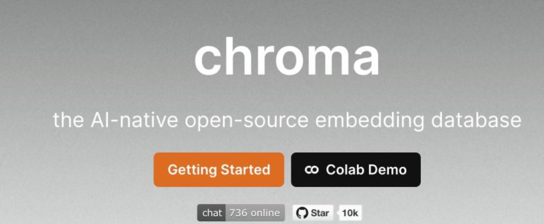
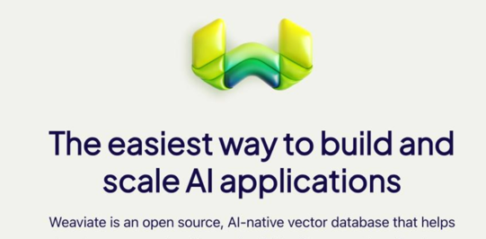

### 1、Chroma

**关键词：** 轻量级、易用性、开源

功能特性：快速搭建小型语义搜索

1. 提供高效的近似最近邻搜索（ANN）

2. 支持多种向量数据类型和索引方法

3. 易于集成到现有的应用程序中

4. 适用于小型到中型数据集

应用系统：小型语义搜索原型、研究或教学项目

**推荐指数：⭐⭐⭐（适合初学者和小型项目）**

Chroma是一个**轻量级、易用的向量数据库**，专注于提供**高效的近似最近邻搜索（ANN）**。它支持多种向量数据类型和索引方法，使得用户可以轻松集成到现有的应用程序中。**Chroma特别适用于小型到中型数据集**，是初学者和小型项目的理想选择。通过Chroma，用户可以快速构建语义搜索原型、研究或教学项目，并实现准确的数据匹配和检索。

### 2、Pinecone

**关键词：** 实时性、高性能、可扩展

**功能特性：** 大规模数据集上的实时搜索

1. 亚秒级的查询响应时间

2. 支持大规模向量集的高效索引和检索

3. 提供高度可伸缩的分布式架构

4. 适用于实时推荐和内容检索场景

**应用系统：** 实时推荐系统、大规模电商搜索引擎、社交媒体内容过滤

**推荐指数：⭐⭐⭐⭐⭐（适合需要高性能和实时性的大型应用）**

Pinecone是一个**实时、高性能的向量数据库**，专为大规模向量集的高效索引和检索而设计。它提供亚秒级的查询响应时间，确保用户可以迅速获取所需信息。Pinecone采用高度可伸缩的分布式架构，可以轻松应对不断增长的数据量。它特别适用于实时推荐和内容检索场景，如电商搜索引擎、社交媒体内容过滤等。**通过Pinecone，企业可以为用户提供个性化、精准的内容推荐和搜索体验**。

### 3、Weaviate

**关键词：** 语义搜索、图数据库、多模态

功能特性：构建智能助手、知识图谱

1. 结合了向量搜索和图数据库的特性

2. 支持多模态数据（文本、图像等）的语义搜索

3. 提供强大的查询语言和推理能力

4. 适用于复杂的知识图谱和知识检索应用

**应用系统：** 复杂知识图谱应用、智能问答系统、多模态内容管理平台

**推荐指数：⭐⭐⭐⭐（适合需要复杂查询和推理能力的知识密集型应用）**

Weaviate是一个结合了**向量搜索和图数据库特性的多模态语义搜索引擎**。它支持多模态数据（文本、图像等）的语义搜索，让用户能够以前所未有的方式探索和理解数据。Weaviate提供强大的查询语言和推理能力，**使得用户可以轻松构建复杂的知识图谱和知识检索应用**。**它适用于需要复杂查询和推理能力的知识密集型应用**，如智能问答系统、多模态内容管理平台等。通过Weaviate，企业可以充分挖掘和利用数据的价值，推动业务创新和发展。

### 4、Milvus

**关键词：大规模数据、云原生、高可用性**

功能特性：大规模内容检索、图像和视频搜索

1. 专为处理超大规模向量数据而设计

2. 提供云原生的分布式架构和存储方案

3. 支持多种索引类型和查询优化策略

4. 适用于大规模内容检索、图像和视频搜索等场景

**应用系统：大规模内容检索平台、图像和视频搜索引擎、智能安防系统**

**推荐指数：⭐⭐⭐⭐⭐（适合需要处理超大规模数据的云端应用）**

Milvus是一个专为**处理超大规模向量数据而设计的云原生向量数据库**。它采用分布式架构和存储方案，确保用户可以高效、可靠地管理和检索大规模数据。Milvus支持多种索引类型和查询优化策略，提供卓越的查询性能和扩展性。**它特别适用于大规模内容检索、图像和视频搜索等场景**，如智能安防系统、图像和视频搜索引擎等。通过Milvus，企业可以轻松应对不断增长的数据挑战，实现快速、准确的内容检索和分析。

### 5、Faiss

**关键词：高效性、灵活性、Facebook支持**

**功能特性：轻松将向量检索功能嵌入到深度学习**

1. 提供高效的相似度搜索和稠密向量聚类能力

2. 支持多种索引构建方法和查询策略优化

3. 易于与深度学习框架集成（如PyTorch）

4. 在Facebook内部广泛应用，有丰富的社区支持和文档资源

**应用系统：Facebook内部语义搜索和推荐系统、广告技术平台、深度学习应用中的向量检索模块**

**推荐指数：⭐⭐⭐⭐⭐（适合需要高效相似度搜索和丰富社区支持的大型应用）**

Faiss是一个**高效、灵活的向量数据库库**，由Facebook于2017年发布并持续维护至今。它提供高效的相似度搜索和稠密向量聚类能力，支持多种索引构建方法和查询策略优化。**Faiss易于与深度学习框架集成**（如PyTorch），使得用户可以轻松将向量检索功能嵌入到深度学习应用中。**它在Facebook内部广泛应用，拥有丰富的社区支持和文档资源**。通过Faiss，企业可以构建高效的语义搜索和推荐系统、广告技术平台等应用，实现数据的精准匹配和价值最大化。