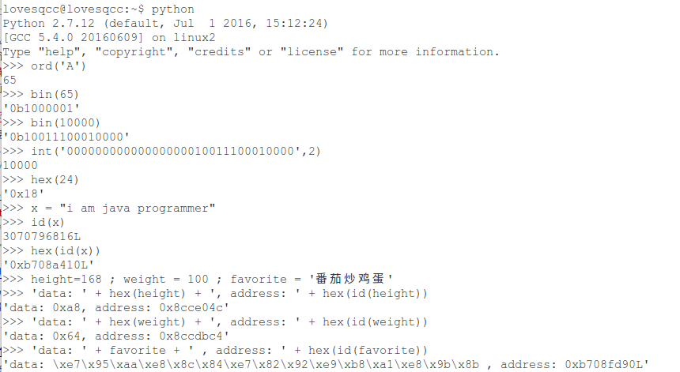
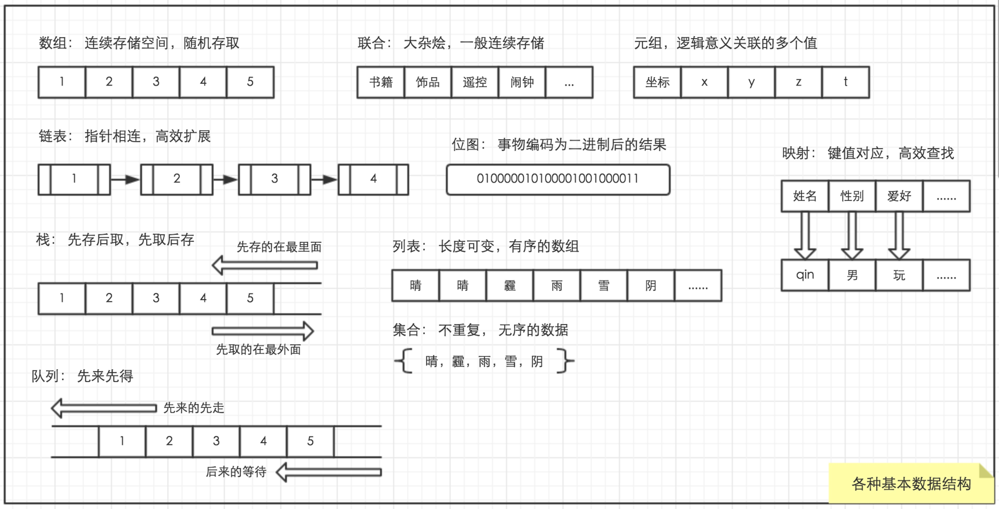
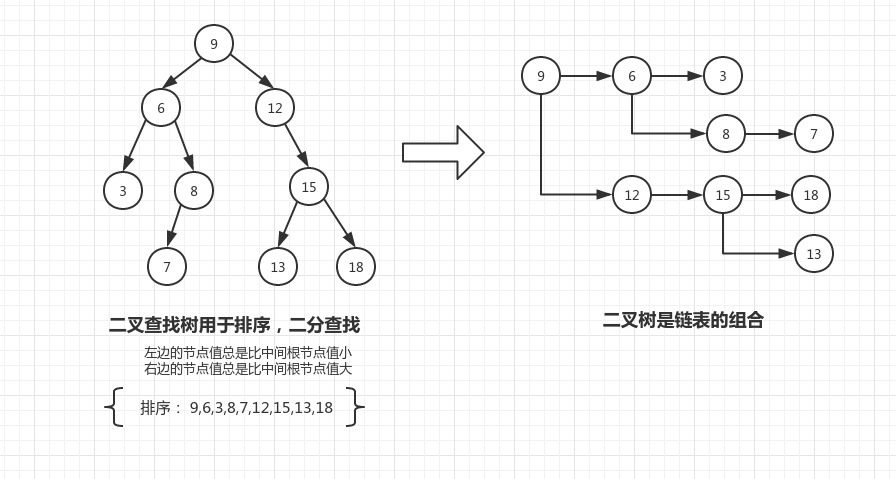
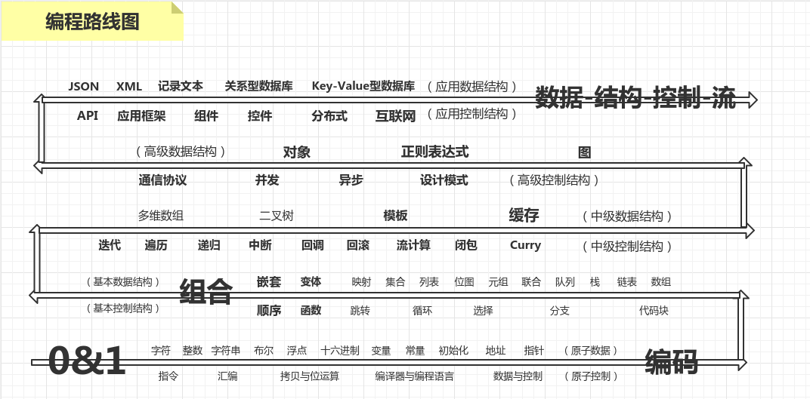

## 简介

#### 0与1
在可预见的很长一段时间，计算世界仍然是由 0 和 1 组成的。 无论是字母、数字、图表、网页、动画、超酷炫的特效等，在计算底层看来，都是流畅的一系列01数字串，就像硬件只会看到一团极其壮丽的电子流一样。我们的旅程从这里出发。

#### 原子数据
计算世界的原子数据通常包括字符、整数、字符串、布尔量、浮点数。 打开某种编程语言的入门书籍，第二章通常都会是变量，以及变量的若干基本类型。

#### 字符
最先映入眼帘的，大概就是字母表。大小写的 ABCDEFG, HIJKLMN,OPQRST,UVWXYZ。 咋看上去，似乎没有什么结构，都是单个的字母。实际上，在计算机内部，任何字母都是一个字节8位的01串编码而成的，通过ASCII 码表来进行映射。比如A，ASCII码值是65，对应的01串是 01000001。 单个数字以及其他控制字符，也是通过 ASCII 码表来标识的。可以百度或谷歌 ASCII 了解详情。由此认识到： 字符是 8 位01串。后面会知道，这里的“串”可以理解为一种“数组”。

#### 整数
接着为人所熟知的，便是整数。 同字符类似，整数也是01串。不过由于整数比较大，一个字节8位可能存不下，因此需要多个字节。Java编程语言里，整数是4个字节32位01串，可以表示的数值是 -2^31 ~ 2^31-1. 还有长整数 8 个字节 64 位 01 串，可以表示的数值是 -2^63 ~ 2^63-1 . 拿整数 10000 来说，可以表示为 00000000 00000000 00100111 00010000 , 可以使用 python 的 bin(10000) 方法来获取10000的二进制表示，也可以使用python 的 int('00000000000000000010011100010000', 2) 来获取二进制表示的整数。关于二进制如何表示整数，有一套模2取余的算法；而如何表示负整数，则要涉及到反码和补码计算。详情可百度或谷歌。由此认识到，整数，实际上也是若干位01串。

#### 字符串
字符串大概是计算世界里处理得最最多的原子数据了。任何文本都是字符串。字符串其实是由字符组成的序列，比如 “ABC” 就是 ["A", "B", "C"]。因此字符串编码为01串，就是把字符串中的每个字符都编码为01串，然后串联起来：010000010100001001000011.

#### 布尔
布尔类型就是 True 和 False ， 真与假。 用于各种条件判断中。

#### 十六进制
写成01串实在太痛苦啦，也不直观。因此先辈们发明了十六进制。实际上，二进制，十进制，十六进制，都是表示计数的一种方法。 N 进制，就是用 0~N-1的数字(N<=10)或0-9, N-10个字母(N>10)来表示所有的整数。十进制，就是用 0-9 来表示整数； 十六进制，就是用 0-9, A-F 来表示整数。 N 表示进位数，逢N进一。十进制转十六进制，采用模N取余的方法来确定各个位的数字。比如 24， 可以表示 2*10 + 4； 也可以表示成 1*16 + 8, 即0x18 , 0x 表示使用十六进制计数法。使用python的hex(24)即可获得24的十六进制表示。 有了十六进制，表示大量的01串，妈妈再也不用为我担心啦！

#### 变量
前面讲了原子数据字符、整数、字符串、布尔，那么在程序里怎么使用这些原子数据呢？变量是用于存储这些值并引用的。 比如 x = "i am java programmer" , x 就是个变量。 给变量指定某个值的动作叫“赋值”。变量在程序的不同地方可以重新赋值，比如 x = "now i am mixed coder. haha!"

#### 常量
常量也是可以指定和存储原子数据值的地方，不过常量在初始化完成后就不能改变了。比如光速在真空中的速度、圆周率PI 、自然常数、默认参数配置等。

#### 初始化
变量与常量都是数据引用。初始化是指为一个数据引用第一次赋值的过程。int x; 这只是声明了一个整数变量 x，而没有初始化这个变量； 而 int x = 1 就为 x 完成了初始化工作，赋予初始值 1 。初始化也称为“声明并定义了”。

#### 地址
“赋值”是个逻辑意义的操作，比如 x = "i am java programmer", 是将字符串赋值给变量 x , 这是从自然语言的角度理解； 从计算机存储和运行的角度来理解，必然要为这个字符串分配一个内存来存放，这就存在变量的内存地址 d = 0xb708a410。使用python的id(x)可以打印x的地址。现在我们知道变量有双重身份啦： 一个是变量指代的值 v ，一个是存储变量值使用的内存地址 d。

#### 指针
上面讲了地址的概念。指针就是用来存放地址 d 的数据引用 p， 可以通过指针来操作变量的值。 比如说，x = "i am java programmer" , x 的地址是 d = 0xb708a410 ，那么 p = 0xb708a410 ； 如果想将 x 的值变成 "i am mixed now." ， 那么可以使用 x = "i am mixed now."; 也可以使用指针 (*p) = "i am mixed now.". *p 的含义就是取出变量 p 所存放的变量地址所指代的变量的值。是不是有点拐弯抹角？ 别担心，很多中高级程序yuan 都在指针上栽了很多次的跟头 ~~

## 原子控制
#### 指令
指令由操作码和操作数组成。操作数就是前面所说的各种原子数据；操作码是预先定义好的01串。比如在8位系统上，定义： 10000000 表示加法， 11000000 表示减法。最高2位表示操作码，其他位表示操作数。 那么， 10000000 00000001 00000010 就表示 1+2 ， 11000000 00000010 00000001 表示 2-1。实际指令可以比这更复杂，但原理是一样的。指令由CPU来执行完成。

#### 汇编
程序yuan，或者码农就是靠编写指令为生的。不过要编写这么多01串，恐怕吃饭都要吐出来的。于是，程序猿中的先驱们发明了汇编。 汇编对指令并没有实质性的改变，仅仅是对指令做了个助记符或者说是命名，不过这个命名产生的意义却是非凡的！比如 10000000 简记为 ADD，11000000 简记为 SUB， 那么上面的指令就可以写成， ADD 0x01 0x02 , SUB 0x02 0x01 ，是不是更直观了？

#### 拷贝与位运算
别看计算机能胜任超级广泛的任务，其实它只会两件事：拷贝与位运算。拷贝，就是将一个值从一个地方挪到另一个地方：我只是大自然的搬运工，哈哈！位运算，就是将指定的操作数的各个位进行运算(与或非)得到新的值。要问计算机为什么能胜任各种各样的事情，其实都是可以拆解为拷贝与位运算。比如我们使用手机聊天，其实就是把数据信息从一个手机拷贝到另一个手机上而已。当然，为了安全的考虑，需要对数据信息进行加密。而加密则无非是一大串的数学计算。任何数学计算都可以通过位运算来完成。就这么简单！ 是不是很神奇？

#### 编译器与编程语言
使用汇编写程序，仍然是很困难的，稍微大点的程序就让人头发掉光光。如果 ADD 0x01 0x02 能够直接写成 1 + 2 岂不是更好？ 于是，编译器和编程语言发明出来了。 编程语言，就是用自然人容易懂的语言来编写程序，而编译器则负责将其翻译成机器能懂的二进制指令；这样，只要我能编写出编译器认得的程序，一样能够在计算机上运行， 而要让编译器认得写出的程序，就要符合编程语言指定的语法规则。这其实跟自然语言很类似，只是编程语言更精确严谨些，比自然语言的容错能力更低一些。为什么猿媛们这么爱细节呢？是因为计算机太太认真啦！

有了编译器和编程语言，现在我们终于能用人话来谈论编程了！

## 数据与控制
处理什么数据？ 怎样处理数据？如何组织大量指令来完成指定目标？ 这三个问题构成了编程的中心问题。

处理什么数据，是编程需求所决定的， 也是由观察世界的角度来产生的；
怎么处理数据，包括如何采集、容纳、传输、存储、组织、加工、展示数据； 这一步产生出许多技术手段；
怎么组织指令，涉及到指令的组织结构，控制指令的执行路径；
因此，编程的中心问题，转化为“数据结构”与“控制结构”的问题。值得提及的一点是，数据的含义，也包括数据之间的关联。

## 编码
将字符、整数、字符串、指令转换成01串，实际上就是编码了。编码是指将现实中的万事万物编码成01串的操作。神乎其技兮！

现在，让我们来一次“对象编程”。假设我们要对对象编码（这是要逆天么）。对象有很多特征，身高、体重、爱好等等，不过我们很难全部覆盖。那么就针对身高、体重和最爱的菜吧。这就是抽象。抽象就是从现实事物的诸多特征中萃取出真正要研究的那些特征。

确定要编码身高、体重和最爱的菜之后，就可以思考如何表示了。可以使用变量 height 表示身高，使用变量 weight 表示体重， 使用变量 favorite 表示最爱。假设身高是 168cm, 体重是 100 kg, 最爱的是番茄炒鸡蛋。 那么，身高和体重， 可以使用整数， 最爱可以使用字符串。比如 int height = 168 , weight = 100 , String favorite = "番茄炒鸡蛋"。 int 是Java语言中表示整数的类型， String 是 Java 语言中表示字符串的类型。使用十六进制表示 height = 0xa8 ; weight = 0x64；favorite=0x795aae88c84e78292e9b8a1e89b8b。十进制转十六进制，使用 python 的 hex 函数。计算机在运行的时候，必定要为这三个变量分配内存空间，比如 d_height = 0x08cce04c, d_weight = 0x08ccdbc4 , d_favorite=0xb708fd90。

各种原子数据的编码：


恭喜你！一下子掌握了编程的两个最精髓的概念： 抽象与编码。

我们了解了程序里的原子数据和原子控制。这些是我们理解程序如何运行的基础。事实上， 无论多么复杂的程序或软件，数据都将被编码成01串，代码都将被编译器翻译成01串，从而被计算机识别和执行。当然，要编写和理解大型程序，仅仅有这些基本知识和思想是不够的。但是，我们已经很勇敢地迈出了第一步，就像人类探索浩瀚宇宙的登月之旅。

## 第一站-初识结构

## 基本数据结构
原子类型的变量就像非正规的散兵，虽然有初步的战斗力，可是这战斗力是很弱的。假设你有十个苹果要发给某人，很难说一个一个苹果发过去，多半是把十个苹果打包成一箱后一起发过去。这个“箱”就是结构。结构是任何可以容纳多个事物的事物。被容纳的事物，称为元素， 既可以是原子类型的值，也可以是结构本身。嗯，这里面就包含了递归的思想。

#### 数组
数组是最基本的数据结构。往连续的固定空间连续存储一系列相同类型的值，就构成了数组。比如 [1,2,3], ['A','B', 'C'] 或者 ["I", "have", "a", "dream"] 。 数组的操作也很简单直接：设置或取出指定位置的值，指定位置使用下标来表示。比如 [1,2,3]，取出下标为 0 的值是1。如果设置下标为2的值为10，那么数组就变成[1,2,10]。最大的下标是2，也就是数组长度减去一。注意，下标是从0开始算起的，第一个这么设计的程序员一定是天才，思维与常人如此不同！这个传统被沿袭下来，从此所有程序yuan都与普通人的思维有所不同~~~

#### 链表
假设有若干人站成一列玩游戏，每个人用双手搭在前面人的肩膀上，就形成了链表。当我们要找到某个人时，可以从最后那个手搭着别人肩的人开始，根据手到肩的指向数过来，直到找到那个人为止。

相同类型的值使用指针相互连接起来，就组成了链表。比如 1 -> 2 -> 3 -> 4 。 链表不能像数组那样指定位置来设置或取值，而是要通过指针遍历一个个数过去。但链表是容易高效扩展的，比如要把 5 插入到 3 与 4 之间， 只要把3指向5,5指向4，就OK 了： 1->2->3->5->4 。

链表是元素通过指针指向来形成关联的结构。

#### 栈
假设我们要把东西一件件放置在冰箱里。这个冰箱每次仅容放置或取出一件物品，每次放置物品都要放置在最里层，要取出最里层的东西，必须先取出最外层的东西，那么，冰箱的这种结构就构成了“栈”。栈是先存后取型的结构。

#### 队列
队列应该是中国人最熟悉的结构了。你可以不懂数组、链表、栈，但你一定知道队列，—— “万恶”的排队。若干个人站成一队等待着， 先到者先得之。

队列是先进先出型的结构。

#### 联合
联合，其实就是“大杂烩”的意思。为了方便计算，数组、链表、栈、队列通常都是存放相同类型的值，俗称“清一色”。联合则比较多样化，什么都可以往里塞。比如说小书架，既可以放几本书，也可以放小饰品，遥控器等。 联合是对象的雏形。

#### 元组
元组，也是一种“大杂烩”。不同之处在于，元组存储的数据通过彼此的逻辑关联共同表达一种概念。比如三维空间里点的直角坐标 (x,y,z) ，一件事情的起始结束时间 (start_time, end_time)。元组的值初始化后就不能改变。

#### 位图
位图，就是一串01。前面讲到原子类型的值时已经提到。现在你明白了，在计算世界里，真正的原子只有0与1，其他的都是位串，都是结构。数组、链表等是位串的结构。位图操作就是置位(指定位置为1)、清零(指定位置零)与测试位(判断指定位是0还是1)。位图用于任何事物的编码结果，亦可以用于任意稠密的不重复整数数组的排序。

#### 列表
列表与数组极为相似，不同之处在于，数组是固定长度的，而列表是长度可变的。实际上，Java 的列表是以数组为基础来实现的(当然并不是所有列表都是以数组来实现的，譬如Scala, Lisp的列表是以链表来实现的)。初始化列表时，会为列表分配一个指定长度的数组，当原来的容量不够存放时，就会申请更大的数组，并将原来数组的元素拷贝到新的数组。如此而已。

#### 集合
集合，是若干个不重复值的可变长结构。集合与列表非常相似，不同之处在于，集合里不存在重复的值，而列表中可能存在重复的值；集合是无序的，而列表是有序的。集合，比方天气的几种类型，有 Set(晴，雨，雪，阴，雾，霾) ， 那么一周的天气就能构成列表： [晴，晴，霾，雨，雪，阴，雾]

#### 映射
映射，就是键与值的一对一或多对一的关系。比如一个人的身高体重， map = { 'height': 168, 'weight': '100' }。这里 height, weight 是键， 而 168, 100 分别是键 height, weight 对应的值。可以根据键快速获取和设置对应的值，是映射的主要操作。映射在计算机中使用哈希表来实现，可实现快速查找、中断处理等。

#### 变体
变体是在现有结构基础上作出某种改动从而能够适应特殊需要的结构。比如优先级队列，就是在普通队列的基础上添加了优先级的概念，允许高优先级的元素“插队”。队列还有三种变体： 双端队列、循环队列、多重队列。 双端队列，允许在一端进行插入和删除，一端只允许插入，从而具有栈和队列的用途；循环队列将队列首尾相连，可高效使用存储空间；多重队列可创建多个同时进行的队列，通常用于多任务所需要的进程挂起/就绪等待队列。栈也有“双栈”的变体，允许从两端进行插入和删除，适合于需要两个栈的场景。

变体是基本结构的微创新。

#### 嵌套
基本数据结构的真正威力在于可以任意的嵌套。嵌套 是指结构中可以包含任意的子结构，子结构又可以包含子结构，一直这样包含下去(能够无穷无尽地包含下去么？)。比如一个公司的职工的信息， persons = [ { 'name': 'qin', 'address': { 'prov': 'zhejiang', 'city': 'hangzhou' } , 'hobby' : ['writing', 'walking', 'riding']，'features': '01001001' } , { 'name': 'ni', ... } ]

图示


现在我们已经了解了数组、链表、栈、队列、联合、元组、位图、列表、集合、映射这些基本数据结构，也知道可以通过嵌套的方法创造任意复杂的新结构。使用基本数据结构，就能批量存放更多的数据，批量操作更多的数据，组建正规化军队，形成更强的战斗力。这些基本数据结构是构建中大型程序的结构基础。其中，列表和映射是最最常用的两种结构。在Java里称为容器，容纳东东的器物，是不是很形象？

## 基本控制结构
存放更多的数据有了基本数据结构及其嵌套结构，那么，如何组织超级多的指令呢？ 根据现实中的逻辑需求以及数学家、科学家的不懈思考，结合工程师的实践经验，就形成了“顺序、分支、循环”三种最基本的控制结构； 并且可以证明，任意代码结构都可以使用这三种控制结构来表示。嗯，数学家就是这个用处：将万事万物统一为简洁而基本的模型。

#### 代码块
单木不成林，单掌不成鸣。单条指令没法做什么事情，只有组合多条指令才能完成具体的功能。就比如乘法运算，也需要拷贝操作数、对操作数移位和相加、拷贝新得到结果。代码块就是将多条指令顺序组织起来进行执行从而实现具体的功能。代码块一般用大括号括起来， 指令之间用分号隔开。

```java
/* 早上的例程 */
{
听到闹钟响关掉闹钟； 继续躺床上20-30分钟；
看到快8点时起床； 洗漱； 收拾全身； 出门；
}

```
#### 分支
分支就是当条件A发生时做某事，当条件B发生时做某事。比如周末如果天晴就出去逛，下雨就宅家里，或者如果心情好的话，去看场电影，或者去找个人一起玩。就是这样了。

```java
/* How to waste a weekend */
if (天晴) { 出去逛； }
else {
if (心情好) {
看电影 or 找人玩；
}
else { 宅家里; }  
}
```

#### 选择
选择是在多个相同类型的选项中选择匹配的一项并执行相应的操作。
```java
/* Talk with an intelligent workmate */
switch fruit:
case 'apple': suggest 'a apple a day keeps the doctor away'
case 'banana': suggest 'a banana a day keeps your skin delicious'
case 'tomato': suggest 'oh, my favorite '
default: suggest 'i dont recognize it '
```

#### 循环
循环就是把一件事重复做多次。过程必有终结之时。此之结束，彼之开端。
```java
/* The life */
while (人生还在继续 && 没有意外发生 ) {
晨起洗漱；  
一日三餐维持生命；
编程； 写作；
感受美好；
睡觉；
}
```

#### 跳转
当一条路走不下去，或者发现要及时掉头时，就会使用跳转语句。break 是终止整个循环；continue 是跳过后面的操作进入下次循环。GOTO是万能跳转语句，曾经盛行一时，但当今高级语言只作为保留关键字，不再推荐使用它了。从底层看来，分支、选择、循环、跳转应该是采用GOTO来实现的。

```java
/* The life */
for (;;) {
工作；娱乐；养家；生活；
if (badHealth || bedying) {
print 'go to hospital.'
break;
}
if (tired) {
print 'go to rest for some days'
rest(somedays)
continue;
}

}
```

#### 函数
函数，就是把一系列指令组织起来实现一个具体通用的功能，并对其命名的过程。 比如前面早上的例程就可以写成函数。
```java
def doInMorning(delay=20，time=7:45):
听到闹钟响关掉闹钟； 继续躺床上 delay 指定的分钟；
看到快到 time 指定的时间就起床； 洗漱； 收拾全身； 出门；
```

相比代码块，函数可以带有参数，比如上面的 delay, time , 根据参数来调节实际的动作。就像电饭煲可以调节温度、时间、闹钟可以设置铃声一样。参数可能带有默认值。以后就可以根据不同的参数执行 doInMorning 行为了。

此外，函数比代码块多了命名。别看只是多了命名，其意义犹如编码一样非凡！ 从此，编程迈入了“堆积木”时代。只要你花时间编写了一个可靠的函数，成千上万的人就可以在数秒内数千万次甚至上亿次地反复使用这个函数，—— 你能找到第二个行业做到这一点吗？ 这就是软件行业能够一日千里、日新月异、天天刷屏的根本原因。

九层之台，起于累土。正如我们可以从四则运算开始，经过代数、方程式、函数、数列、复数、平面几何、解析几何， 直到微积分、卷积、级数等非常高阶的数学运算，也可以从实现1+1=2的简单函数开始，一层层地累加，直到构建起超大规模互联网软件系统。

如果你要程序员造一座巴比伦城市，那么，程序员会写一个函数去创造一个城市，然后传入参数名为巴比伦。

到现在为止，真值得为自己庆祝一下： 我们已经走过一段路了。 熟悉了基本数据结构和基本控制结构，已经可以编写小型程序了。不过， 如果要以登山作比方的话，那么，我们现在正处于山脚下，望着巍峨高山，是否有一种登高望远的冲动呢？O(∩_∩)O

请多休息一会，补充充沛的体力和精力。接下来， 我们将开始真正的登山之旅。

## 第二站-中级结构
中级结构通常是一种或多种基本结构通过某种组合形式而实现的更复杂一点的结构，亦称为“复合结构”。组合蕴藏的威力是非常强大的。现实中的事物几乎都是由基本元素和基本事物组合而形成的。嵌套是组合的一种形式。

#### 中级数据结构
#### 多维数组
多维数组是一维数组在多维空间的扩展，是数组(...的数组)。比较常用的是二维数组。比如 [[1,2,3], [4,5,6], [7,8,9]] 是二维数组； [ [ [1,2,3], [4,5,6], [7,8,9]], [ [11,22,33], [44,55,66], [77,88,99] ] ] 是三维数组。 访问 N 维数组的元素需要 N个对应的下标，可以根据指定位置随机存取。 比如访问二维数组需要 [row][col] 下标， 访问三维数组需要 [N][row][col]。 二维数组可用于点阵图表示、曲线模拟、矩阵表示；三维数组可用于立体图形的模拟。

#### 二叉树
从一个起点出发，每次选择向左或向右进行探索；如果不想在一个方向走下去了，那么回退到上一个地方向另一个方向进行探索，如此反复，最终形成的结构就是二叉树。二叉树实际上可以看成是多个链表的组合。字典查找就使用到了二叉树。处理二叉树通常会用到递归的方法。

二叉树是编程中第一个不太容易掌握的数据结构，其原因是，人们更习惯于以线性的方式思考问题，然后二叉树告诉我们：要分叉，要多向探索，世界有更多可能。


#### 模板
模板是含有固定不变内容和待填充内容（称为占位符）的混合体。当实际运行时，将具体的内容替换占位符，即可得到动态内容。常用于生成动态页面，自动生成代码等。

比如 I have a dream that ${dream}. 就是个模板， ${dream} 是占位符。当使用具体内容“someday i will teach kids programming”替换时，就生成了最终内容： I have a dream that someday i will teach kids programming.

#### 缓存
我们来做个游戏：有一个教官和一队顺序编号的十名学员。教官与学员相距 10 米。现在，教官要点到名的学员来到跟前敬礼然后回去。教官的记性和视力不太好，容易点到重复的名字，且如果有不超过5名学员都站在离教官5米远的距离，教官是分辨不出来的。学员怎么走才能更少距离到达教官呢？

当然，所有学员可以来到教官面前，然后敬礼归队，这样每位点到名的学员都得往返 20米。但有些淘气的学员故意离得近一点，站在离教官5米的距离，这样教官点到名的时候，就只要往返 10 米。当然，如果点到名的学员站在10米远的地方，就不得不往返20米了。现在的问题是，学员得找到教官点名的规律，并及时让相应的学员站到5米远的地方，从而使得全部点名后，所有学员的往返距离最小？

这5个离教官5米远的位置，就是缓存。缓存是计算世界中仅次于编码的极为重要的编程思想之一。计算世界的缓存几乎无处不在：CPU与内存之间有缓存，磁盘、网络与操作系统之间有缓存，应用程序与数据库之间访问有缓存。你与我之间也有缓存。缓存能够让获取数据更快，从而运算更快，效率更高，但缓存也更贵。缓存的两大指标是：缓存容量和命中率。如果相同成本下的缓存容量更大，就能使用缓存来替代原来的存储，然后制造更近的缓存；如果缓存容量难以提高，就要琢磨数据存取的规律，尽可能让每次的命中率更大。缓存容量就是有多少个离教官5米远的位置；命中率就是有总共的点名次数中多大的比率教官点到了离教官5米远位置的学员。


## 中级控制结构
#### 迭代
迭代是使用固定的计算规则集合不断用新值取代旧值趋向真实值的控制结构。比如牛顿迭代法求N的平方根 X(k+1) = (X(k) + N/X(k))/2 (k>=0) 就是一个迭代过程。可以指定初始值和终结迭代过程的迭代次数。迭代的重要指标是收敛性和收敛速度。

#### 遍历
遍历是从结构中的某个初始节点出发，使用某种控制算法直至访问结构中的所有节点。遍历有深度遍历和广度遍历。深度遍历是一直往一个方向走，直到无路可走，然后回退到上一个可选择路径的节点，选择另一个没有遍历的路径。依次直至所有节点都访问完毕。深度遍历上述的数结构，得到的节点顺序依次是 { 9,6,3,8,7,12,15,18,13} ； 广度遍历是首先访问初始节点的所有邻接节点，然后访问这些邻接节点的邻接节点，这样一层层地辐射般的铺开，得到的节点顺序依次是 { 9,6,12,3,8,15,7,13,18 } 。

常见的遍历操作有列表遍历、对象遍历和合并操作。列表遍历主要有映射、过滤和查找(匹配)。 映射即是对列表的所有元素依次应用一个函数得到另一个列表，比如 [1,2,3,4,5] 应用 f(x) = x*2 得到 [2,4,6,8,10]; 过滤即是对列表的所有元素依次应用一个函数得到另一个列表，这个函数根据某种条件返回 true or false , 比如 [1,2,3,4,5] 应用 f(x) = { return x > 2; } 返回 [3,4,5]； 查找操作是在列表中找到指定元素的第一次出现位置或所有出现位置；实际中的列表遍历往往两者兼之，在遍历列表的时候判断是否满足某种条件，如果满足，对列表元素做一定处理，然后添加到结果列表中。Traverse(list) = list.filter(condition).map(listElemHandler)

对象遍历是遍历对象的所有状态以及递归遍历对象引用的对象，由此形成了对象遍历图。

合并是通过遍历将两个数据结构的对应元素通过某种方式合并成一个列表的过程。比如折叠操作 zip([1,2,3,4], [6,7,8,9]) = [(1, 6), (2, 7), (3, 8), (4, 9)]； 比如 Map 合并 merge ({'name':'qin', 'address': 'hubei'}, { 'hobby': ['writing', 'programming, 'walking'] } ) = {'name':'qin', 'address': 'hubei', 'hobby': ['writing', 'programming, 'walking']}.

对于嵌套的数据结构的遍历，需要使用递归的方法来完成。

#### 递归
数据有嵌套的结构，控制也有嵌套的结构。递归就是在函数F以不同的参数调用它自身。比如计算 1+2+3 , 既可以顺序循环地计算，也可以递归地计算： 1+(2+(3)) ， 1-3 的和，就是 1 与 (2-3) 的和，而 2-3 的和，是 2 与 (3) 的和，(3)的和就是它本身。这里有三个要素： 1. 一个可以以不同参数重复调用自身的过程，这些不同参数通常是要处理的总结构以某种方式依次去掉一些元素的子结构； 2. 一个原子的操作，比如这里两个数的和； 3. 终止条件： 在某一次调用时传入参数的子结构只有一个值的情况。

递归是计算世界中与缓存思想同等重要的编程思想。

#### 中断
当你正投入工作状态的时候，领导发话了：开会开会！ 于是你不得不放下手头心爱的事情，跑去听一段@#￥@#%@￥%@%#￥%#的讲话，讲话回来后再以莫名的心绪重新干活。当然，人是有记忆的，当你去开会前，实际上已经记忆了当时做的事情的一些重要细节和进程，这样在回来时就能从这些细节和进程逐渐恢复到当时状态继续干活，就像讲话似乎发生过一样。这就是中断：做某件事，更高优先级事情插入，保存现场，完成更高优先级的事情，恢复现场，继续做原来的事情。

中断是计算世界中与递归思想同等重要的编程思想。

#### 回调
回调是常规逻辑的一种变体。通常代码会顺序地执行A -> B -> C ->D 等，但在某些情况下，我们希望在 B 处做不同的处理，比如 A 生成一个列表 [1,2,3] , 而在 B 处既可能去对列表元素做乘法运算，也可能做加法运算。这时候，可以在B 处提供一个回调 callback(list)，允许传入不同的函数 add(list) 或 multi(list) 对列表做不同的处理。再比如前端发送一个ajax异步请求，当成功的时候显示表格数据，当失败的时候打印友好的错误信息，就需要提供两个回调： success(response) 和 fail(response) ，分别处理成功和错误时的情况。回调通常用于模板设计模式中。

#### 回滚
当我们在编辑器里编辑错误时，就会使用 Ctrl+z 快捷键回退到上一个编辑状态，即“撤销”操作。回退到某个指定状态的操作叫做回滚。比如发布代码到线上后，发现有重要BUG，就需要回滚发布代码到上一个可靠的状态。在软件中，回滚有两个应用领域：一个是事务管理，一个是GUI编程。事务管理中，比如处理入账汇款的功能，当你向家人汇款一笔钱时，通常需要在你的账户里扣减这笔钱且同时在家人的账户里增加一笔钱，两者必须同时成功才构成一次正确的汇款操作。如果在你账户里扣减款项之后，设备出故障了，那么就必须回滚到未扣减的初始状态，以确保你的财产不受损失。在GUI编程中，常常存放用户的编辑操作序列，以便于在用户操作出错时可以撤销，从某个状态重新开始编辑。

#### 流计算
假设有个列表 [1,2,3,4,5] , 你想先对列表中所有元素依次乘以10，再依次加上4，再依次除以2，最后依次过滤掉结果少于20的元素。那么有两种方式。一种方式是按照指定计算顺序地进行，每次都遍历列表对所有元素计算，先得到 [10,20,30,40,50]，然后得到[14,24,34,44,54], 然后得到 [7,12,17,22,27]，最后过滤后的元素是 [22,27] ; 很简单，不过要对列表遍历4次。如果指定运算更多一些，就要遍历更多次。另外一种计算方式是，先收集相关信息，比如所有的计算要求及顺序，然后进行聚合，对于上述计算而言，实际上就是把列表中的每个元素乘以5再加上2，然后保留大于或等于20的元素。即将 5x+2 >=20 应用于列表中的每个元素得到新的列表 。这样就只需要对列表进行一次遍历。这就是流计算。流计算不同于普通计算之处，在于它把待处理数据看成流，将要做的运算聚合成一次运算，然后在真正需要结果的时候才进行计算。

一次流计算的基本组成元素有列表遍历和列表聚合操作。列表遍历见遍历部分，列表聚合主要指求和、求平均、最大最小值等。流计算可以是串行的，也可以是并行的。详见 Java8 Stream API.

#### 闭包
闭包是一个从学院流传到工程界的思想，历来众说纷纭，莫衷一是。既然如此，不妨从其溯源、本质和形式来理解。

为什么有闭包呢？这是变量为了突破函数的限制而产生的。假设函数F里定义了一个局部变量 x，那么当函数执行完成退出后，x 就会自动被销毁。这就像寄生于宿主中的寄生者一样，宿主灭亡就会导致寄生者灭亡；又像古代陪葬，做奴的要随主子的入葬而陪葬。闭包，就是为了创建能够突破这一限制的变量。当在函数F中定义了闭包 C 来访问变量 x, 那么在函数F退出后 x 并不会被销毁，而是以当前状态存留并长眠，等待函数F的下一次执行的时候复苏过来。嗯，是不是像在看科幻小说？这就是闭包的溯源。

闭包就是为了创建函数中的自由变量。在不同编程语言中的实现形式有所不同。C语言中，在函数中的变量使用 static 修饰，就可以成为不随函数退出而灭亡的自由之身，不过这并不算是闭包；Python 语言中，闭包使用在函数内被定义的嵌套函数来实现；Groovy 语言中，是一段自由出现的用括号括起来的代码块，可以赋值给变量和传递给函数；Java语言中，是含有参数和函数体但没有函数声明的代码块。

#### Curry
在学习数学时，常常会遇到这样的函数，f(n, x) = 1^x + 2^x + ... + n^x ， 其中 n^x 是 n 的x 次方。当 x 取不同值时， f(n,x) 就退变为一元函数，比如 x=1 时， f(n,1) = 1+2+...+n, 是求n个数的和；x=2 时，f(n,2) = 1^2 + 2^2+ ... + n^2 是求n个数的平方和等。将 f(n,x) Curry 化，就得到了 f(n)(x) = 1^x + 2^x + ... + n^x； 那么 f(n)(1) 就是 n 个数的和， f(n)(2) 就是 n个数的平方和，依然是函数。这对计算世界里的传统函数是一个创新：传统函数得到的结果总是具体的值。运用 Curry 化，编程语言就有表达数学公式的抽象能力而不仅仅只是计算值了。功力又见长了！

Curry 将多元函数逐层拆解，可以批量生产出大量的低元函数，简直就是个“函数工厂”！运用Curry很容易做出可扩展的微框架，组合基础函数来完成大量数据处理的功能。Scala 语言提供了 Curry 的支持。

在这一站里，我们学到了新的数据结构（二叉树、模板、缓存）以及新的控制结构（迭代、遍历、递归、中断、回调、回滚、流计算、闭包、Curry）。熟悉这些结构会略有点难度，因为其特征与人类的顺序、线性的日常思维不太适配。

迭代在科学计算与软件工程中广泛使用，体现了“逐步求精”的思想；遍历是开发中最常用的控制结构，很多代码都需要对一个列表或映射进行遍历和操作；递归需要思维随着结构逐层递进深入，甚至超越思维能够承受的范围（当结构可能嵌套任意有限的任意结构时）；中断相对容易接受，与日常场景比较相似；回调则类似在代码路径中做了个多路分叉，在不同情况下可以选择不同的算法来处理；回滚则可回退到历史存在的某个状态重新操作，提供了出错处理的机制；流计算体现了对源数据流的聚合与延迟的计算特性；闭包创建了函数里的自由变量，从而扩展了函数的能力；Curry 将多元函数拆解为多个低元函数的层层调用，批量生产大量函数，能够以最大灵活性组合代码逻辑，有时甚至以简短的几行代码就能做出一个简易微框架。

学习这些结构，需要思维能够更加灵活，突破顺序、线性思维的局限性，甚至需要深入思考和练习；学会这些结构，基本可以应对软件开发中的普通难度的业务编程了。

现在我们已经站在山腰了，可以看到一点点壮观的风景了！那么，继续向上，还是返航？ 由你决定。

## 第三站-高级结构
#### 高级数据结构
#### 图
图是多个事物相互关联形成的复合结构。国家铁路交通网，公司所有成员的社交关系网，都是图的例子。图是数据结构中最难掌握的BOSS级结构。图编程的难点在于事物之间的多向关联，让线性思维的人们无所适从。事物的关联蕴藏着惊人的价值。Google是利用网页之间的关联权重发迹的，Facebook则更直接利用人们的社交关系来成就的。大部分程序yuan写不出像样的处理图的基本程序，工作一年后绝大部分程序yuan几乎不会表示图了。图是数据结构领域的金字塔顶。可以说，掌握了图结构编程，就意味着数据结构最终通关成功，编程领域里几乎没有可以难倒你的数据结构了。

图可以使用二维数组来表示， 也可以使用数组和邻接链表组合起来表示。这充分说明：最基本数据结构的组合，就可以创建最复杂的BOSS级数据结构。

#### 正则表达式
正则表达式是一种非典型数据结构，用于描述数据文本的特征。比如 0571-8888888, 027-6666666 都是电话号码，是由连字符 - 分隔的两数字串，可以使用正则表达式来描述这样的文本: [0-9]{3,4}-[0-9]{7}。[0-9]表示匹配0-9的任意某个数字，{m,n}表示位数为[m,n]之间，{m}表示位数就是m。[0-9]通常也简写为\d. 正则表达式广泛用于文本匹配和替换工作。

#### 对象
到现在为止，数据与控制都是分开发展的。分久必合。在对象这里，数据与控制合为一体。对象是具有状态和行为的统一体。正如人具有身体结构、精力、体力等状态，并能够运用这些结构和状态来完成实际行动一样。数据通过复杂结构构成实体，实体具备影响数据变化的能力；数据与控制成为相互影响密不可分的整体。对象是程序yuan对现实世界的事物的抽象。

#### 高级控制结构
#### 设计模式
设计模式是对象编程的技艺。要完成一件事情，通常要很多人一起来配合协作，充分发挥每个人的专长。那么职责任务分配就非常重要了。设计模式即解决对象的职责以及对象之间怎么协作的问题。比如程序yuanA代码写得特别溜，就是不喜欢跟人交流，那么就需要一个和TA合得来的yuanB来传达yuanA思想。这个合得来的yuanB就是yuanA对于外界的适配器。适配器模式并不完成新的事情，只是将一件事转换一种形式来完成。设计模式能够让软件的柔性更强。

```java
Class A {
public void writeNBCode(HardTalking hardTalking) {
// HardTalking 是非常难以使用的参数
//  balabalabalabala
}  
}

Class B {
public void goodSpeaking(GoodTalking goodTalking) {
//  GoodTalking 是非常容易使用的参数
hardTalking = transfer(goodTalking)
A.writeNBCode(hardTalking);
}
}

B.goodSpeaking(talking);   // 人要使用到A的牛逼能力，只需要与 B 沟通就行； 这里 goodSpeaking 就是个适配器接口。

```


#### 异步
在顺序的模型下，当你执行计算时，需要等待计算完成后获得结果。如果执行计算的时间会比较长，那么显然不能干等着吧。这时候，就需要采用异步模型。异步与在餐馆点菜很相似。当你付款后，由于菜肴要准备一段时间不能立即获得，这时候，你会得到一个类似令牌的东西，代表你的一次请求和要获取的菜肴。在菜肴准备期间，你可以去做任何事情，除了不能挂掉。当菜肴准备好后，就会通知你使用令牌来获取相应的菜肴。这也有两种方式，要么服务员直接把饭菜端上你的桌（推），要么你拿着令牌去取（拉）。异步广泛用于请求不能立即完成和获得结果的场合。
```java
token = 点菜(菜单列表)；

// 立即返回，不阻塞在服务台那里，体现异步流程
做其他的事情，比如看看手机聊聊天；

吃饭流程:
while (饭菜没吃完) {
token.getResult(菜已上桌) {
吃饭，聊天，...  ;
}
token.getResult(菜无法供应) {
if (饭菜不够吃) {
token = 重新点菜(菜单列表)；
goto 吃饭；
}
else {
放弃点的这盘菜；
}
}
}

token.pay()
```

#### 并发
一边烧开水，一边看报纸。这大概是并发的最经典比方了。不过对于现代人来说，看报纸大概要换成“追剧”了。不错，并发就是同时做两件事了。这个“同时”可以有两种理解：(1) 两个人在同一个时刻各做了两件事； (2) 一个人在一段时间内同时做了两件事。（1）是严格的并发，也称为“并行”。一边烧开水，一边看报纸，实际上是壶在烧水，人在看报纸。可以说壶与人是并行工作的；(2) 称为“分时切换”，是广义的并发，比如单CPU在IO操作时执行其他的计算，此时称CPU也是并发的，实际上是因为CPU与IO设备同时在工作，但是以CPU为中心而言的缘故。 并发操作的原因，是因为一个事物由多个部分组成，而每个部分都能独立地做一件事。比如千手观音，假如人真的有千手，那么真的可以同时吃饭、看报纸、写字等（量子化的世界，是否可能实现一个事物在一个时刻点同时做多件事？）。

别看并发理解起来比较容易，在软件开发中，并发是最本质的难题。并发会导致多个事情的执行顺序和结果的不确定，导致数据访问死锁，加上大规模数据流，大规模的逻辑并发，基本超过了人类理解力能够承受的极限。并发是导致极难排查的BUG的根本原因（很难复现，但它又会不请自来，像软件中的幽灵）。现有的大多数应用，还仅仅只是使用多台服务器并行提供服务，使用多线程或多进程来运行相互独立的子任务，并发在应用中只是局部使用，也就是顺序为主、并发为辅的。

并发的实现方式主要有： 多线程(Java)、多进程(C)、多协程(GO)、Actor(Scala).

#### 通信协议
到目前为止，我们讨论的范围还仅限于单机范围。可是绝大多数人是无法忍受孤独的，人亦非孤岛般存在。让计算机能够彼此通信，让人们能够跨时空互联深入交流，才是互联网的最大梦想。通信协议就是解决计算机中间如何可靠通信的问题，而为了可靠通信，就必须制定好协议。比如一次5个人的聚会吧，首先大家肯定要事先约定什么时候什么地点碰头，好各自安排行程；这是静态协议； 不过计划总赶不上变化。当实际去赴会时，会发现因为某位明星的到来导致路上特堵，结果2个人不能如约到达；这时候，就必须重新调整计划另约时间和地点，甚至还可能改变原来的游玩计划；或者在原计划中留下充分的缓冲余地。这就是协议要做的事情：约定与标准（碰头时间地点）、缓冲余地（容错）、动态调整（灵活性）。实际的通信协议可能更复杂，依据不同的应用而设定，不过原理是相同的。

通信协议是互联网诞生和发展的基础软件设施。最为人所熟知的莫过于 HTTP， TCP 和 IP 协议了。


很有勇气！你已经抵达山上大约 2/3 的地方，可以看到更加壮美的风景！高级数据结构和高级控制结构，理解起来比较容易，大规模实践起来，却是件很有难度的事情，需要扎实的功底、多年的经验、出色的悟性和直觉， 就像习武一样，起初的进步是飞快的，随着功力的提升，以及事情固有的难度（或许是因为我们还没有真正理解事情，没有找到有效的方法），会遇到一个瓶颈。在这一层中，大量的努力和实践可能只带来少量的收获，但仍然要不懈攀登。当能够掌握这些高级结构时，就编程功底而言，已经没有什么编程难题是无法跨越的了。

接下来的事情，就是最后的冲刺，真正的实战与挑战。

## 第四站-应用
应用中的数据结构和控制结构在编程领域不一定是最困难的，但由于要承载现实世界中的大规模流量，以及多人协作维护的大型工程，因此更多的是工程领域的难点和挑战。大流量、并发用户访问、不可避免的脏数据和无规则数据、非法访问代码等，都是应用数据结构和控制结构需要应对的问题。

#### 应用数据结构
#### JSON

JSON是基本数据结构的嵌套而成的结构， 是广泛应用于子系统之间的标准数据交换结构。比如服务端返回给前端的数据结构就是 JSON，服务A 调用服务 B 的 API 接口获取的返回数据结构也是 JSON。 JSON 定义可参考网站：JSON.org


#### XML
XML是一种标记语言，通过 <标记含义>标记内容</标记含义> 来表达语义内容。超文本标记语言HTML是一种结构相对松散容错性较高的XML。比如一个人的信息，可以使用 {'name':'qin', 'hobby': ['programming','riding']} , 也可以使用以下格式来表示。XML也是系统之间一种标准数据交换结构，同时也常用于配置文件。与JSON相比，在数据交换结构方面，XML更重量级，可能不如JSON那么灵活，但是用途更广泛一些。
```java
<person>
<name>qin</name>
<hobby>
   <list>
        <value>programming</value><value>riding</value>   
   </list>  
</hobby>
</preson>
```

#### 记录文本
记录文本是每行以固定规律呈现的结构化文本。比如csv文件是每行以逗号分隔的文本，properties配置每行是以key=value形式的文本。记录文本格式简单，容易解析，常用于Shell任务处理和应用配置文件。

#### 关系型数据库
关系型数据库是几乎所有互联网应用必不可少的数据结构组件。

关系型数据库的基础是二维表，就是一行一行的记录，每行记录都是由多条数据项组成的。为了支持大容量记录以及方便地按照各种条件进行检索，二维表采用了B+树实现，并实现了一套数据库管理系统，包括数据库服务器、数据库语言SQL、以及数据库客户端。数据库服务器用于确保所有记录能够按照条件进行访问（查询、插入、更新、删除，俗称 CRUD），包括服务器的正常运转；数据库语言SQL提供了要查询什么数据的表达方式；客户端提供了编写、执行SQL和查看结果的操作界面。

关系数据库适合存储和检索结构化的有规则的数据集，一个业务功能的详细设计通常都会从数据库设计着手。比如学生选课，可以设计四张表：学生表，每一行都是格式相同的记录，数据项为（学号，姓名，学生的其他信息字段等）； 课程表，每一行都是格式相同的记录，数据项为(课程编号，课程名称，课程的其他信息字段等)；教师表，每一行都是格式相同的记录，(教师编号，教师姓名，教师的其他信息字段等)； 选课表，每一行都是格式相同的记录，数据项为（学号，课程编号，教师编号），这里学号会关联学生表的学号来获取对应学生的信息，课程号会关联课程表的课程编号字段来获取对应课程的信息，教师编号会关联教师表的教师编号来获取对应教师的信息，这种关联称为Join操作，在数学上称作“笛卡尔乘积”。数据库表的设计是有一套范式可遵循的，尽可能保证数据的一致性、完整性和最小冗余度。

#### key-value型数据库
关系数据库适合存储和检索结构化的有规则的数据集，但对于移动互联网时代的应用所要承载的大规模数据流量来说，就很有点吃力了。随着表记录的大幅增多，数据库的查询响应时间会逐渐降低，数据库也面临着巨大的并发访问压力，因此出现了 key-value型数据库，可以作为数据库的辅助。 key-value 数据库适合存储非规则型的容量级别更大的数据，可以有效地作为应用与数据库访问之间的缓存，从而大幅减少直接访问数据库产生的压力。

#### 应用控制结构
#### API
API的实质就是函数。API是被封装的可复用的函数在软件工程语境中的正式称谓，常用于表示一个子系统、子模块对外所能提供的服务，以及子系统、子模块之间的交互关系。封装和复用，是软件工程领域中最重要的思想。

API可以是操作系统提供的，比如文件读写接口；可以是某种编程语言库提供的，比如JDK； 可以是第三方平台提供的，比如用于获取商家用户及交易数据的淘宝API，用于获取位置信息的谷歌地图API等。

#### 应用框架
当我们登录访问互联网网站时，需要填入用户名或扫码，提交请求后，请求就会发送到服务器后台，后台会对请求进行格式化、合法性校验、权限校验、日志记录等，然后交给特定的服务程序处理，处理后的结果再经过格式化后返回页面展示给用户。这个过程中，“浏览器发送请求给服务后台，服务后台做请求格式化、合法性校验、权限校验、日志记录、提交特定程序处理、结果格式化等”其实都是通用的控制流程，跟网站业务只有一毛钱关系，于是，程序yuan就将这些通用流程抽离出来，形成应用框架。这样，以后无论是搭小学生网站，还是搭大学生网站，都可以使用这个应用框架快速搭建起应用。除了网站应用框架，还有很多其他用途的成熟的应用框架。一位熟练的工程师完全可能在一周内独立搭建起一个可演示的系统。

应用框架使得搭建应用可以从 40% 起步，甚至从 70% 起步。一个正式运营的互联网应用软件，使用的应用框架、复用的程序库代码，占比可能达到90%，真正由应用程序yuan写的代码，可能只有10%左右。也就是1000行代码中，大约100行是应用相关代码。

#### 组件
组件是用于特定用途的可复用的符合该组件类型约定标准的成品，可以在不同的应用系统中灵活地组装使用。类似于标准化的汽车零部件。比如消息中间件，可以可靠地在极短时间内接收和推送数亿条消息； 日志组件可以根据应用指定的配置打印格式多样化的不同级别的信息到指定的输出流中；工作流组件可以将业务流程(比如审批)抽象成一个个顺序或分支节点来执行和完成。应用框架也是一种组件。组件使得初始应用系统可以从更大粒度进行组装完成，在后续开发和维护中也可以灵活地进行去旧换新。

如果想了解更多组件类型，可参考网站： Java开源组件 。Java 语言中，组件采用 Jar 包的形式，使用开源组件 Maven 自动化管理。

#### 控件
控件是指那些能够容纳数据和展示数据的客户端界面。比如文本框、表格、图片、图表等。控件由数据模型、数据管理器和界面组成。数据模型是控件可以容纳的数据结构的形式，比如字符串、记录列表、二维数组等，界面就是用于展示数据模型容纳的数据的可视化的视觉子组件；而数据管理器则是可以用于搜索、过滤、排序、下载等操作的子组件。数据模型是控件的数据部分，界面是控件的视图部分，数据管理器是控件的控制部分，通常称为“MVC”设计模式。

#### 分布式
分布式是利用部署在不同服务器上的大量子系统或子服务相互协作共同完成请求的。比如网站 W 给消费者提供行业咨询服务，可能要使用到云服务商 B 提供的大规模云服务器 E、负载均衡服务 L、关系数据库服务 R、开放存储服务 S、大数据离线计算服务 D，使用到 T 公司平台提供的第三方API接口，使用到 C 公司的 CDN ， 使用到 D 公司的域名解析服务， 使用到 E 网站提供的广告推广链接，而服务商 B 提供的服务器集群需要许多管理、监控、运维等内部系统 M 来维护，这些内部系统 M 可能使用 F 网站提供的链接和 G 网站提供的开源组件，使用到自身的云服务集群，而 F,G 网站也可能使用到 B 提供的云服务集群等。

再比如IAAS服务商 A ，为了提供可靠友好的云服务器服务接口 S ，需要前端控制台应用 F 调用 OpenApi 接口应用 O, O 又调用后台Dubbo服务应用 D, D 解析请求中的信息转发给对应地域的网关代理接口 P , P 将请求转发给控制系统 C , C 进行计算调度后发送虚拟机相关指令(比如重启)到指定的物理机 H 上执行相应的虚拟化、存储、网络底层模块接口 M 。这些物理机 H 需要定时上报心跳给控制系统 C ，需要在底层模块处理成功或失败的时候推送消息给消息中间件 N ， N 需要推送消息给控制系统 C 来更新其数据库服务器 R 上的虚拟机状态。 所有这些应用 F,O,D P, C, R 都是部署多台服务器来避免单点故障的， 而 H 则更是分布在不同地域不同机房的数万台物理机中的某一台。

简单地理解，一个跨地域、通过多人并协作完成目标的组织机构，就是分布式的。分布式系统可以组合廉价服务器来获取高可靠高可用，可以通过多个中小型应用并发、协作地完成高难度的计算目标（比如基因测序)，其潜能非常巨大。不过分布式系统具有并发所带来的难题，同时又增加了不同机器之间的时序同步、数据不一致性等疑难问题，具有相当高的复杂度。

#### 互联网

分布式的互联网，或许是人类构建的最为恢弘壮丽而错综复杂的系统了，一个全新的虚拟世界，远超过埃菲尔铁塔和万里长城，虽然后者也是令人震撼的杰作。数亿的在线访问用户、部署在数千万的服务器上的不计其数的应用服务、相互依赖的子服务协作良好地稳定而不知疲倦地运行着，并发的不确定性、机器时序分布式同步等带来的困扰，似乎并没有影响互联网正常秩序的运转。如果说这是人类智慧的结晶，也间接证明了上帝奇迹般的设计，—— 因为只要一个无规则的微小扰动，这些可能就根本不存在。

在山顶静静驻留一刻，或者在水的包围中静静驻留一刻，将是生命中难得的记忆之一。

在这一站中，我们领略了人们为了应对和攻克现实世界和实际工程中的难题所发明创造的具有实用性的可复用的数据结构和控制结构，感受到编程所创造的超级世界 —— 互联网。或许，这就是《终结者》中天网的雏形，一个还不具备足够智能和思考能力的处于胚胎期的生命体。未来将会怎样呢？ 无法得知，唯有珍惜此刻。

## 软件之道的思考
#### 性能与效率
程序yuan永恒地追求着性能与效率。低性能几乎总是由不必要的重复操作造成的。比如在多重循环中重复地取出相同的值，在循环中重复创建开销很大的相同对象，在循环中一次次调用相同的网络服务接口（重复的网络传输开销），重复调用相同的接口获取相同的数据等。要达到高性能和高效率，就要聚焦热点区域，设计优良的结构，精打细算，去除那些不必要的重复操作，尽可能减少不必要的网络操作。

#### 健壮性
健壮性通常是对现实复杂性估计不足，没有考虑到：

各种可能的非法输入：脏数据、不规则数据、格式合法但内容非法的数据、含恶意代码的数据等；
运行环境的低概率的不稳定，比如偶尔的网络波动，读取不到资源的URL等；
难以覆盖到所有场景的组合情况。
对于第一点，尽可能对输入数据严苛地检查并拒绝；对于第二点，及时捕获异常打印日志并返回友好的提示信息；对于第三点，则要思虑周全，需要不断积累功底和经验才能做得更好(但永远无法做到完美)。

#### 可扩展性
可扩展性涉及到对控制结构的设计。简单地使用顺序、分支、循环语句来编写代码实现需求总是可以的，毕竟这是数学家已经证明的事情； 不过，埋下的坑总有一天要让人跌进去的，虽然不用上医院，也要让人灰了头。

要达到良好的可扩展性，就要对控制结构进行仔细的设计。能够通用化的控制流程要设法抽离出来进行复用；尽量做到“模型与业务”分离。创建稳定可扩展的模型（比如主从模型、订阅-推送模型），将易变更的业务点抽离出来提供回调，允许根据实际情况进行适当的变更调节。

#### 存储设计与请求构造
从多源头解析和获取数据、对数据进行变换处理、聚合数据【可选】、构造和发送请求 或 存储数据、从多源头解析和获得数据、对数据进行变换处理、聚合数据【可选】、构造和发送请求 或 存储数据、。。。， 大部分互联网应用在不知疲倦无休无止地重复做着这些事情。数据的存储设计，即存取和组织数据的结构设计，与请求流的构造， 是完成具体业务功能的两大要素。

#### 配置式的软件通用框架
当仔细观察和推敲软件的构成和运行时会发现，软件一直在做的事情就是：构造请求、发送请求、获取数据、聚合数据、存储数据。或许我们可以做成一个可配置式的软件通用框架：可配置的请求参数列表、可配置的服务名称、可配置的数据获取器、可配置的可灵活组合的数据聚合器、标准化的数据存储设计，即服务模板的可配置化和服务调用的可配置化。这些都与具体的业务无关。就像规则引擎做的那样，将业务逻辑以规则的形式进行动态配置，通过将对象匹配规则和触发规则来完成实际功能。一旦服务可以实现可配置化，那么，就像5分钟搭建一个WordPress博客一样，或许我们也能在5分钟内搭建起一个可以运行的实际系统，需要填充的只是具体的参数和流程配置。

#### 编程之道
创建和使用结构来组织和容纳数据，创建和使用相应的控制结构来遍历结构处理数据，创建结构来聚合重组数据作为最终展示，这就是编程之道。编程是结构的艺术。

#### 数据-结构-控制-流
从0和1出发到现在，似乎已经走过很长的一段路程。我们已经登上山顶。山顶上风光无限，山下的房屋像蚂蚁一样密密麻麻地排列着，河流蜿蜒地流淌在群山之间。现在，让我们闭上眼，感受下软件的生命灵动：大流量的数据在控制流的指引下，像水流一样穿梭流动于形态各异的结构中，犹如车辆在道路的指引下川流不息。如果结构设计得不够好，数据就会像水流撞在暗礁上那样溅起水花，出现错误或不一致的数据；如果控制设计得不够好，那么数据就会在结构中堵塞滞留，导致系统出现各种问题甚至崩溃。数据-结构-控制-流，这就是运行中的软件，亦即运行中的世界。

#### 路线图

