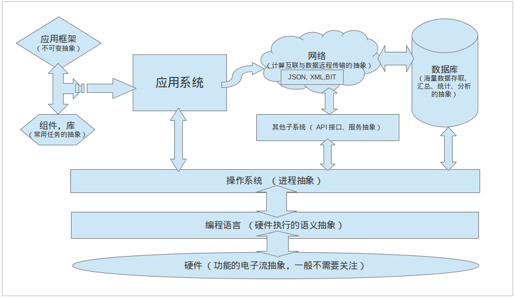

## 抽象（编程的实质）

抽象是针对问题的特征对现实事物的紧密相关的属性的提炼过程及结果。程序中弥漫着大大小小的抽象。 分页控件是对分页功能的抽象，
Extjs 中 store 是对组件的数据管理者的抽象， Java 并发库是对底层多核处理器的抽象， 拦截器，回调函数， Socket , 管道， 消息，
对象， 都是对现实世界的某种实体的抽象。 没有抽象， 也可以写出程序； 但当系统越来越大时， 就会无休止地重复相似的代码，
使系统变得臃肿而难以忍受； 而通过将实体和事件抽象成简洁的概念并找到一致的处理方法， 就可能开发出更为简洁优雅的方案。

编程的实质是抽象与表达。 将现实世界的问题抽象成容易处理的可计算对象，然后使用计算语言来实现它。

编程可以是一种冥想与表达的过程，一种纯粹的心智活动，甚至不需要计算机，就可编程。不是敲入屏幕的一行行字符，而是淌过心里的一条流，从来处来，往去处去，这才是编程之美。

如果善于将万事万物予以合理的抽象，掌握对这些抽象的处理手段， 那么，表达与编程将是一件非常流畅自然的事情，就像 《SICP》 做的那样；
不然，就只好凭有限的思维、经验与一时的直觉来编写还算能工作的代码，艰难地与现实困境作战了。这也是抽象思维能力强弱将导致的差别。

因此， 编程不仅仅只是编写和练习， 更是思考与冥想的过程； 编程与弹钢琴相似，都需要大量的练习； 编程又与弹钢琴不一样：
弹钢琴更需要娴熟的手法，而编程更倾向于作为一种缜密的心智活动， 心思到了，编程也就下笔千言了。

## 在合适的抽象层次上思考问题

程序员通常是在一定的抽象层次上思考问题。 int i = 4 , 从最底层来看， 是将某个内存地址 0xXXXXXXXX 填入数值 0x04 ， 对于小程序，
当然可以这么思考； 但是， 当面对一个软件系统时， 总是以这个层面来思考问题就显得非常吃力了。 此时， 它的合适语义是： “将变量 i
赋值为 4 ， 变量 i 代表着某个地址， 但我们暂时不需要去关注是哪个地址。” 这是更高抽象层的思考。 再高一层，
可能是在函数、类、组件级别的语义层面上来理解程序。

抽象， 意味着要学会在合适的语义层面来理解程序， 而不是从最原始最底层的地方开始。 api 文档， 或者语言规范，
即是定义了某个实体的标准可参考的语义。 因此， 写 java web 应用写到一定程度， 会去阅读 Servlet 规范和 JVM 规范。

开发的本质是解决问题。 将问题表达为可计算的对象， 使用编程语言、开发框架、组件、库、包等各种抽象的编程设施来实现它。开发一个功能可以分为三步：

1. 理解需求， 分析问题， 并将问题抽象成可计算的对象；
2. 从编程语言、开发框架、组件、库、包等提供的抽象工具中寻找适合处理指定对象的编程设施；
3. 将编程设施作用于处理的计算对象， 实现问题的解决方案。

## 计算世界里的抽象

* 计算机世界里的抽象无处不在。
* 技术是问题的解决方案和手段的机制抽象； 每一类技术都建立了一套抽象，针对所面临的问题提出一种一致的机制，然后遵从该机制来实现这一类问题的求解；
* 开发框架是对不可变的过程抽象，将可变部分留给应用开发者根据具体问题域来定义和实现；
* 编程语言是对硬件执行的语义抽象；
* 标准库SDK 是对常用子任务的过程抽象或数据抽象；
* 操作系统是对进程实例执行的过程抽象；
* 数据库是对大量数据存储、查询与汇总统计的抽象；
* 网络是对计算互联与远程数据传输的抽象；

所有这些抽象都是一种强有力的工具。抽象，实现了“关注点分离”的原则，将一件复杂而完整的应用系统分解成多个子系统，各司其责，更容易构建和维护；
善于系统地使用抽象， 在合适的抽象层次上思考问题， 或许就真正掌握了编程之道。

