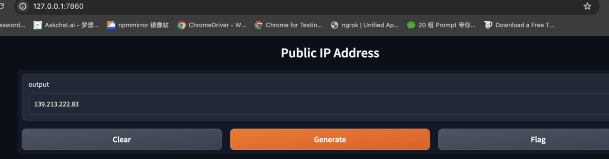
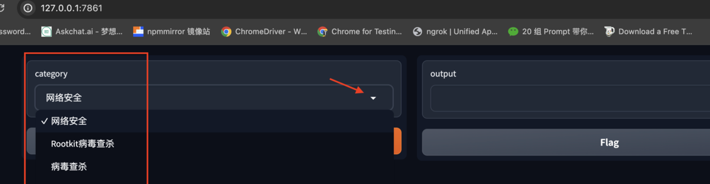
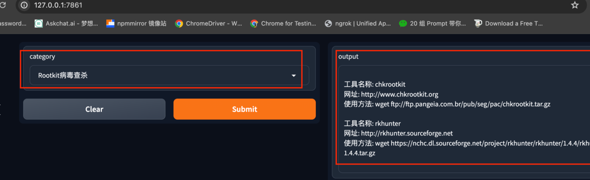

## Python的一个非常cool的库Gradio

#### Gradio简介

Gradio是一个开源的Python库，它允许用户为机器学习模型、API或任何Python函数快速构建演示或Web应用程序。Gradio的目标是简化AI模型的可视化和交互过程，使得即使没有前端开发背景的用户也能够轻松地创建和分享他们的工作。

#### Gradio的特点

- **自动生成页面且可交互**：Gradio可以自动生成带有交互功能的网页，用户可以通过这些网页与AI模型进行实时互动。
- **改动几行代码就能完成**：用户只需要在原有的代码中增加少量的Gradio调用代码，就能将函数转化为可交互的Web界面。
- **支持自定义多种输入输出**：Gradio支持多种输入输出类型，如文本、图像、音频等，可以灵活地适应不同的应用场景。
- **支持生成可外部访问的链接**：Gradio可以生成可以通过互联网访问的链接，方便用户分享他们的工作成果。

#### Gradio的使用方法

1. 安装Gradio

   ：首先，确保你的系统中已安装Python 3.8或更高版本。然后，使用pip命令安装Gradio：

    ```bash
    pip install gradio
    ```

2. **编写函数**：定义一个[Python函数]，作为Gradio界面的处理函数。

3. **创建接口**：使用`gr.Interface`类创建一个新的接口实例，传递你的函数以及输入和输出的类型。

4. **启动服务器**：使用`launch`方法启动Gradio服务器，它会在本地打开一个网页，你可以通过这个网页与你的函数进行交互。


例如，以下是一个简单的"Hello World"示例：

```python
import gradio as gr

def greet(name):
    return "Hello " + name + "!"

demo = gr.Interface(fn=greet, inputs="text", outputs="text")
demo.launch()

```

在浏览器中输入`http://localhost:7860`，即可看到运行结果。

#### Gradio的应用场景

Gradio广泛应用于[机器学习模型]的演示和测试，尤其适合那些需要与用户进行实时交互的场景。例如，图像分类、自然语言处理、推荐系统等领域的模型都可以通过Gradio进行可视化展示。此外，Gradio还被用于创建教育工具、游戏、艺术作品等多种有趣的应用。

#### 应用案例

##### 1. 查看自己上网的公网IP

虽然这个小工具软件很简单，但是用起来很方便而且界面也不错。还可以增加其他功能，大家自己体验。

源码如下：

```python
import gradio as gr
import requests

def get_public_ip():
    try:
        response = requests.get('https://api.ipify.org')
        public_ip = response.text.strip()
        return public_ip
    except requests.exceptions.RequestException as e:
        print(f"Error: {e}")
        return None

def main():
    ip_textbox = gr.Textbox(placeholder="Public IP Address")

    def update_ip():
        public_ip = get_public_ip()
        if public_ip:
            return public_ip
        else:
            return "Failed to retrieve your public IP address."

    iface = gr.Interface(
        fn=update_ip,
        inputs=None,
        outputs=ip_textbox,
        title="Public IP Address"
    )
    iface.launch()

if __name__ == "__main__":
    main()
```


运行结果如下图：


##### 2. 小型资料检索

我平时学习用到一些资料和工具，为了方便，正好利用gradio库实现这个功能。

源码如下：

```python
import gradio as gr


# 工具字典，你可以根据实际情况进行修改
security_tools = {
    "网络安全": [
        {
            "name": "工具1",
            "url": "http://example.com/tool1",
            "usage": "工具1的使用方法..."
        },
        # 添加更多的网络安全工具
    ],
    "Rootkit病毒查杀": [
        {
            "name": "chkrootkit",
            "url": "http://www.chkrootkit.org",
            "usage": "wget ftp://ftp.pangeia.com.br/pub/seg/pac/chkrootkit.tar.gz"
        },
        {"name": "rkhunter",
         "url": "http://rkhunter.sourceforge.net",
         "usage": "wget https://nchc.dl.sourceforge.net/project/rkhunter/rkhunter/1.4.4/rkhunter-1.4.4.tar.gz",
         },],
    "病毒查杀":[
        {
            "name": "Clamav",
            "url": "http://www.clamav.net/download.html",
            "usage": "wget http://nchc.dl.sourceforge.net/project/libpng/zlib/1.2.7/zlib-1.2.7.tar.gz",
        },],
    "webshell查杀":[
        {
            "name":"河马webshell查杀",
            "url":"http://www.shellpub.com",

        },
        {
            "name": "深信服webshell网站后门检测工具",
            "url":"http://edr.sangfor.com.cn/backdoor_detection.html",

        }
    ],

    # 添加其他类别的工具
    "网络安全在线工具箱": [
        {
            "name":"个人安全检查表",
            "url": "https://digital-defense.io/",
        },
        {
            "name":"感染IOT设备的在线地图统计",
            "url":"https://dashboard.shadowserver.org/zh-hans/"
        },
        {
            "name":"在线 C2 追踪",
            "url":"https://tracker.viriback.com/",
        },
        {
            "name":"调查互联网上任何主机的威胁情报网站",
            "url":"https://threatyeti.com/"
        },
        {
            "name":"源代码搜索引擎",
            "url":"https://publicwww.com/",
        },
        {
            "name":"在线靶场",
            "url":"https://labs.hackxpert.com/"
        }

    ]
}


def display_tools(category):
    tools = security_tools.get(category)
    if tools:
        result = ''
        for tool in tools:
            result += f"\n工具名称: {tool['name']}\n"
            result += f"网址: {tool['url']}\n"
            result += f"使用方法: {tool.get('usage', '请在网站上看说明')}\n"
        return result
    else:
        return "对不起，我们没有这个类别的工具。"


iface = gr.Interface(fn=display_tools,
                     inputs=gr.Dropdown(choices=list(security_tools.keys())),
                     outputs='text')

if __name__ == "__main__":
    iface.launch()

```


运行结果如下图：




