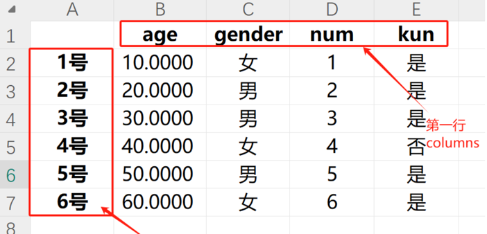
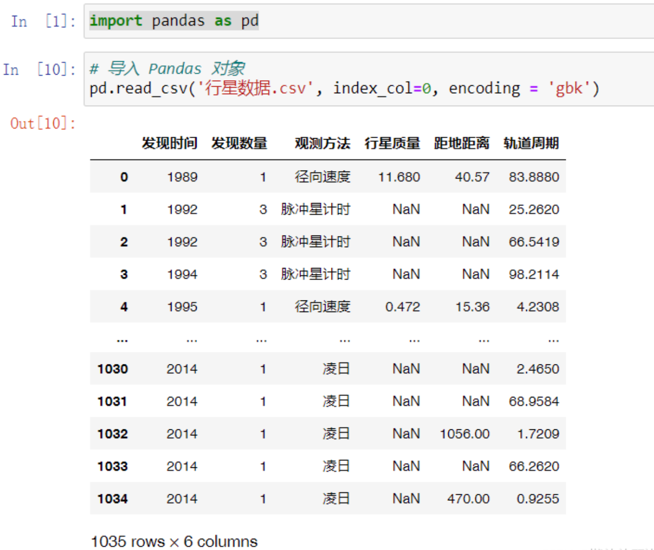
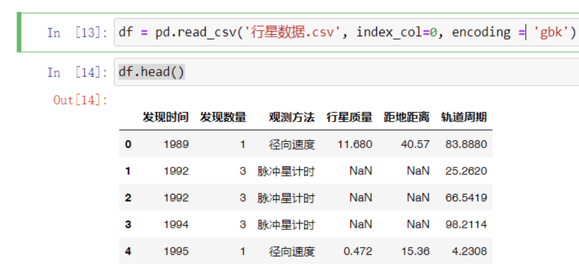
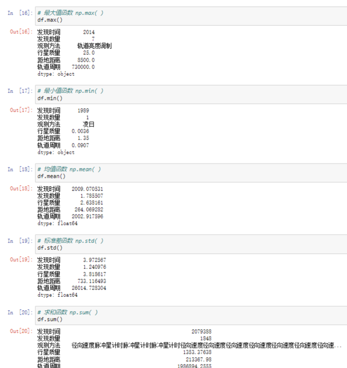
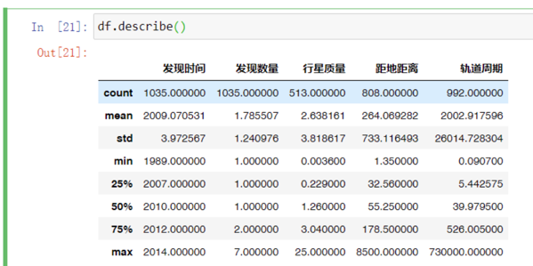
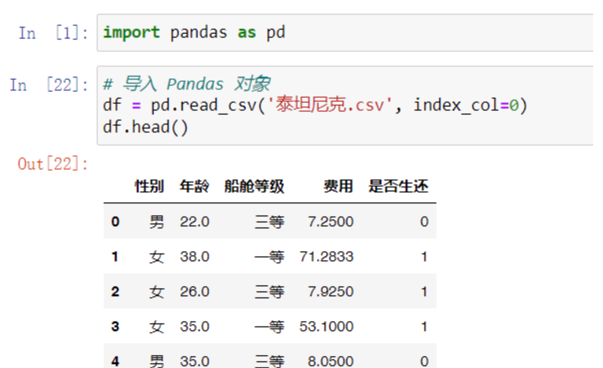
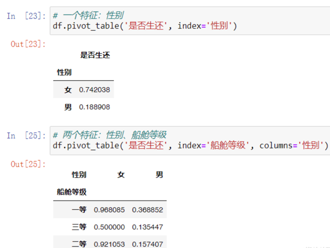
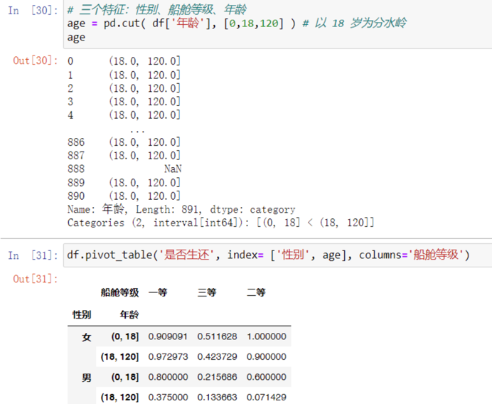
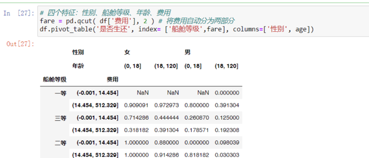

## 对象的创建

- 导入 Pandas 时，通常给其一个别名“pd”，即 import pandas as pd。
- 作为标签库，Pandas 对象在 NumPy 数组基础上给予其行列标签。可以说，列表之于字典，就如 NumPy 之于 Pandas。
- Pandas 中，所有数组特性仍在，Pandas 的数据以 NumPy 数组的方式存储。

### 一维对象的创建

1. 字典创建法  
   NumPy 中，可以通过 np.array()函数，将 Python 列表转化为 NumPy 数组；同样，Pandas 中，可以通过 pd.Series()函数，将 Python 字典转化为 Series 对象。

```python
import pandas as pd
# 创建字典
dict_v = { 'a':0, 'b':0.25, 'c':0.5, 'd':0.75, 'e':1 }
# 用字典创建对象
sr = pd.Series( dict_v )
sr                      #OUT:a    0.00
                        #    b    0.25
                        #    c    0.50
                        #    d    0.75
                        #    e    1.00
                        #    dtype: float64
```

2. 数组创建法  
   最直接的创建方法即直接给 pd.Series()函数参数，其需要两个参数。第一个参数是值 values（列表、数组、张量均可），第二个参数是键 index（索引）。

```python
import pandas as pd
# 先定义键与值
v = [0, 0.25, 0.5, 0.75, 1]
k = ['a', 'b', 'c', 'd', 'e']
 # 用列表创建对象
sr = pd.Series( v, index=k )
sr                      #OUT:a    0.00
                        #    b    0.25
                        #    c    0.50
                        #    d    0.75
                        #    e    1.00
                        #    dtype: float64
```

其中，参数 index 可以省略，省略后索引即从 0 开始的顺序数字。

### 一维对象的属性

Series 对象有两个属性：values 与 index。

```python
import numpy as np
import pandas as pd
# 用数组创建 sr
v = np.array( [ 53, 64, 72, 82 ] )
k = ['1 号', '2 号', '3 号', '4 号']
sr = pd.Series( v, index=k )
sr                      #OUT:1 号    53
                        #    2 号    64
                        #    3 号    72
                        #    4 号    82
                        #    dtype: int32
# 查看 values 属性
sr.values               #OUT:array([53, 64, 72, 82])
# 查看 index 属性
sr.index               #OUT:Index(['1 号', '2 号', '3 号', '4 号'], dtype='object')
```

事实上，无论是用列表、数组还是张量来创建对象，最终 values 均为数组。虽然 Pandas 对象的第一个参数 values 可以传入列表、数组与张量，但传进去后默认的存储方式是 [NumPy](https://so.csdn.net/so/search?q=NumPy&spm=1001.2101.3001.7020) 数组。这一点更加提醒我们，Pandas 是建立在 NumPy 基础上的库，没有 NumPy 数组库就没有 Pandas 数据处理库。当想要 Pandas 退化为 NumPy 时，查看其 values 属性即可。

### 二维对象的创建

二维对象将面向矩阵，其不仅有行标签 index，还有列标签 columns。

1. 字典创建法  
   用字典法创建二维对象时，必须基于多个 Series 对象，每一个 Series 就是一列数据，相当于对一列一列的数据作拼接。

- 创建 Series 对象时，字典的键是 index，其延展方向是竖直方向；
- 创建 DataFrame 对象时，字典的键是 columns，其延展方向是水平方向。

```python
import pandas as pd
# 创建 sr1：各个病人的年龄
v1 = [ 53, 64, 72, 82 ]
i = [ '1 号', '2 号', '3 号', '4 号' ]
sr1 = pd.Series( v1, index=i )
sr1                     #OUT:1 号    53
                        #    2 号    64
                        #    3 号    72
                        #    4 号    82
                        #    dtype: int32
 # 创建 sr2：各个病人的性别
v2 = [ '女', '男', '男', '女' ]
i = [ '1 号', '2 号', '3 号', '4 号' ]
sr2 = pd.Series( v2, index=i )
sr2                     #OUT:1 号    女
                        #    2 号    男
                        #    3 号    男
                        #    4 号    女
                        #    dtype: object
# 创建 df 对象
df = pd.DataFrame( { '年龄':sr1, '性别':sr2 } )
df                      #OUT:	   年龄  性别
                        #    1 号	53	  女
                        #    2 号	64	  男
                        #    3 号	72	  男
                        #    4 号	82	  女
```

如果 sr1 和 sr2 的 index 不完全一致，那么二维对象的 index 会取 sr1 与 sr2的所有 index，相应的，该对象就会产生一定数量的缺失值（NaN）。
2. 数组创建法  
   最直接的创建方法即直接给 pd.DataFrame 函数参数，其需要三个参数。第一个参数是值 values（数组），第二个参数是行标签 index，第三个参数是列标签columns。其中，index 和 columns 参数可以省略，省略后即从 0 开始的顺序数字。

```python
import numpy as np
import pandas as pd
# 设定键值
v = np.array( [ [53, '女'], [64, '男'], [72, '男'], [82, '女'] ] )
i = [ '1 号', '2 号', '3 号', '4 号' ]
c = [ '年龄', '性别' ]
# 数组创建法
df = pd.DataFrame( v, index=i, columns=c )
df                      #OUT:	   年龄  性别
                        #    1 号	53	  女
                        #    2 号	64	  男
                        #    3 号	72	  男
                        #    4 号	82	  女
```

上述 NumPy 数组居然又含数字又含字符串，上一篇博文中明明讲过数组只能容纳一种变量类型。这里的原理是，数组默默把数字转为了字符串，于是 v 就是一个字符串型数组。

### 二维对象的属性

DataFrame 对象有三个属性：values、index 与 columns。

```python
import pandas as pd
# 设定键值
v = [ [53, '女'], [64, '男'], [72, '男'], [82, '女'] ]
i = [ '1 号', '2 号', '3 号', '4 号' ]
c = [ '年龄', '性别' ]
# 数组创建法
df = pd.DataFrame( v, index=i, columns=c )
df                      #OUT:	   年龄  性别
                        #    1 号	53	  女
                        #    2 号	64	  男
                        #    3 号	72	  男
                        #    4 号	82	  女
# 查看 values 属性 # 查看 index 属性
df.index                #OUT:array([[53, '女'],
                        #           [64, '男'],
                        #           [72, '男'],
                        #           [82, '女']], dtype=object)
# 查看 index 属性
df.index                #OUT:Index(['1 号', '2 号', '3 号', '4 号'], dtype='object')
# 查看 columns 属性
df.columns              #OUT:Index(['年龄', '性别'], dtype='object')
```

当想要 Pandas 退化为 NumPy 时，查看其 values 属性即可。

```python
# 提取完整的数组
arr = df.values
print(arr)                #OUT:[['53' '女']
                          #     ['64' '男']
                          #     ['72' '男']
                          #     ['82' '女']]
# 提取第[0]列，并转化为一个整数型数组
arr = arr[:,0].astype(int)
print(arr)                #OUT:[53 64 72 82]
```

由于数组只能容纳一种变量类型，因此需要 .astype(int) 的操作。但对象不用，对象每一列的存储方式是单独的，这就很好的兼容了大数据的特性。

## 对象的索引

在学习 Pandas 的索引之前，需要知道

- Pandas 的索引分为显式索引与隐式索引。显式索引是使用 Pandas 对象提供的索引，而隐式索引是使用数组本身自带的从 0 开始的索引。
- 现假设某演示代码中的索引是整数，这个时候显式索引和隐式索引可能会出乱子。于是，Pandas 作者发明了索引器 loc（显式）与 iloc（隐式），手动告诉程序自己这句话是显式索引还是隐式索引。

### 一维对象的索引

1. 访问元素

```python
import pandas as pd
# 创建 sr
v = [ 53, 64, 72, 82 ]
k = ['1 号', '2 号', '3 号', '4 号']
sr = pd.Series( v, index=k )
sr                        #OUT:1 号    53
                          #    2 号    64
                          #    3 号    72
                          #    4 号    82
                          #    dtype: int64
# 访问元素
sr.loc[ '3 号' ]          #OUT:72    显示索引
sr.iloc[ 2 ]              #OUT:72    隐式索引
# 花式索引
sr.loc[ [ '1 号', '3 号' ] ]  #OUT:1 号    53    显示索引
                             #    3 号    72
                             #    dtype: int64
sr.iloc[ [ 0, 2 ] ]          #OUT:1 号    53    隐式索引
                             #    3 号    72
                             #    dtype: int64
# 修改元素
sr.loc[ '3 号' ] = 100
sr                           #OUT:1 号     53    显示索引
                             #    2 号     64
                             #    3 号    100
                             #    4 号     82
                             #    dtype: int64
# 修改元素
sr.iloc[ 2 ] = 100
sr                           #OUT:1 号     53    隐式索引
                             #    2 号     64
                             #    3 号    100
                             #    4 号     82
                             #    dtype: int64
```

2. 访问切片  
   使用显式索引时，‘1 号’:‘3 号’ 可以涵盖最后一个’3 号’，但隐式与之前一样。

```python
import pandas as pd
# 创建 sr
v = [ 53, 64, 72, 82 ]
k = ['1 号', '2 号', '3 号', '4 号']
sr = pd.Series( v, index=k )
sr                        #OUT:1 号    53
                          #    2 号    64
                          #    3 号    72
                          #    4 号    82
                          #    dtype: int64
# 访问切片
sr.loc[ '1 号':'3 号' ]   #OUT: 1 号    53    显示索引
                          #    2 号    64
                          #    3 号    72
                          #    dtype: int64
sr.iloc[ 0:3 ]            #OUT:1 号    53    隐式索引
                          #    2 号    64
                          #    3 号    72
                          #    dtype: int64
 # 切片仅是视图
cut = sr.loc[ '1 号':'3 号' ]
cut.loc['1 号'] = 100
sr                        #OUT: 1 号    53    显示索引
                          #    2 号    64
                          #    3 号    72
                          #    dtype: int64
cut = sr.iloc[ 0:3 ]
cut.iloc[0] = 100
sr                        #OUT:1 号    53    隐式索引
                          #    2 号    64
                          #    3 号    72
                          #    dtype: int64
# 对象赋值仅是绑定
cut = sr
cut.loc['3 号'] = 200
sr                        #OUT:1 号    100    显示索引
                          #    2 号     64
                          #    3 号    200
                          #    4 号     82
                          #    dtype: int64
cut = sr
cut.iloc[2] = 200
sr                        #OUT:1 号    100    隐式索引
                          #    2 号     64
                          #    3 号    200
                          #    4 号     82
                          #    dtype: int64
```

若想创建新变量，与 NumPy 一样，使用.copy()方法即可。如果去掉 .loc 和 .iloc ，此时与 NumPy 中的索引语法完全一致。

### 二维对象的索引

在二维对象中，索引器不能去掉，否则会报错，因此必须适应索引器的存在。

1. 访问元素：

```python
import pandas as pd
 # 字典创建法
i = [ '1 号', '2 号', '3 号', '4 号' ]
v1 = [ 53, 64, 72, 82 ]
v2 = [ '女', '男', '男', '女' ]
sr1 = pd.Series( v1, index=i )
sr2 = pd.Series( v2, index=i )
df = pd.DataFrame( { '年龄':sr1, '性别':sr2 } )
df                        #OUT:
                          #        年龄  性别
                          #    1 号	53	  女
                          #    2 号	64    男
                          #    3 号	72	  男
                          #    4 号	82	  女
# 访问元素
df.loc[ '1 号', '年龄' ]   #OUT:53
df.iloc[ 0, 0 ]           #OUT:53
# 花式索引
df.loc[ ['1 号', '3 号'] , ['性别','年龄'] ]   #OUT:	性别    年龄
                                          #    1 号  女	    53
                                          #    3 号	 男	    72
df.iloc[ [0,2], [1,0] ]                      #OUT:	性别    年龄
                                          #    1 号  女	    53
                                          #    3 号	 男	    72
# 修改元素
df.loc[ '3 号', '年龄' ] = 100
df                        #OUT:
                          #        年龄  性别
                          #    1 号	53	  女
                          #    2 号	64    男
                          #    3 号	100	  男
                          #    4 号	82	  女
df.iloc[ 2, 0 ] = 100
df                        #OUT:
                          #        年龄  性别
                          #    1 号	53	  女
                          #    2 号	64    男
                          #    3 号	100	  男
                          #    4 号	82	  女
```

在 NumPy 数组中，花式索引输出的是一个向量。但在 Pandas 对象中，考虑到其行列标签的信息不能丢失，所以输出一个向量就不行了。
2. 访问切片

```python
import pandas as pd
 # 数组创建法
v = [ [53, '女'], [64, '男'], [72, '男'], [82, '女'] ]
i = [ '1 号', '2 号', '3 号', '4 号' ]
c = [ '年龄', '性别' ]
df = pd.DataFrame( v, index=i, columns=c )
df                        #OUT:
                          #        年龄  性别
                          #    1 号	53	  女
                          #    2 号	64    男
                          #    3 号	72	  男
                          #    4 号	82	  女
# 切片
df.loc[ '1 号':'3 号' , '年龄' ]  #OUT:  1 号  53
                                 #      2 号  64
                                 #      3 号  72
                                 #      Name: 年龄, dtype: int64
df.iloc[ 0:3 , 0 ]               #OUT:  1 号  53
                                 #      2 号  64
                                 #      3 号  72
                                 #      Name: 年龄, dtype: int64
# 提取二维对象的行  
df.loc[ '3 号' , : ] [#OUT](app://obsidian.md/index.html#OUT): 年龄 72  
# 性别 男  
# Name: 3 号, dtype: object  
df.iloc[ 2 , : ] [#OUT](app://obsidian.md/index.html#OUT): 年龄 72  
# 性别 男  
# Name: 3 号, dtype: object  
# 提取矩阵对象的列  
df.loc[ : , '年龄' ] [#OUT](app://obsidian.md/index.html#OUT): 1 号 53  
# 2 号 64  
# 3 号 72  
# 4 号 82  
# Name: 年龄, dtype: int64  
df.iloc[ : , 0 ] [#OUT](app://obsidian.md/index.html#OUT): 1 号 53  
# 2 号 64  
# 3 号 72  
# 4 号 82  
# Name: 年龄, dtype: int64
```


在显示索引中，提取矩阵的行或列还有一种简便写法，即

- 提取二维对象的行：df.loc[ ‘3 号’]（原理是省略后面的冒号，隐式也可以）
- 提取二维对象的列：df [‘年龄’ ]（原理是列标签本身就是二维对象的键）

## 对象的变形

### 对象的转置

有时候提供的大数据很畸形，行是特征，列是个体，这必须要先进行转置。

```python
import pandas as pd
# 创建畸形 df
v = [ [53, 64, 72, 82], [ '女', '男', '男', '女' ] ]
i = [ '年龄', '性别' ]
c = [ '1 号', '2 号', '3 号', '4 号' ]
df = pd.DataFrame( v, index=i, columns=c )
df                    #OUT:	1 号	2 号	3 号	4 号
                      #年龄  53      64      72      82
                      #性别  女      男       男      女
# 转置
df = df.T
df                    #OUT:
                      #          年龄   性别
                      #1 号       53	女
                      #2 号	      64	男
                      #3 号	      72	男
                      #4 号	      82	女
```

### 对象的翻转

```python
# 左右翻转
df = df.iloc[ : , : : -1 ]
df                    #OUT:
                      #       性别   年龄   
                      #1 号    女     53	
                      #2 号	   男     64	
                      #3 号	   男     72	
                      #4 号	   女     82	
 # 上下翻转
df = df.iloc[ : : -1 , : ]
df                    #OUT:
                      #       性别   年龄   
                      #4 号	   女     82
                      #3 号	   男     72
                      #2 号	   男     64
                      #1 号    女     53
```

### 对象的重塑

考虑到对象是含有行列标签的，.reshape()已不再适用，因此对象的重塑没有那么灵活。但可以做到将 sr 并入 df，也可以将 df 割出 sr。

```python
import pandas as pd
# 数组法创建 sr
i = [ '1 号', '2 号', '3 号', '4 号' ]
v1 = [ 10, 20, 30, 40 ]
v2 = [ '女', '男', '男', '女' ]
v3 = [ 1, 2, 3, 4 ]
sr1 = pd.Series( v1, index=i )
sr2 = pd.Series( v2, index=i )
sr3 = pd.Series( v3, index=i )
sr1, sr2, sr3        #OUT:(1 号 10 1 号 女 1 号 1
                     #OUT:2 号 20 2 号 男 2 号 2
                     #OUT:3 号 30 3 号 男 3 号 3
                     #OUT:4 号 40 4 号 女 4 号 4
                     #OUT:dtype: int64, dtype: object, dtype: int64)
# 字典法创建 df
df = pd.DataFrame( { '年龄':sr1, '性别':sr2 } )
df                    #OUT:
                            年龄     性别
                      #1 号	10       女
                      #2 号 20       男
                      #3 号 30       男
                      #4 号 40       女
# 把 sr 并入 df 中
df['牌照'] = sr3
df                    #OUT:	年龄   性别   牌照
                      #1 号  10    女      1
                      #2 号  20    男      2
                      #3 号  30    男      3
                      #4 号  40    女      4
# 把 df['年龄']分离成 sr4
sr4 = df['年龄']
sr4                    #OUT:1 号    10
                      #2 号    20
                      #3 号    30
                      #4 号    40
                      #Name: 年龄, dtype: int64
```

### 对象的拼接

Pandas 中有一个 pd.concat()函数，与 np.concatenate()函数语法相似。

1. 一维对象的合并

```python
import pandas as pd
 # 创建 sr1 和 sr2
v1 = [10, 20, 30, 40]
v2 = [40, 50, 60]
k1 = [ '1 号', '2 号', '3 号', '4 号' ]
k2 = [ '4 号', '5 号', '6 号' ]
sr1 = pd.Series( v1, index= k1 )
sr2 = pd.Series( v2, index= k2 )
sr1, sr2                    #OUT:(1 号    10
                            #     2 号    20
                            #     3 号    30
                            #     4 号    40
                            #     dtype: int64,
                            #     4 号    40
                            #     5 号    50
                            #     6 号    60
                            #     dtype: int64)
# 合并
pd.concat( [sr1, sr2] )     #OUT:1 号    10
                            #     2 号    20
                            #     3 号    30
                            #     4 号    40
                            #     4 号    40
                            #     5 号    50
                            #     6 号    60
                            #     dtype: int64
```

值得注意的是，上述出现了两个“4 号”，这是因为 Pandas 对象的属性，放弃了集合与字典索引中“不可重复”的特性，实际中，这可以拓展大数据分析与处理的应用场景。那么，如何保证索引是不重复的呢？对对象的属性 .index 或 .columns 使用 .is_unique 即可检查，返回 True表示行或列不重复，False 表示有重复

```python
sr3 = pd.concat( [sr1, sr2] )
sr3.index.is_unique        #OUT:False
```

2. 一维对象与二维对象的合并  
   一维对象与二维对象的合并，即可理解为：给二维对象加上一列或者一行。因此，不必使用 pd.concat()函数，只需要借助 2.2 小节“二维对象的索引”语法。

```python
import pandas as pd
# 创建 sr1 与 sr2
v1 = [ 10, 20, 30]
v2 = [ '女', '男', '男']
sr1 = pd.Series( v1, index=[ '1 号', '2 号', '3 号'] )
sr2 = pd.Series( v2, index=[ '1 号', '2 号', '3 号'] )
sr1, sr2            #OUT:(1 号    10
                    #     2 号    20
                    #      3 号    30
                    #      dtype: int64,
                    #      1 号    女
                    #      2 号    男
                    #      3 号    男
                    #      dtype: object)
# 创建 df
df = pd.DataFrame( { '年龄':sr1, '性别':sr2 } )
df                 #OUT:
                   #     年龄     性别
                   #1 号  10       女
                   #2 号  20       男
                   #3 号  30       男
# 加上一列
df['牌照'] = [1, 2, 3]
df                 #OUT:
                   #     年龄	性别     牌照
                   #1 号  10     女       1
                   #2 号  20     男       2
                   #3 号  30     男       3
# 加上一行
df.loc['4 号'] = [40, '女', 4]
df                 #OUT:
                   #     年龄   性别   牌照
                   #1 号  10     女     1
                   #2 号  20     男     2
                   #3 号  30     男     3
                   #4 号  40     女     4
```

3. 二维对象的合并  
   二维对象合并仍然用 pd.concat()函数，不过其多了一个 axis 参数。

```python
import pandas as pd
# 设定 df1、df2、df3
v1 = [ [10, '女'], [20, '男'], [30, '男'], [40, '女'] ]
v2 = [ [1, '是'], [2, '是'], [3, '是'], [4, '否'] ]
v3 = [ [50, '男', 5, '是'], [60, '女', 6, '是'] ]
i1 = [ '1 号', '2 号', '3 号', '4 号' ]
i2 = [ '1 号', '2 号', '3 号', '4 号' ]
i3 = [ '5 号', '6 号' ]
c1 = [ '年龄', '性别' ]
c2 = [ '牌照', 'ikun' ]
c3 = [ '年龄', '性别', '牌照', 'ikun' ]
df1 = pd.DataFrame( v1, index=i1, columns=c1 )
df2 = pd.DataFrame( v2, index=i2, columns=c2 )
df3 = pd.DataFrame( v3, index=i3, columns=c3 )
df1                #OUT:
                   #     年龄   性别
                   #1 号  10     女
                   #2 号  20     男
                   #3 号  30     男
                   #4 号  40     女
df2                #OUT:
                   #     牌照   ikun
                   #1 号  1      是
                   #2 号  2      是
                   #3 号  3      是
                   #4 号  4      否
df3                #OUT:
                   #     年龄   性别   牌照   ikun
                   #5 号  50    男     5      是
                   #6 号  60    女     6      是
# 合并列对象（添加列特征）
df = pd.concat( [df1,df2], axis=1 )
df                #OUT:	年龄   性别   牌照   ikun
                  #1 号	10     女     1      是
                  #2 号	20     男     2      是
                  #3 号	30     男     3      是
                  #4 号	40     女     4      否
# 合并行对象（添加行个体）
df = pd.concat( [df,df3] )
df                #OUT:
                  #     年龄   性别   牌照   ikun
                  #1 号  10	   女     1      是
                  #2 号  20	   男     2      是
                  #3 号  30	   男     3      是
                  #4 号  40	   女     4      否
                  #5 号  50	   男     5      是
                  #6 号  60	   女     6      是
```

## 对象的运算

### 对象与系数之间的运算

1. 一维对象

```python
import pandas as pd
# 创建 sr
sr = pd.Series( [ 53, 64, 72 ] , index=['1 号', '2 号', '3 号'] )
sr                #OUT:1 号    53
                  #    2 号    64
                  #    3 号    72
                  #    dtype: int64
sr = sr + 10
sr                #OUT:1 号    63
                  #    2 号    74
                  #    3 号    82
                  #    dtype: int64
sr = sr * 10
sr                #OUT:1 号    630
                  #    2 号    740
                  #    3 号    820
                  #    dtype: int64
sr = sr ** 2
sr                #OUT:1 号    396900
                  #    2 号    547600
                  #    3 号    672400
                  #    dtype: int64
```

2. 二维对象

```python
import pandas as pd
# 创建 df
v = [ [53, '女'], [64, '男'], [72, '男'] ]
df = pd.DataFrame( v, index=[ '1 号', '2 号', '3 号' ], columns=[ '年龄', '性别' ] )
df                #OUT:	年龄   性别
                  #1 号  53     女
                  #2 号  64     男
                  #3 号  72     男
df['年龄'] = df['年龄'] + 10
df                #OUT:	年龄   性别
                  #1 号  63     女
                  #2 号  74     男
                  #3 号  82     男
df['年龄'] = df['年龄'] * 10
df                #OUT:	 年龄    性别
                  #1 号  630     女
                  #2 号  740     男
                  #3 号  820     男
df['年龄'] = df['年龄'] ** 2
df                #OUT:	 年龄     性别
                  #1 号 396900     女
                  #2 号 547600     男
                  #3 号 672400     男
```

### 对象与对象之间的运算

对象做运算，必须保证其都是数字型对象，两个对象之间的维度可以不同。

1. 一维对象之间的运算

```python
import pandas as pd
 # 创建 sr1
v1 = [10, 20, 30, 40]
k1 = [ '1 号', '2 号', '3 号', '4 号' ]
sr1 = pd.Series( v1, index= k1 )
sr1                #OUT:1 号   10
                   #    2 号   20
                   #    3 号   30
                   #    4 号   40
                   #    dtype: int64
# 创建 sr2
v2 = [1, 2, 3 ]
k2 = [ '1 号', '2 号', '3 号' ]
sr2 = pd.Series( v2, index= k2 )
sr2                #OUT: 1 号   1
                   #    2 号   2
                   #    3 号   3
                   #    dtype: int64
sr1 + sr2          #OUT:1 号   11.0   加法
                   #    2 号   22.0
                   #    3 号   33.0
                   #    4 号   NaN
                   #    dtype: float64
sr1 - sr2          #OUT:1 号   9.0   减法
                   #    2 号   18.0
                   #    3 号   27.0
                   #    4 号   NaN
                   #    dtype: float64
sr1 * sr2          #OUT:1 号   10.0   乘法
                   #    2 号   40.0
                   #    3 号   90.0
                   #    4 号   NaN
                   #    dtype: float64
sr1 / sr2          #OUT:1 号   10.0   乘法
                   #    2 号   10.0
                   #    3 号   10.0
                   #    4 号   NaN
                   #    dtype: float64
sr1 ** sr2         #OUT:1 号   10.0   乘法
                   #    2 号   400.0
                   #    3 号   27000.0
                   #    4 号   NaN
                   #    dtype: float64
```

2. 二维对象之间的运算

```python
import pandas as pd
# 设定 df1 和 df2
v1 = [ [10, '女'], [20, '男'], [30, '男'], [40, '女'] ]
v2 = [ 1, 2 ,3, 6 ]
i1 = [ '1 号', '2 号', '3 号', '4 号' ]; c1 = [ '年龄', '性别' ]
i2 = [ '1 号', '2 号', '3 号', '6 号' ]; c2 = [ '牌照' ]
df1 = pd.DataFrame( v1, index=i1, columns=c1 )
df2 = pd.DataFrame( v2, index=i2, columns=c2 )
df1                #OUT:
                   #    年龄   性别
                   #1 号 10    女
                   #2 号 20    男
                   #3 号 30    男
                   #4 号 40    女
df2                #OUT:
                   #       牌照
                   #1 号    1
                   #2 号    2
                   #3 号    3
                   #6 号    6
# 加法
df1['加法'] = df1['年龄'] + df2['牌照']
df1                #OUT:
                   #       年龄   性别   加法
                   #1 号    10    女    11.0
                   #2 号    20    男    22.0
                   #3 号    30    男    33.0
                   #4 号    40    女    NaN
# 减法、乘法、除法、幂方
df1['减法'] = df1['年龄'] - df2['牌照']
df1['乘法'] = df1['年龄'] * df2['牌照']
df1['除法'] = df1['年龄'] / df2['牌照']
df1['幂方'] = df1['年龄'] ** df2['牌照']
df1                #OUT:
                   #       年龄   性别   加法   减法   乘法   除法   幂方
                   #1 号	10    女	11.0   9.0	10.0	10.0	10.0
                   #2 号	20    男	22.0   18.0	40.0	10.0	400.0
                   #3 号	30    男	33.0   27.0	90.0	10.0	27000.0
                   #4 号	40    女	NaN    NaN	NaN  	NaN	     NaN
```

- 使用 np.abs()、np.cos()、np.exp()、np.log() 等数学函数时，会保留索引；
- Pandas 中仍然存在布尔型对象，用法与 NumPy 无异，会保留索引。

## 对象的缺失值

### 发现缺失值

发现缺失值使用 .isnull() 方法。

```python
import pandas as pd
# 创建 sr
v = [ 53, None, 72, 82 ]
k = ['1 号', '2 号', '3 号', '4 号']
sr = pd.Series( v, index=k )
sr                #OUT:1 号 53.0
                  #2 号 NaN
                  #3 号 72.0
                  #4 号 82.0
                  #dtype: float64
# 创建 df
v = [ [None, 1], [64, None], [72, 3], [82, 4] ]
i = [ '1 号', '2 号', '3 号', '4 号' ]
c = [ '年龄', '牌照' ]
df = pd.DataFrame( v, index=i, columns=c )
df                #OUT: 年龄    牌照
                  #1 号 NaN     1.0
                  #2 号 64.0    NaN
                  #3 号 72.0    3.0
                  #4 号 82.0    4.0
# 发现 sr 的缺失值
sr.isnull()       #OUT:  1 号   False
                  #      2 号   True
                  #      3 号   False
                  #      4 号   False
                  #      dtype: float64
df.isnull()       #OUT: 年龄    牌照
                  #1 号 True    False
                  #2 号 False    True
                  #3 号 False    False
                  #4 号 False    False
```

除了.isnull() 方法，还有一个与之相反的 .notnull() 方法，但不如在开头加一个非号“~”即可。

### 剔除缺失值

剔除缺失值使用 .dropna() 方法，一维对象很好剔除；二维对象比较复杂，要么单独剔除 df 中含有缺失值的行，要么剔除 df 中含有缺失值的列。

```python
import pandas as pd
# 创建 sr
v = [ 53, None, 72, 82 ]
k = ['1 号', '2 号', '3 号', '4 号']
sr = pd.Series( v, index=k )
sr                #OUT:1 号 53.0
                  #2 号 NaN
                  #3 号 72.0
                  #4 号 82.0
                  #dtype: float64
# 剔除 sr 的缺失值
sr.dropna()       #OUT:1 号 53.0
                  #3 号 72.0
                  #4 号 82.0
                  #dtype: float64
 # 创建 df
v = [ [None, None], [64, None], [72, 3], [82, 4] ]
i = [ '1 号', '2 号', '3 号', '4 号' ]
c = [ '年龄', '牌照' ]
df = pd.DataFrame( v, index=i, columns=c )
df                #OUT: 年龄    牌照
                  #1 号 NaN     NaN
                  #2 号 64.0    NaN
                  #3 号 72.0    3.0
                  #4 号 82.0    4.0
df.dropna()       #OUT: 年龄    牌照
                  #3 号 72.0    3.0
                  #4 号 82.0    4.0
```

把含有 NaN 的行剔除掉了，你也可以通过 df.dropna(axis=‘columns’)的方式剔除列。但请警惕，一般都是剔除行，只因大数据中行是个体，列是特征。  
有些同学认为，只要某行含有一个 NaN 就剔除该个体太过残忍，我们可以设定一个参数，只有当该行全部是 NaN，才剔除该列特征。

```python
df.dropna(how='all')       #OUT: 年龄    牌照
                           #2 号 64.0    NaN
                           #3 号 72.0    3.0
                           #4 号 82.0    4.0
```

ps:也可以设置缺失值大于几行时剔除。

### 填补缺失值

填充缺失值使用 .fillna() 方法，实际的数据填充没有统一的方法，很灵活。

1. 一维对象

```python
import pandas as pd
# 创建 sr
v = [ 53, None, 72, 82 ] 
sr = pd.Series( v, index=['1 号', '2 号', '3 号', '4 号'] )
sr                #OUT:1 号 53.0
                  #2 号 NaN
                  #3 号 72.0
                  #4 号 82.0
                  #dtype: float64
# 用常数（0）填充
sr.fillna(0)      #OUT:1 号 53.0
                  #2 号 0.0
                  #3 号 72.0
                  #4 号 82.0
                  #dtype: float64
# 用常数（均值）填充
import numpy as np
sr.fillna(np.mean(sr))      #OUT:1 号 53.0
                            #2 号 69.0
                            #3 号 72.0
                            #4 号 82.0
                            #dtype: float64
# 用前值填充
sr.fillna(method='ffill')   #OUT:1 号 53.0
                            #2 号 53.0
                            #3 号 72.0
                            #4 号 82.0
                            #dtype: float64
# 用后值填充
sr.fillna(method='bfill')   #OUT:1 号 53.0
                            #2 号 72.0
                            #3 号 72.0
                            #4 号 82.0
                            #dtype: float64
```

2. 二维对象

```python
import pandas as pd
# 设定 df
v = [ [None, None], [64, None], [72, 3], [82, 4] ]
i = [ '1 号', '2 号', '3 号', '4 号' ]; c = [ '年龄', '牌照' ]
df = pd.DataFrame( v, index=i, columns=c )
df                #OUT:
                  #     年龄    牌照
                  #1 号 NaN    NaN
                  #2 号 64.0   NaN
                  #3 号 72.0   3.0
                  #4 号 82.0   4.0
# 用常数（0）填充
df.fillna(0)      #OUT:
                  #     年龄    牌照
                  #1 号 0.0    0.0
                  #2 号 64.0   0.0
                  #3 号 72.0   3.0
                  #4 号 82.0   4.0
# 用常数（均值）填充
import numpy as np
df.fillna( np.mean(df))#OUT:
                       #     年龄   牌照
                       #1 号 72.69  3.5
                       #2 号 64.0   3.5
                       #3 号 72.0   3.0
                       #4 号 82.0   4.0
# 用前值填充
df.fillna(method='ffill')#OUT:
                         #     年龄   牌照
                         #1 号 NaN    NaN
                         #2 号 64.0   NaN
                         #3 号 72.0   3.0
                         #4 号 82.0   4.0
# 用后值填充
df.fillna(method='bfill')#OUT:
                         #     年龄   牌照
                         #1 号 64.0   3.0
                         #2 号 64.0   3.0
                         #3 号 72.0   3.0
                         #4 号 82.0   4.0
```

## 导入Excel文件

### 创建Excel文件

首先，创建 Excel 文件，录入信息，第一列为 index，第一行为 columns。（字体选择微软雅黑即可）  

如果你的数据没有 index 和 columns，也即你只是想导入一个数组，那么也请先补上行列标签，后续用 .values 属性就能将二维对象转换为数组。  
接着，将其另存为为 CSV 文件（在另存为的弹窗里面的保存类型选择.csv ）。

### 放入项目文件夹

将刚刚另存为的 CSV 文件放置工程文件下（不一定是默认路径）。

### 导入Excel信息

```python
import pandas as pd
# 导入 Pandas 对象
df = pd.read_csv('Data.csv', index_col=0)
df           #OUT:	
             #    age   Mgender   num   kun
             #1号 10.0    女       1     是
             #2号 20.0    男       2     是
             #3号 30.0    男       3     是
             #4号 40.0    女       4     否
             #5号 50.0    男       5     是
             #6号 60.0    女       6     是
# 提取纯数组
arr = df.values
arr          #OUT:array([[10.0, '女', 1, '是'],
             #           [20.0, '男', 2, '是'],
             #           [30.0, '男', 3, '是'],
             #           [40.0, '女', 4, '否'],
             #           [50.0, '男', 5, '是'],
             #           [60.0, '女', 6, '是']], dtype=object)
```

## 数据分析

### 导入信息

按上一章内容导入信息

```python
import pandas as pd
# 导入 Pandas 对象
pd.read_csv('行星数据.csv', index_col=0, encoding = 'gbk')
```


### 聚合方法

可在输出 df 时，对其使用 .head() 方法，使其仅输出前五行。

```python
df = pd.read_csv('行星数据.csv', index_col=0, encoding = 'gbk')
df.head()
```

NumPy 中所有的聚合函数对 Pandas 对象均适用。此外，Pandas 将这些函数变为对象的方法，这样，不导入 NumPy 也可使用。

```python
# 最大值函数 np.max( )
df.max()
# 最小值函数 np.min( )
df.min()
# 均值函数 np.mean( )
df.mean()
# 标准差函数 np.std( )
df.std()
# 求和函数 np.sum( )
df.sum()
```

在这些方法中，像 NumPy 中一样，有默认值为 0 的参数 axis。一般不要将其数值手动设定为 1，因为这种情况在数据分析中毫无意义。此外，这些方法都忽略了缺失值，属于 NumPy 中聚合函数的安全版本。

### 描述方法

在数据分析中，用以上方法挨个查看未免太过麻烦，可以使用 .describe() 方法直接查看所有聚合函数的信息。


- 第 1 行 count 是计数项，统计每个特征的有效数量（即排除缺失值），从 count可以看出，行星质量的缺失值比较多，需要考虑一定的办法填充或舍弃。
- 第 2 行至第 3 行的 mean 与 std 统计每列特征的均值与标准差。
- 第 4 行至第 8 行的 min、25%、50%、75%、max 的意思是五个分位点，即把数组从小到大排序后，0%、25%、50%、75%、100%五个位置上的数值的取值。显然，50%分位点即中位数。

### 数据透视

1. 两个特征内的数据透视  
   数据透视，对数据分析来讲十分重要。  
   现以泰坦尼克号的生还数据为例，以“是否生还”特征为考察的核心（或者说是神经网络的输出），研究其它特征（输入）与之的关系，如示例所示。

```python
import pandas as pd
# 导入 Pandas 对象
df = pd.read_csv('泰坦尼克.csv', index_col=0)
df.head()
# 一个特征：性别
df.pivot_table('是否生还', index='性别')
# 两个特征：性别、船舱等级
df.pivot_table('是否生还', index='性别', columns='船舱等级')
```




- 在上述示例中，数据透视表中的数值默认是输出特征“是否生还”的均值（mean），行标签和列标签变成了其它的输入特征。
- 值得注意的是，pivot_table() 方法有一个很重要的参数：aggfunc，其默认值是’mean’，除此以外，所有的聚合函数 ‘max’、‘min’、‘sum’、‘count’ 均可使用。显然，对于这里的“是否生还”来说，'mean’就是最好的选择，其刚好为概率

2. 多个特征的数据透视  
   前面的示例只涉及到两个特征，有时需要考察更多特征与输出特征的关系。  
   这里，将年龄和费用都加进去。但是，这两个特征的数值很分散，之前的性别和船舱等级都可以按照类别分，现在已经不能再按类别分了。因此，需要涉及到数据透视表配套的两个重要函数：pd.cut()与 pd.qcut()

```python
# 三个特征：性别、船舱等级、年龄
age = pd.cut( df['年龄'], [0,18,120] ) # 以 18 岁为分水岭
df.pivot_table('是否生还', index= ['性别', age], columns='船舱等级')
```


```python
# 四个特征：性别、船舱等级、年龄、费用
fare = pd.qcut( df['费用'], 2 ) # 将费用自动分为两部分
df.pivot_table('是否生还', index= ['船舱等级',fare], columns=['性别', age])
```


- pd.cut()函数需要手动设置分割点，也可以设置为[0,18,60,120]。
- pd.qcut()函数可自动分割，如果需要分割成 3 部分，可以设置为 3。