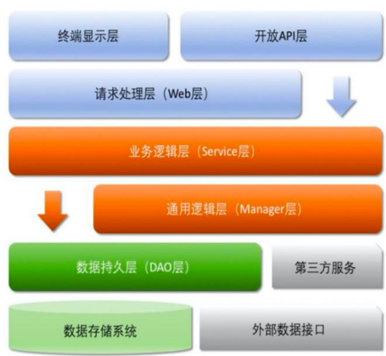

## (一) 应用分层
#### 1.【推荐】根据业务架构实践，结合业界分层规范与流行技术框架分析，推荐分层结构如图所示，默认上层依赖于下层，箭头关系表示可直接依赖，如：开放 API 层可以依赖于 Web 层（Controller 层），也可以直接依赖于 Service 层，依此类推：

* ⚫ 开放 API 层：可直接封装 Service 接口暴露成 RPC 接口；通过 Web 封装成 http 接口；网关控制层等。 
* ⚫ 终端显示层：各个端的模板渲染并执行显示的层。当前主要是 velocity 渲染，JS 渲染，JSP 渲染，移动端展示等。 
* ⚫ Web 层：主要是对访问控制进行转发，各类基本参数校验，或者不复用的业务简单处理等。 
* ⚫ Service 层：相对具体的业务逻辑服务层。 
* ⚫ Manager 层：通用业务处理层，它有如下特征

* 1）对第三方平台封装的层，预处理返回结果及转化异常信息，适配上层接口。
* 2）对 Service 层通用能力的下沉，如缓存方案、中间件通用处理。
* 3）与 DAO 层交互，对多个 DAO 的组合复用。

* ⚫ DAO 层：数据访问层，与底层 MySQL、Oracle、Hbase、OceanBase等进行数据交互。 
* ⚫ 第三方服务：包括其它部门 RPC 服务接口，基础平台，其它公司的 HTTP 接口，如淘宝开放平台、支付宝付款服务、 高德地图服务等。 
* ⚫ 外部数据接口：外部（应用）数据存储服务提供的接口，多见于数据迁移场景中。
#### 2.【参考】（分层异常处理规约）在 DAO 层，产生的异常类型有很多，无法用细粒度的异常进行 catch，使用 catch(Exception e) 方式，并 throw new DAOException(e)，不需要打印日志，因为日志在Manager 或 Service 层一定需要捕获并打印到日志文件中去，如果同台服务器再打日志，浪费性能和存储。在 Service 层出现异常时，必须记录出错日志到磁盘，尽可能带上参数和上下文信息，相当于保护案发现场。Manager 层与 Service 同机部署，日志方式与 DAO 层处理一致，如果是单独部署，则采用与Service 一致的处理方式。Web 层绝不应该继续往上抛异常，因为已经处于顶层，如果意识到这个异常将导致页面无法正常渲染，那么就应该直接跳转到友好错误页面，尽量加上友好的错误提示信息。开放接口层要将异常处理成错误码和错误信息方式返回。
#### 3.【参考】分层领域模型规约：
* ⚫ DO（Data Object）：此对象与数据库表结构一一对应，通过 DAO 层向上传输数据源对象。 
* ⚫ DTO（Data Transfer Object）：数据传输对象，Service 或 Manager 向外传输的对象。
* ⚫ BO（Business Object）：业务对象，可以由 Service 层输出的封装业务逻辑的对象。 
* ⚫ Query：数据查询对象，各层接收上层的查询请求。注意超过 2 个参数的查询封装，禁止使用 Map 类来传输。 
* ⚫ VO（View Object）：显示层对象，通常是 Web 向模板渲染引擎层传输的对象。 

## (二) 二方库依赖
#### 1.【强制】定义 GAV 遵从以下规则： 

* 1）GroupId 格式：com.{公司/BU}.业务线.[子业务线]，最多 4 级。
  * 说明：{公司/BU}例如：alibaba / taobao / tmall / kaikeba 等 BU 一级；子业务线可选。
  * 正例：com.taobao.jstorm 或 com.alibaba.dubbo.register
* 2）ArtifactId 格式：产品线名-模块名。语义不重复不遗漏，先到中央仓库去查证一下。
  * 正例：dubbo-client / fastjson-api / jstorm-tool
* 3）Version：详细规定参考下方。
#### 2.【强制】二方库版本号命名方式：主版本号.次版本号.修订号
* 1）主版本号：产品方向改变，或者大规模 API 不兼容，或者架构不兼容升级。 
* 2）次版本号：保持相对兼容性，增加主要功能特性，影响范围极小的 API 不兼容修改。
* 3）修订号：保持完全兼容性，修复 BUG、新增次要功能特性等。
说明：注意起始版本号必须为：1.0.0，而不是 0.0.1。

反例：仓库内某二方库版本号从 1.0.0.0 开始，一直默默“升级”成 1.0.0.64，完全失去版本的语义信息。
#### 3.【强制】线上应用不要依赖 SNAPSHOT 版本（安全包除外）；正式发布的类库必须先去中央仓库进行查证，使 RELEASE 版本号有延续性，且版本号不允许覆盖升级。
说明：不依赖 SNAPSHOT 版本是保证应用发布的幂等性。另外，也可以加快编译时的打包构建。
#### 4.【强制】二方库的新增或升级，保持除功能点之外的其它 jar 包仲裁结果不变。如果有改变，必须明确评估和验证。
说明：在升级时，进行 dependency:resolve 前后信息比对，如果仲裁结果完全不一致，那么通过 dependency:tree 命 令，找出差异点，进行<exclude></exclude>排除 jar 包。
#### 5.【强制】二方库里可以定义枚举类型，参数可以使用枚举类型，但是接口返回值不允许使用枚举类型或者包含枚举类型的 POJO 对象。
#### 6.【强制】二方库定制包的命名方式，在规定的版本号之后加“-英文说明[序号]”，英文说明可以是部门简称、业务名称，序号直接紧跟在英文说明之后，表示此定制包的顺序号。
说明：fastjson 给 SCM 定制的版本号：1.0.0-SCM1。注：请尽可能在应用端来解决类冲突和加载问题，避免随意发布此类定制包。
#### 7.【强制】依赖于一个二方库群时，必须定义一个统一的版本变量，避免版本号不一致。
说明：依赖 springframework-core，-context，-beans，它们都是同一个版本，可以定义一个变量来保存版本： ${spring.version}，定义依赖的时候，引用该版本。
#### 8.【强制】禁止在子项目的 pom 依赖中出现相同的 GroupId，相同的 ArtifactId，但是不同的 Version。
说明：在本地调试时会使用各子项目指定的版本号，但是合并成一个 war，只能有一个版本号出现在最后的 lib 目录 中。曾经出现过线下调试是正确的，发布到线上却出故障的先例。
#### 9.【推荐】底层基础技术框架、核心数据管理平台、或近硬件端系统谨慎引入第三方实现。 
#### 10.【推荐】所有 pom 文件中的依赖声明放在<dependencies></dependencies>语句块中，所有版本仲裁放在<dependencyManagement></dependencyManagement>语句块中。

说明：<dependencyManagement></dependencyManagement>里只是声明版本，并不实现引入，因此子项目需要显式的声明依赖，version 和 scope 都读取自父 pom。而<dependencies></dependencies>所有声明在主 pom 的<dependencies></dependencies>里的依赖都会自动引入，并默认被所有的子项目继承。
#### 11.【推荐】二方库不要有配置项，最低限度不要再增加配置项。
#### 12.【推荐】不要使用不稳定的工具包或者 Utils 类。
说明：不稳定指的是提供方无法做到向下兼容，在编译阶段正常，但在运行时产生异常，因此，尽量使用业界稳定的二方工具包。 
#### 13.【参考】为避免应用二方库的依赖冲突问题，二方库发布者应当遵循以下原则：
* 1）移除一切不必要的 API 和依赖，只包含 Service API、必要的领域模型对象、Utils 类、常量、枚举等。如果依赖其它二方库，尽量是 provided 引入，让二方库使用者去依赖具体版本号；无 log 具体实现，只依赖日志框架。 
* 2）每个版本的变化应该被记录，二方库由谁维护，源码在哪里，都需要能方便查到。除非用户主动升级版本，否则公共二方库的行为不应该发生变化。 
## (三) 服务器
#### 1.【强制】调用远程操作必须有超时设置。
说明：类似于 HttpClient 的超时设置需要自己明确去设置 Timeout。根据经验表明，无数次的故障都是因为没有设置超时时间。 
#### 2.【推荐】客户端设置远程接口方法的具体超时时间（单位 ms），超时设置生效顺序一般为：
* 1）客户端 Special Method；
* 2）客户端接口级别；
* 3）服务端 Special Method；
* 4）服务端接口级别。 
#### 3.【推荐】高并发服务器建议调小 TCP 协议的 time_wait 超时时间。
说明：操作系统默认 240 秒后，才会关闭处于 time_wait 状态的连接，在高并发访问下，服务器端会因为处于time_wait 的连接数太多，可能无法建立新的连接，所以需要在服务器上调小此等待值。

正例：在 linux 服务器上请通过变更/etc/sysctl.conf 文件去修改该缺省值（秒）：net.ipv4.tcp_fin_timeout=30
#### 4.【推荐】调大服务器所支持的最大文件句柄数（File Descriptor，简写为 fd）
说明：主流操作系统的设计是将 TCP / UDP 连接采用与文件一样的方式去管理，即一个连接对应于一个 fd。主流的 linux服务器默认所支持最大 fd 数量为 1024，当并发连接数很大时很容易因为 fd 不足而出现“open too many files”错误，
导致新的连接无法建立。建议将 linux 服务器所支持的最大句柄数调高数倍（与服务器的内存数量相关）。 
#### 5.【推荐】给 JVM 环境参数设置-XX：+HeapDumpOnOutOfMemoryError 参数，让 JVM 碰到 OOM 场景时输出 dump 信息。
说明：OOM 的发生是有概率的，甚至相隔数月才出现一例，出错时的堆内信息对解决问题非常有帮助。
#### 6.【推荐】在线上生产环境，JVM 的 Xms 和 Xmx 设置一样大小的内存容量，避免在 GC 后调整堆大小带来的压力。 
#### 7.【推荐】了解每个服务大致的平均耗时，可以通过独立配置线程池，将较慢的服务与主线程池隔离开，免得不同服务的线程同归于尽。 
#### 8.【参考】服务器内部重定向必须使用 forward；外部部重定向地址必须使用 URL Broker 生成，否则因线上采用 HTTPS 协议而导致浏览器提示“不安全”。此外，还会带来 URL 维护不一致的问题。
