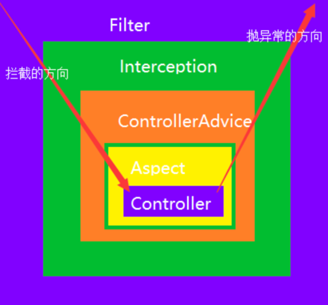

## Filter过滤器

> - **过滤器拦截web访问url地址**。 严格意义上讲，filter只是适用于web中，依赖于Servlet容器，利用**Java的回调机制**进行实现。
> - Filter**过滤器**：和框架无关，可以控制最初的http请求，但是更细一点的类和方法控制不了。
> - **过滤器可以拦截到方法的请求和响应(ServletRequest request, ServletResponse response)**，并对请求响应做出像响应的过滤操作，
> - 比如**设置字符编码，鉴权操作**等

## Interceptor拦截器

> - **拦截器拦截以 .action结尾的url，拦截Action的访问**。 Interfactor是基于**Java的反射机制**（APO思想）进行实现，不依赖Servlet容器。
> - **拦截器可以在方法执行之前(preHandle)和方法执行之后(afterCompletion)进行操作，回调操作(postHandle)**，**可以获取执行的方法的名称**，请求(HttpServletRequest)
> - Interceptor：**可以控制请求的控制器和方法**，但**控制不了请求方法里的参数(只能获取参数的名称，不能获取到参数的值)**
> - **（**用于处理页面提交的请求响应并进行处理，例如做国际化，做主题更换，过滤等）。

## Spring AOP拦截器

> - **只能拦截Spring管理Bean的访问（业务层Service）**。 具体AOP详情参照 [Spring AOP：原理、 通知、连接点、切点、切面、表达式](https://blog.csdn.net/fly910905/article/details/84025425)
> - 实际开发中，AOP常和事务结合：[Spring的事务管理:声明式事务管理(切面)](https://blog.csdn.net/fly910905/article/details/83547744)
> - **AOP操作可以对操作进行横向的拦截**，最大的优势在于他可**以获取执行方法的参数( ProceedingJoinPoint.getArgs() )**，对方法进行统一的处理。
> - Aspect : 可以自定义切入的点，有方法的参数，**但是拿不到http请求，可以通过其他方式如RequestContextHolder**获得(
    >
    >     ```cobol
>     ServletRequestAttributes servletRequestAttributes= (ServletRequestAttributes) RequestContextHolder.getRequestAttributes();
>     ```
    >
    >     )。
> - 常见**使用日志，事务，请求参数安全验证**等

### Spring对AOP的支持

Spring中AOP代理由Spring的IOC容器负责生成、管理，其依赖关系也由IOC容器负责管理。因此，AOP代理可以直接使用容器中的其它bean实例作为目标，这种关系可由IOC容器的依赖注入提供。

> Spring创建代理的规则为：  
> 1、默认使用Java动态代理来创建AOP代理，这样就可以为任何接口实例创建代理了  
> 2、当需要代理的类不是代理接口的时候，Spring会切换为使用CGLIB代理，也可强制使用CGLIB

AOP编程其实是很简单的事情，纵观AOP编程，程序员只需要参与三个部分：

>
> 1、定义普通业务组件  
> 2、定义切入点，一个切入点可能横切多个业务组件  
> 3、定义增强处理，增强处理就是在AOP框架为普通业务组件织入的处理动作

- 所以进行AOP编程的关键就是定义切入点和定义增强处理，一旦定义了合适的切入点和增强处理，AOP框架将自动生成AOP代理，
- 即：代理对象的方法=增强处理+被代理对象的方法。

## Filter与Interceptor联系与区别

> - 拦截器是基于java的反射机制，使用代理模式，而过滤器是基于函数回调。
> - 拦截器不依赖servlet容器，过滤器依赖于servlet容器。
> - 拦截器只能对action起作用，而过滤器可以对几乎所有的请求起作用（可以保护资源）。
> - 拦截器可以访问action上下文，堆栈里面的对象，而过滤器不可以。
> - 执行顺序：过滤前-拦截前-Action处理-拦截后-过滤后。

从上面对拦截器与过滤器的描述来看，它俩是非常相似的，都能对客户端发来的请求进行处理，它们的区别如下：

- **作用域不同**
    - 过滤器依赖于servlet容器，只能在 servlet容器，web环境下使用
    - 拦截器依赖于spring容器，可以在spring容器中调用，不管此时Spring处于什么环境
- **细粒度的不同**
    - 过滤器的控制比较粗，只能在请求进来时进行处理，对请求和响应进行包装
    - 拦截器提供更精细的控制，可以在controller对请求处理之前或之后被调用，也可以在渲染视图呈现给用户之后调用
- **中断链执行的难易程度不同**
    - 拦截器可以 `preHandle`方法内返回 false 进行中断
    - 过滤器就比较复杂，需要处理请求和响应对象来引发中断，需要额外的动作，比如将用户重定向到错误页面

### 小结

简单总结一下，拦截器相比过滤器有更细粒度的控制，依赖于Spring容器，可以在请求之前或之后启动，过滤器主要依赖于servlet，过滤器能做的，拦截器基本上都能做。

## Filter、Interceptor、aop拦截方向和抛出异常方向图

