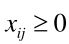
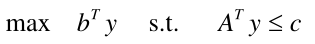

# 1、线性规划

## 1.1 线性规划的定义

线性规划的标准形式：


其中的 c 和 x 均为 n 维列向量，A、 Aeq 为适当维数的矩阵，b 、beq 为适当维数的列向量。

例如：x1 和 x2 称为决策变量，整个式子分为了目标函数和约束条件


总之， 线性规划问题是在一组**线性约束条件**的限制下， 求一线性目标函数最大或最小的问题。

## 1.2 线性规划的解

线性规划问题的标准数学形式：


满足（4）并使（3）达到最大值的可行解称为最优解；可行解构成的域称为可行域。

### 1.2.1 图解法

1.1 中例子的约束条件 x1 和 x2 可用域如下，显然，对于目标函数来说，x1 和 x2
越大，目标函数值越大，最优解为
，最优目标值为 z* = 26。


有如下结论：

1. 可行域可出现多种情况，既可能有界，也可能无界。
2. 可行域非空时，既可存在有限最优解，也可不存在最优解。
3. 若存在最优解，则必可找到具有可行域的“顶点” 。

### 1.2.2 MATLAB 解法

MATLAB 线性规划标准形式为


线性规划的函数为 linprog ，注意，linprog 求解的为线性规划最小值 min，若想求线性规划最大值，则需要对向量 c 取符号

```matlab
[x,fval] = linprog(c,A,b,Aeq,beq,LB,UB,X0,OPTIONS) 
```

fval 返回目标函数的值， LB 和 UB 分别是变量 x 的下界和上界，x0 是 x 的初始值，

> 例 1


m 文件：注意 linprog 中 c 取了负号


> 例 2


m 文件：


## 1.3 可转换为线性规划的问题


可取


那么问题转化为


> 例 3


其中 

对于以上问题，取  ，那么问题变为线性规划问题


## 1.4 运输问题

某产品有 m 个产地，n 个销地，各地产量为 a1，a2 ... am，各地需求量为 b1，b2 ... bn，从 i 到 j 的**单价**运费为
cij，问如何调度才可使总运费最省？

解：

引入 xij，其取值为由 i 产地运往 j 销地的该商品数量，有


对于产销平衡问题，有以下关系：


## 1.5 指派问题

n 个人干 n 项工作，若第 i 个人去干第 j 项工作，需要花费 cij 时间，给定矩阵 C = (cij) 问如何分配才可使花费总时间最短？

解：

引入变量 xij，用来表示第 i 个人是否做第 j 项工作，xij = 1 表示做，xij = 0 表示不做，那么可得到如下数学模型：


同理，xij 也可使用矩阵来表示，每行每列仅有一个为 1，其余为 0，因此这为 0-1 规划问题，针对指派问题，可将约束条件写为 xij >= 0
，m = n = n，ai = bi = 1 ，因此可发现，这个问题进一步简化为了运输问题。



### 1.5.1 指派问题的匈牙利算法

对系数矩阵 C 行或列进行线性变换，得到新的矩阵 B，矩阵 B 和 C 具有相同的最优指派。

> 例 4

指派问题的系数矩阵为


对其进行行列变换得到：


可发现，最优指派为 x12 = 1, x21 = 1, x33 = 1, x44 = 1


> 例 5

对于较为复杂的指派问题


对其进行线性变换，有


对于第 3 行和第 5 行，都只在第 1 个元素的位置为 0，那么这时无法得到最优指派，只能继续进行线性变换，有


这时，可发现，最优指派为 x12 = 1, x24 = 1, x31 = 1, x43 = 1, x55 = 1


## 1.6 对偶理论与灵敏度分析

### 1.6.1 原始问题和对偶问题


称（P）为原始问题， （D）为它的对偶问题。 注意变换时 c 和 b 的位置。

对于如下线性规划问题：


可改写为


那么对偶问题为


令 y = y1 - y2 ，又可写成


可将原始问题转化为对偶问题进行求解，在求出最优解后，再根据性质反求出原始问题的最优解。

### 4.2 灵敏度分析

灵敏度分析就是系数、常数等发生变化时， 已求得的线性规划问题的最优解会有什么变化；或者这些系数在什么范围内变化时，
线性规划问题的最优解或最优解不变。也可理解为鲁棒性。

## 1.7 投资的收益和风险

以一个题目为例对本知识点进行总结。

### 1.7.1 问题描述

市场上有 n 种资产 si(i = 1, 2, ..., n)，目前资金总数为 M，资产 si 的收益率为 ri，亏损率为 qi，交易费率为 pi，在不超过金额 ui
时，交易费按 ui 计算，假设银行存款利率为 r0。r0 = 5%

n = 4 时


目标是使净收益尽可能大，总风险尽可能小。

### 1.7.2 符号规定

定义 xi 为投资 si 的资金，a 为投资风险度，Q 为总体收益。

基本假设：

1. 投资数额 M 相当大，为了便于计算，假设 M = 1
2. 投资越分散，总的风险越小
3. 总体风险用所投资的所有项目中最大的一个风险来度量
4. n 种资产之间是相互独立的
5. ri，pi，qi，r0 为定值，不受外界影响

### 1.7.3 建模与分析

模型为：目标函数第一个为收益，第二个为风险


### 1.7.4 模型简化

> 固定风险水平，优化收益

在实际中，由于承受风险能力不同，因此规定一个风险界限 a，使得  ，那么模型变为

模型一：


> 固定盈利水平，极小化风险

若希望总盈利到达 k 以上，则目标函数变为了极小化风险

模型二：


> 权衡资产风险和预期收益

对风险和收益进行权衡，设置权重 s (0 < s < 1)，s 称为投资偏好系数

模型三：


### 1.7.5 模型的求解

以上模型的求解可使用 MATLAB 解法进行解决，以模型一为例


从 a = 0 开始，以步长 0.001 循环搜索，MATLAB 代码如下：


### 1.7.6 结果分析

1. 风险大，收益也大。
2. 当投资越分散时，投资者承担的风险越小，冒险的投资者会出现集中投资的情况，保守的投资者则尽量分散投资。
3. （根据 MATLAB 图形进行说明）在 a = 0.006
   附近有转折点，在这一点左边，风险增加很少时，利润增长很快。在这一点右边，风险增加很大时，利润增长很缓慢，所以对于风险和收益没有特殊偏好的投资者来说，应该选择曲线的拐点作为最优投资组合，大约
   a = 0.6%，Q = 20%，（然后计算投入各个资产的资金数量）x0 = 0, x1 = 0.24, x2 = 0.4, x3 = 0.1091, x4 = 0.2212.