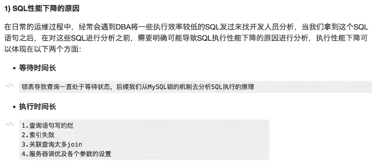
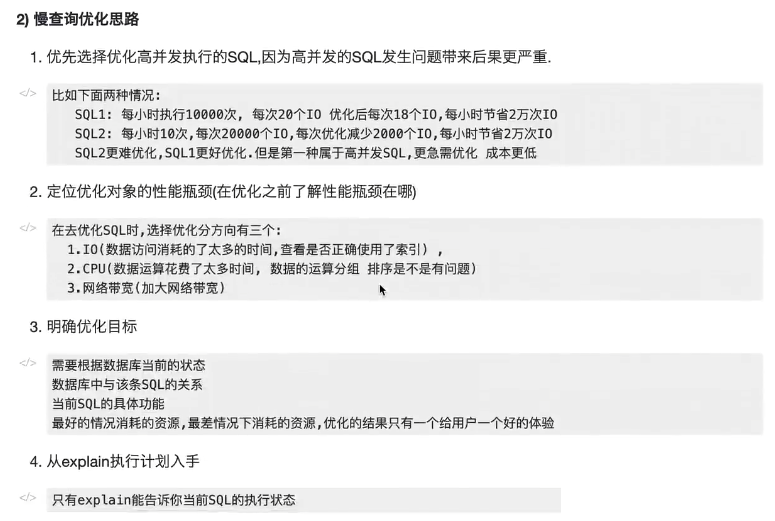
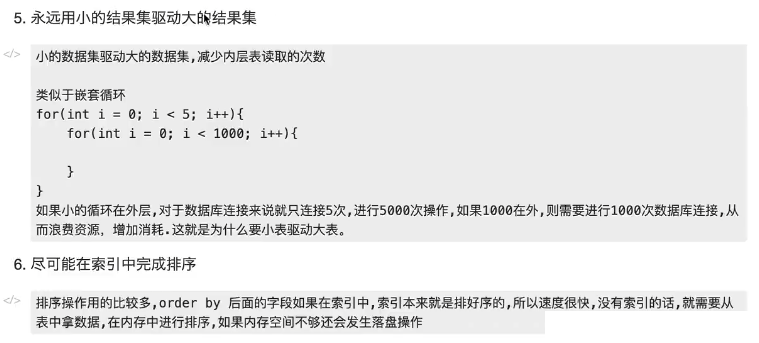
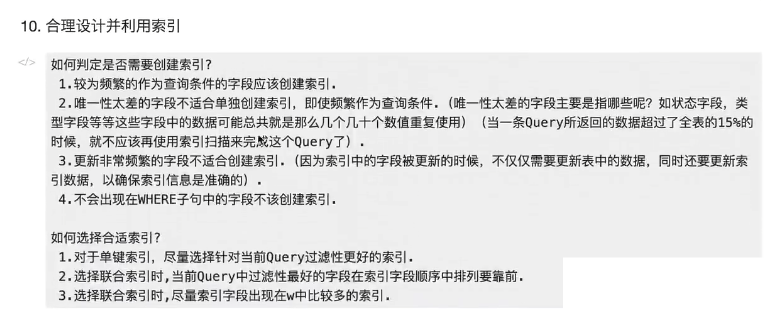
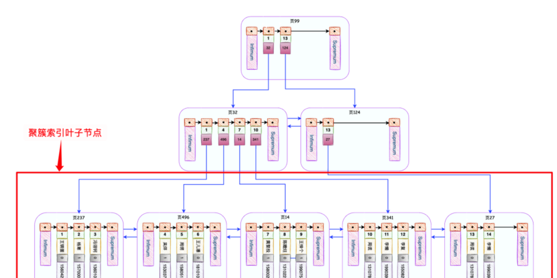
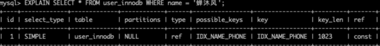
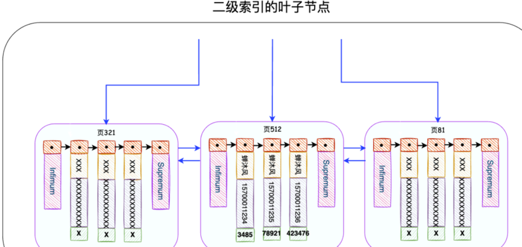
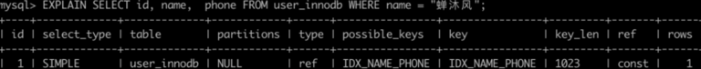

## 简介

MySQL服务器处理查询请求的整个过程：

* 客户端发送SQL强求给服务器
* 服务器检查是否可以在查询缓存中命中该SQL
* 服务器端进行SQL解析，预处理，再由优化器生成对应的执行计划
* 根据执行计划，调用存储引擎API来查询数据
* 将结果返回给客户端
查询性能低下最基本的原因是访问的数据太多。

## 一、如何优化慢查询？

1，首先开启慢查询日志：

* long_query_time（多长时间视为慢查询）
* slow_query_log（是否开启了慢查询日志，off表示未开启）
* slow_query_log_file（慢查询日志存放的位置）

2.慢查询优化思路：








3，分析慢查询语句，来进行相应的优化

* ①建立索引
* ②减少表之间的关联
* ③优化sql，尽量让sql很快定位数据，不要让sql做全表查询，应该走索引，把数据量大的表排在前面
* ④简化查询字段，没用的字段不要，已经对返回结果的控制，尽量返回少量数据

## 二、数据库优化的方法：

1，SQL语句优化：
* ①应该尽量避免在where子句中使用！=或者<>操作符，否则将引擎放弃使用索引而进行全表扫描
* ②应尽量避免在where子句中对字段进行null值判断，否则将导致引擎放弃使用而进行全表扫描
* ③很多时候，用exits代替in是一个很好的选择
* ④用where子句替代having子句，因为having只会在检索出所有记录之后才对结果集进行过滤

2，索引优化：
* ①为经常出现在关键字order by，group by，distinct后面的字段，建立索引
* ②为经常用作where查询选择的字段，建立索引
* ③在经常用作表连接的属性上建立索引
* ④更新非常频繁的字段不适合建立索引

3，数据库结构优化：
* ①范式优化（如消除冗余，节省空间）
* ②反范式化优化（适当增加冗余）
* ③拆分表（不同分区的数据可以指定保存在处于不同磁盘上的数据文件里）
* ④拆分又分为垂直拆分和水平拆分

4，服务器硬件优化（对花钱）

## 三、MySQL查询优化（0其实这个概念比较偏小，上一道题的概念比较偏大）：

* 应该尽量避免全表扫描，首先应考虑哎where及order by涉及的列上建索引
* 尽量避免在where子句中对字段进行null值判断
* 尽量避免在where子句中使用or来连接条件
* 尽量避免在where子句中使用！=或<>操作符
* in和not in也要慎用
* %aa%应尽量避免
* 尽量避免在where子句中对字段进行表达式操作
* 在where子句中使用参数慎用
* 尽量避免在where子句中进行函数操作
* 不要在where子句中的“=”左边进行函数算术运算或其他表达式运算
* 若使用复合索引，则必须使用到该索引中的第一个字段作为条件时才能保证系统使用索引
* 不要写无意义的查询，select…from…where 0=1
* 用exists代替in是一个很好的选择
* 建立索引时要慎重（并不是越多越好）
* 应尽量避免更新cluster（索引数据列）
* 尽量使用数字型字段（尽量不要设计为字符型）
* 尽量使用varchar/nvaechar代替char/nchar，因为变长字段存储空间小
* 尽量避免select * from t
* 尽量使用表变量来代替临时表

## 四、为什么Like以%开头索引会失效 ？

like失效的原因：

* %在右：由于B+树的索引顺序，是按照首字母的大小进行排序，%号在右的匹配又是匹配首字母，所以可以在B+树上进行有序的查找，查找首字母符合要求的数据。
* %在左：是匹配字符串尾部的数据，我们上面说了排序规则，尾部的字母是没有顺序的，所以不能按照索引顺序查询，就用不到索引。
* 两个%号：这个查询任意位置的字母满足条件即可，只有首字母是进行索引排序的，其他位置的字母都是相对无序的，所以查找任意位置的字母是用不上索引的。

解决%出现在左边索引失效的方法，使用覆盖索引。

## 五、select * 为什么禁止使用？

为了说明这个问题，我们需要建一个表:
```sql
CREATE TABLE `user_innodb` (
`id` int NOT NULL AUTO_INCREMENT,
`name` varchar(255) DEFAULT NULL,
`gender` tinyint(1) DEFAULT NULL,
`phone` varchar(11) DEFAULT NULL,
PRIMARY KEY (`id`),-----主键索引
KEY `IDX_NAME_PHONE` (`name`,`phone`) USING BTREE-----name和phone的联合索引
) ENGINE=InnoDB DEFAULT CHARSET=utf8mb4 COLLATE=utf8mb4_0900_ai_ci;

```

我们创建了一个存储引擎为InnoDB的表user_innodb，并设置id为主键，另外为name和phone创建了联合索引，最后向表中随机初始化了500W+条数据。

InnoDB会自动为主键id创建一棵名为主键索引（又叫做聚簇索引）的B+树，这个B+树的最重要的特点就是叶子节点包含了完整的用户记录，大概长这个样子：



如果我们执行这个语句：
```sql
SELECT * FROM user_innodb WHERE name = '蝉沐风';

```

使用EXPLAIN查看一下语句的执行计划：



发现这个SQL语句会使用到IDX_NAME_PHONE索引，这是一个二级索引。二级索引的叶子节点长这个样子：



InnoDB存储引擎会根据搜索条件在该二级索引的叶子节点中找到name为蝉沐风的记录，但是二级索引中只记录了name、phone和主键id字段（谁让我们用的是SELECT *呢），因此InnoDB需要拿着主键id去主键索引中查找这一条完整的记录，这个过程叫做回表。

想一下，如果二级索引的叶子节点上有我们想要的所有数据，是不是就不需要回表了呢？是的，这就是覆盖索引。

举个例子，我们恰好只想搜索name、phone以及主键字段。
```sql
SELECT id, name,  phone FROM user_innodb WHERE name = "蝉沐风";
```
使用EXPLAIN查看一下语句的执行计划：



可以看到Extra一列显示Using index，表示我们的查询列表以及搜索条件中只包含属于某个索引的列，也就是使用了覆盖索引，能够直接摒弃回表操作，大幅度提高查询效率。

小总结及问题：

1.select * from 表 where name = “蝉沐风” 与 select id,name,gender,phone from 表 where name = “蝉沐风” 效率一样吗？

答：一样；因为只是在name和phone建立了联合索引，根据上面的分析，
可以看到二级索引中的树的情况，叶子节点中只有name、phone、id ;
但是叶子节点中没有gender这个字段 ，
想要获得这个gender字段，必须根据二级索引得到id，
然后根据id去查主键索引得到id，name、gender、phone等所有字段。
select * 也是类似的。所以两个的效率是一样的。