# 第一章

### 1.运筹学（operations Research，简称OR）是一门研究如何有效的组织管理人机系统的科学。

### 2.运筹学的目的是通过定量分析为决策和揭露新问题提供数量根据

### 3.运筹学利用计划方法和有关学科的要求把复杂功能关系表示成数学模型，其目的是通过定量分析为决策和揭露新问题提供数量根据

### 4.运筹学应用分析的经验和数量的方法，对各种可供选择的方案进行比较评价，为制定最优的管理决策提供数量上的依据。

### 5.对于管理领域，运筹学也是对管理决策工作进行决策的计量方法。

### 6.在当今信息时代，运筹学和计算机方法的分界线将会消失，并将脱离各自原来的领域，组合成更通用广泛的管理科学的形式

### 7.根据决策人员的主观经验或知识而制定的决策，称之为定性决策

### 8.必须运用定性和定量两种方法才能制定的决策，称之为混合性决策

### 9.借助于某种正规的计量方法而做出的决策，称之为定量决策

# 第二章

### 1.作为运筹学应用者，接受管理部门的要求，去收集和阐明数据，建立和试验数学模型，预言未来作业，然后制定方案，并推荐给经理部门。

### 2.问题域的环境有内部环境和外部环境。

### 对企业来说，

- 内部环境一般指问题域内部的人、财、物之间的交互活动。
- 外部环境一般指问题域界面与外界的人、财、物之间的交互活动

### 3.SWOT分析和决策不属于应用运筹学进行决策过程

### 4.运筹学科学方法论的六个步骤

### 　　①观察待决策问题所处的环境

### 　　②分析和定义待决策的问题

### 　　③拟定模型

### 　　④选择输入资料

### 　　⑤提出解并验证它的合理性

### 　　⑥实施最优解

### 5.应用运筹学方法进行决策过程中，一旦建立成适当的模型，就要准备收集哪个模型所需要的数据

### 6.预测是决策基础。企业预测的目的就是为企业决策提供适当的数据或资料

### 7.预测就是对未来的不确定的事件进行估计或预判

### 8.不属于微观经济学的内容是国民收入增长率

### 9.对科学发展趋势和发明、科学发展、产品发展与社会生活的关系等预测属于科学预测

### 10.社会预测

- 人口增长预测属于社会预测
- 社会购买心里的预测属于社会预测

### 11.定性预测有两种方法

- 专家小组法（面对面讨论，容易被权威影响、适用于短期预测）
- 特尔斐法（专家群、匿名获取意见、多次信息反馈、适用于长期预测）

### 12.军事预测是研究与战争、军事有关的问题

### 13.按内容划分，预测方法中包含经济预测

### 14.按内容划分的预测方法

- 经济预测
- 社会预测
- 科学预测
- 军事预测

### 15.定性预测又称之为直观预测，是指利用直观材料，依靠个人经验的主观经验的主管判断和分析能力，对未来的发展进行预测

### 16.科技预测年限范围

- 短期的年限是5~10年
- 中期的年限是10~30年
- 长期的年限是30~50年

### 17.外推法包含时间序列分析法

### 18.凡利用历史数据来推算事物发展趋势的叫外推法，常用的有时间序列分析法

### 19.凡利用事物内部因素发展的因果关系来预测事物发展趋势的叫因果法，常用的有回归分析法、经济计量法、投入产出分析法等

### 20.根据历史数据和资料，应用数理统计方法来预测事物的未来，或者利用事物发展的因果关系来预测事物的未来，属于定量预测

### 21.经济预测分为两种

- 宏观经济预测：国民经济范围（国民收入增长率）
- 微观经济预测：单个实体经济（市场需求、市场占有率、产品的销售额）

### 22.一般而论，1~3年内的经济预测为中期预测

### 23.经济预测的年限范围

- 短期（近期）预测是1年内
- 中期预测是1~3年内
- 长期预测是3~5年内

### 24.描述国民经济大系统以及相关经济变量的社会综合值的预测属于宏观经济预测

### 25.技术预测包括：新技术发明可能应用的领域范围和速度、新设备、新工艺、新材料的特点、性能及作用等

### 26.预测的方法

- 定性预测
- 定量预测

### 27.[滑动平均预测法](https://www.cnblogs.com/saoge/p/16079225.html)

### 28.带权滑动平均数

### 29.指数平滑预测法

### 30.平滑公式:8月份预测值 = 7月份实际值*平滑系数+(1-平滑系数)*7月份预测值

### 31.若是商品看涨或看跌滑动系数大于1较为合理

### 32.回归模型预测法(回归分析法)

### 33.直线方程:y=a+bx

### 34.回归分析法就是依据事物发展的内部因素变化的因果关系来预测事物未来的发展趋势

### 35.相关关系是由于变量之间的因果关系存在着其他因素的干扰与影响,使变量间的关系出现不确定性

### 36.一元线性回归:只有一个X,表达式:y=a+bx

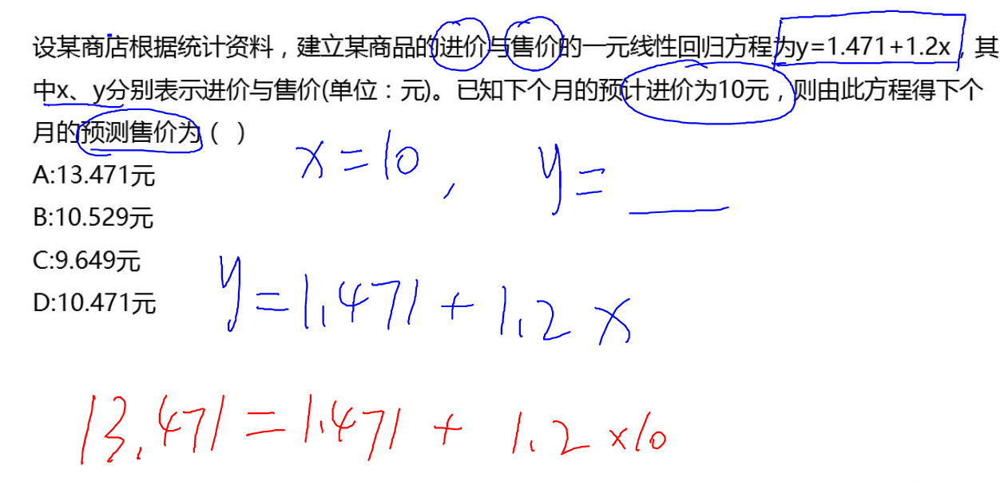

### 37.多元线性回归:多个X

### 38.最小二乘法:寻求使误差平方总和为最小的配合趋势线的方法

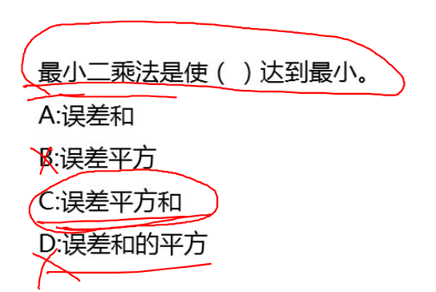

### 39.回归模型建立后,还需要经过相关检验,才能应用与预测

### 40.可以根据已知数据计算出相关系数R,根据R的大小来判定Y与X的相关程度

### 41.R的取值范围是[-1,1],即-1<=R<=1

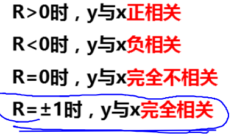

### 42.置信区间:这个值和实际值达到概率的95%

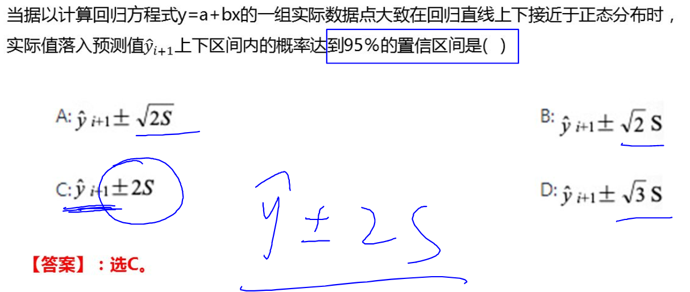

### 43.季节性变动的预测

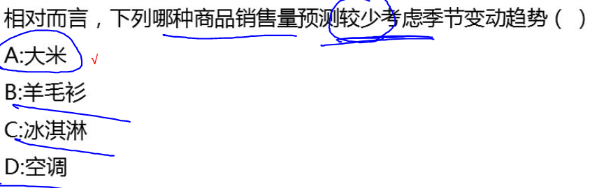

### 44.调整成本采用指数平滑法进行预测,依然选用较小的a

# 第三章

### 1.在不同环境下的决策

- 确定条件的决策:只存在一种状态
- 不确定条件下的决策:存在一个以上的状态,不完全了解概率
- 风险条件下的决策:根据概率值,有概率就有风险

### 2.决策的分类

- 计划性决策:制定计划时做的决策
- 控制性决策:实施计划时做的决策
- 常规性决策:重复性决策(吃饭)
- 特殊性决策:无先例的新问题(报专业)

### 3.西蒙在<管理决策新科学>,管理的关键在于决策

### 4.广义的决策的四个程序

- 明确决策的目的
- 寻找可行的方案
- 在诸多可行方案中进行抉择
- 对选定的方案实施后的结果进行总结评价
  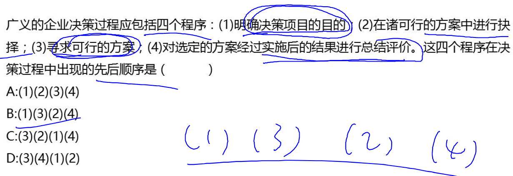

### 5.决策的概念:明确目标问题,并拟定多个可行方案,在选中最佳方案的全过程

### 6.最大最大决策标准:乐观->先大后大(max{a,b,c})

### 7.最大最小决策标准:悲观->先小后大(先min后max)

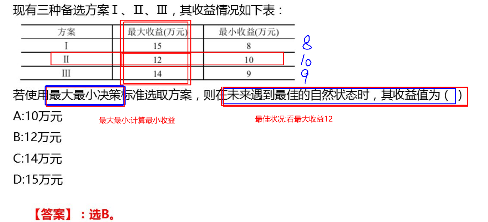

### 8.现实主义决策标准:

- 折中主义决策标准
- 最佳概率定为a,最差概率定义为(1-a)
- a=折中系数
- 范围(0<a<1)
- 公式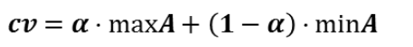
- 先算CV在max

### 9.最小最大遗憾值决策标准

- 遗憾值 = 后悔值
- 画图:收益值改为遗憾值
- 用该列最大值-其他值=遗憾值
- 最后max所有遗憾值行,后在min结果遗憾值
  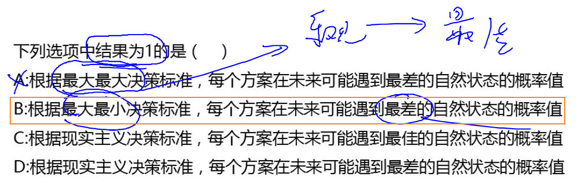

### 10.最大期望收益值标准:

- 用概率作为其权重,计算加权平均数-期望收益
- 公式:收益1 * 概率1 + 收益2 * 概率2 + 收益3 * 概率3 = 期望收益
- 根据公式计算期望值收益后,在进行max期望收益
- 收益 = 售价 * 售出数量 - 成本 * 生产数量
  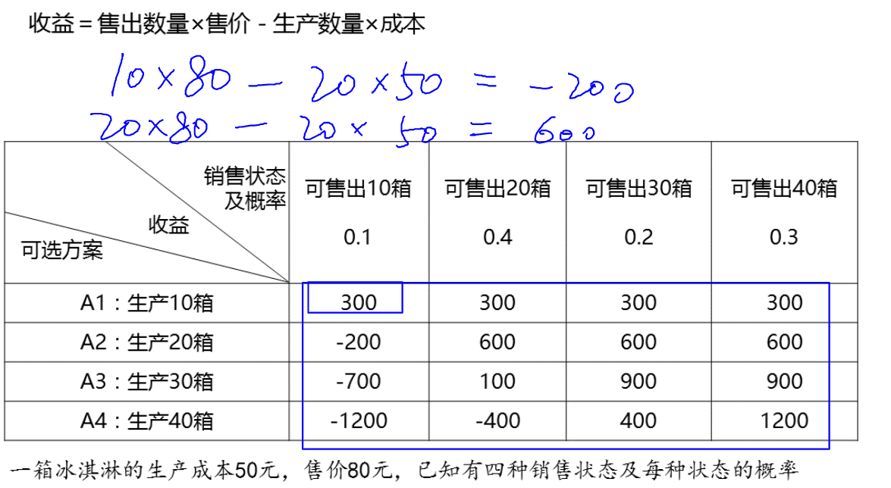

### 11.最小期望损失值标准

### 12.决策树

- 不仅可以解决但阶段决策问题,而且可以应用于复杂的多阶段决策
- 方块结点 -> 决策结点 -> 决策两个节点的线叫方案枝
- 圆圈结点 -> 状态结点 ->两个节点的线叫状态枝

### 13.总结

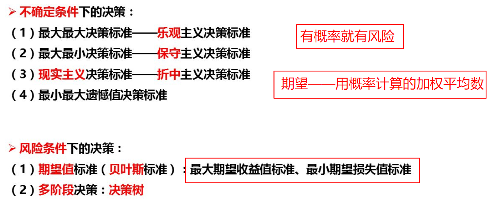

### 14.案例

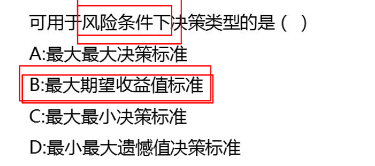

# 第四章

### 1.库存管理的对象

- 原材料,半成品
- 在制品
- 成品

### 2.库存管理的意义

- 保证企业按计划实现均衡生产,不能因缺少原材料或卡物质而停工停产
- 使库存管理的总费用达到最低

### 3.存货台套法:以存货台套作为存货管理的单位,在一个存货台套中可以包括有关的各种单项存货,是一种单位

### 4.ABC分析法:按照年度需用价值

- A类:(特殊物品,数量少,但很重要,很值钱)数量10% 年度需用价值70%
- B类:(数量30%,年度需用价值20%)
- C类:(数量60%,年度需用价值10%)不值钱,但数量多

#### 5.原材料库库存费用模型构造: 库存费用 = 订货费 +保管费

- 保管费用:折旧和管理
- 订货费用:订货需要的费用(采购人员的工作,差旅费)
- 基本都是按年算的,订货费用都是固定的
- 订货费 = 每年订货次数 * 每次订货费用
- 保管费 = 全年需求量 / 每年订货次数 * 每次原材料保管费
- 运费不算订货费,算进厂价

### 6.半成品和成品库:库存费用 = 工装调整费 + 保管费

- 工装调整费:(设备调整和检验所需费用)

### 7.年需求量固定的情况下

- 订货次数越多,订货费用越多,订货量越少,保管费用越低
- 订货次数越少,订货费用越少,订货量越多,保管费用越高

### 8.平均库存概念

- 平均库存量等于订货批量大小的一半
- 平均库存 = 订货量 / 2

### 9.订货费用 = 年需要量 / 订货量 * 一次订货费

### 10.保管费用 = 平均存货量 * 每一库存台套的年保管费用 =最佳订货量 / 2 * 单价 * 保管费用率

- 平均存货量 = 最佳订货量 / 2
- 每一库存台套的年保管费用 = 单价 * 保管费用率
- 平均库存量就是平均存货量
  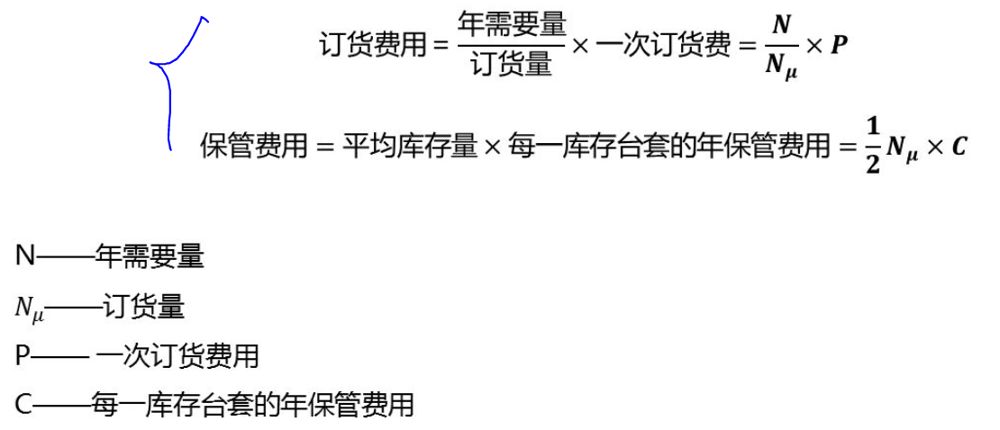

### 11.经济订货量(EOQ)是使总存货费用达到最低的某个存货台套的最佳订货批量,使全年保管费用和订货费用的总和达到最小值

### 12.当订货费用 = 保管费用 时达到最小

### 13.最佳订货量 = 2订需/存 开根号

### 14.最佳订货次数 = 年需要量 / 最佳订货量

### 15.最佳订货间隔期 = 最佳订货次数 / 365

### 16.平均存货量 = 最佳订货量 / 2

### 17.平均存货额 = 最佳订货量 / 2 * 单价 = 平均存货量 * 单价

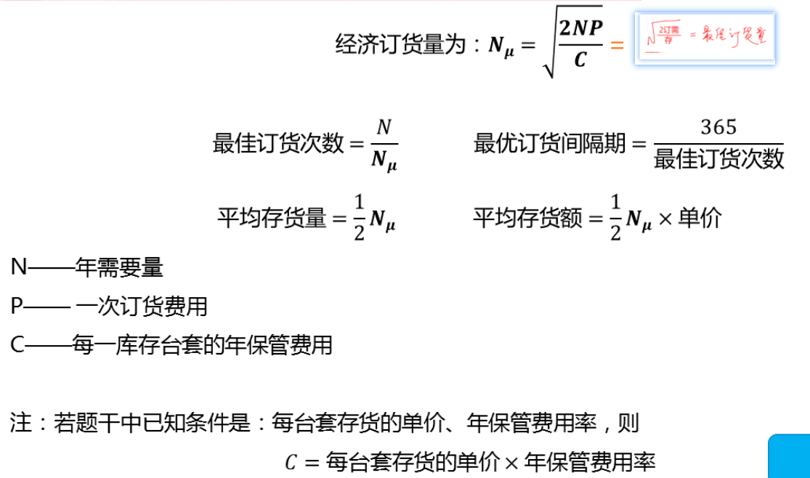

### 18.订货时间的确定

- 前置时间 = > 订货提前期
- 再订货点 :再订货的时间或订货的数量
- 缺货是指仓库中已没有某项存货可以满足生产需求或销量需要时的状况

### 19.确定库存模型的前提是:使用量和提前时间都是恒定的

### 20.避免缺货

- 增加订货库存
- 订货催运
- 提高前置时间
- 安全库存量=>库存预警:防止缺货的额外库存

### 21.大批量采购

- 优点:订货费低,降低了订货费用
- 缺点:保管费用高

# 第五章

### 1.图解法

- 先设置x1,x2,f公式,和2个不等式,x1>=0,x2>= 0
- 根据两个不等式画图,一个不等式一条线,x1和x2分别等于0 带入不等式得到两个点
- 解二元一次方程,带入法或加减消除法
- 算出图中的交叉点的两个值
- 再将三个点的值分别带入f 公式算出值
- 最后max算出的三个点值

### 2.现性规则是一种合理利用资源'合理调配资源的应用数学方法

### 3.线性规划的基本特点是模型中的线性函数

### 4.线性规划模型结构

- 变量是指实际系统或决策问题中有待确认的未知因素
- 目标函数是决策者对决策问题目标的数学描述,是一个极值问题,即极大值或极小值
- 约束条件是指实现目标的限制因素
- 线性规划的变量为非负值

### 5.线性规划的基本特点是模型的数学表达式是线性函数

### 6.线性规划的解法有图解法和单纯形法两种

- 图解法:适用于解2~3个变量的线性规划问题,满足约束条件的解称之为可行解 (图形的阴影部分)
- 可行解区就是全部可行解所分布的区域,又称凸集(图形的阴影部分)
- 可行解区域内满足目标函数的解称之为最优解

### 7.线性规划的基本原理:如果线性规划问题有最优解,最优解必在可行解区边缘折线的凸交点上

### 8.单纯形法

- 引入辅助变量(松弛变量)k1和k2,将约束条件的不等式转变成等式
- 约束条件的大于等于,则引进剩余变量和人工变量
- k1和k2是多用的原材料(基变量),约束方程组的通解
- 非基变量x1和x2一个具体的值,九可以获得到一个特解(特解有多个)
- 所有非基变量都等于0的特解称之为基解
- 当基解满足非负的要求时,叫可行基解
- 一个线性规划问题,若有最优解,那么最优解必然是一个基变量组的可行基解
- 一个基变量组有一个通解,一个基解,无数个特解(总结:只有特解是多个,其他只有一个)
- 先写不等式解出后,要画图

### 9.线性规划模型的标准形式中约束条件为等式方程组

### 10.线性规划模型因素

- 决策问题目标->目标函数
- 限制因素->约束条件
- 未知因素->变量
- 基本特性->线性函数

### 11.单渠道随机排队法:由一个单服务台,随机到达和随即服务时间的情况形成

# 第六章

### 1.求得一个最初的运输方案

- 西北角法(阶石法)-求最初运输方案

### 2.初始运输方案数字格的数目应为:(m + n - 1)

### 3.寻求改进方案

- 闭合回路法->改进路线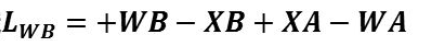

### 4.建立改进方案

- 在所有空格中,挑选绝对值最大的负改进指数所在的空格作为调整格
- 在调整路线中,选中负号格的最小运量作为调整运量

### 5.最优方案可以继续改进,改进之后运输费用已经不能进一步降低

### 6.当所有空格的改进指数都大于或等于0时,就得到了最优方案

### 7.运输问题必然有最优方案,但最优方案不一定是唯一.

### 8.修正分配法(位势法)

- 先求每一个空格的改进指数
- 再寻求最优改进指数的改进路线
- 没有讲,主要用于电脑的

### 9.修正分配法与闭合回路法的关系

- 闭合回路法是修正分配法的基础
- 修正分配法更简便
- 两种方法的结果是相同的

### 10.运输问题属于线性规划问题.

### 11.产销不均衡,我们可以通过虚设一个产地或销地解决

### 12.可求解运输问题的最简便方法是表上作业法.

### 13.运输问题的解是指满足要求的各供应点到各需求点的运量.

### 14.平衡运输问题的所有产地的总产量和所有销地的总需求量相等.

### 15.表上作业法是指首先把产销平衡表和运价表压缩在一张表格里,然后求出一个初始调运方案,再加以判断和调整,直至求得最优方案的方法

### 16.表上作业法的基础是单纯形法

### 17.对于供需平衡的运输问题和供需不平衡的运输问题,其结构模型是不同的,所以要分别对待

- 供需平衡
- 供大于需
- 供小于需

### 18.当存在最优解时,其中数字格有m+n-1个

### 19.改进指数(位势差)就是指循着改进路线,当货物的运输量作为一个单位的变化时,会引起总运输费用的改变量

### 20.闭合回路法需要先对各个空格寻求一条闭合的改进路线

### 22.都是负数,运量最小,绝对值最大

### 23.退化现象:数字格子<m+n-1

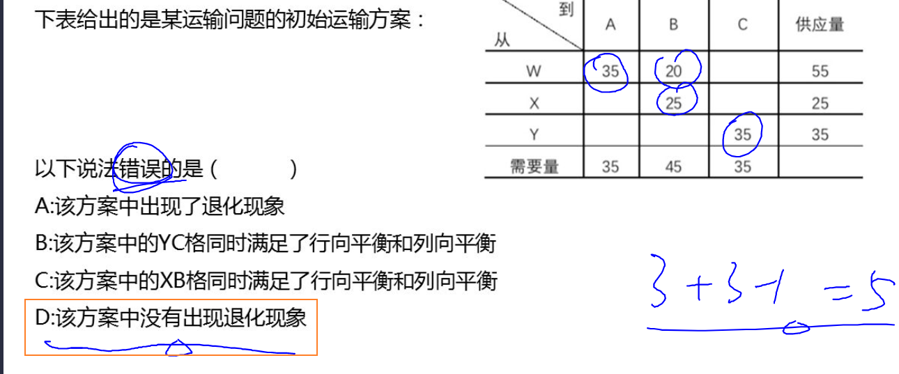

# 第七章

### 1.网络图的分类

- 线路
- 结点
- 箭线
- 虚活动

### 2.网络计划技术是综合运用计划评核术和关键路线法的一种比较先进的计划管理方法

- 计划评核术是对计划项目进行核算'评价,然后选定最优计划方案的技术
- 关键路线法是再计划项目的各项错综复杂的工作中,抓住其中的关键路线(路长最大的线路)进行计划安排的一种方法

### 3.网络图分两种

- 结点式网络图以结点代表活动,以箭线代表个活动的先后承接关系(开始和完成)
- 箭线式网络图以箭线代表活动(作业),以结点代表活动的开始和完成

### 4.箭线式网络图

- 线路:起点沿着箭线方向到终点的线
- 结点:活动的开始或完成,两个活动之间的交接点,不消耗资源,不占用时间
- 箭线(活动:消耗资源,占用时间)
- 虚活动:可有可无,不消耗资源,不占用时间
- 路长:线路的长度
- 关键线路:总作业时间最长(路长最大的线路)

### 5.活动明细表

- 箭线(活动)
- 编号必须是奇数
- 如果有两个以上紧前活动,就可以加虚活动
- 关键线路:双横线,不等减少工期

### 6.某工程 各道工具已确定,为使其达到"成本最低和工期合理"的要求,进行优化时应采用网络计划技术.

### 7.网络计划技术是解决组织生产和进行计划管理的科学方法

### 8.网络计划技术的基础是网络图

### 9.作业时间(T)就是在一定的生产技术条件下,完成一项活动或一道工序所需的时间

### 10.确定作业时间两种方法

- 单一时间估计法:在估计各项活动的作业时,只确定一个时间值
- 三种时间估计法
    - 最乐观时间 -> 最短时间
    - 最保守时间 -> 最长时间
    - 最可能时间 -> 可能性最大时间
    - 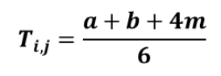

### 11.图上计算法:网络时间的计算方法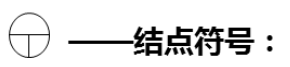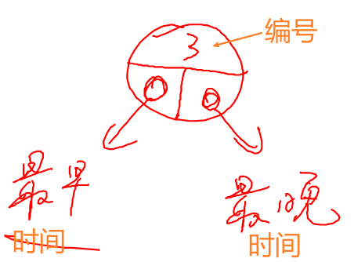

### 12.结点最迟完成时间

### 13.因为不占用时间,所以一个结点的最迟完成时间和最迟开始时间是同一个时间

### 14.最早时间:(早大晚小)

### 15.最晚时间:(早大晚小)

### 16.结点的时间

- 最早开始
- 最晚开始
- 最早完成
- 最晚完成

### 17.活动最早开始时间是箭尾结点的最早完成时间

### 18.活动最迟完成时间是箭头结点的最晚完成时间

### 19.最迟开始时间等于他的最迟完成时间减去所需作业时间

### 20.表格技计算法

### 21.时差为0的点就是关键结点,关键结点从起点到终点合起来就是关键线路

### 22.总时差:后大 - 前小 - 作业时间

### 23.专用时差:后小 - 前大 - 作业时间

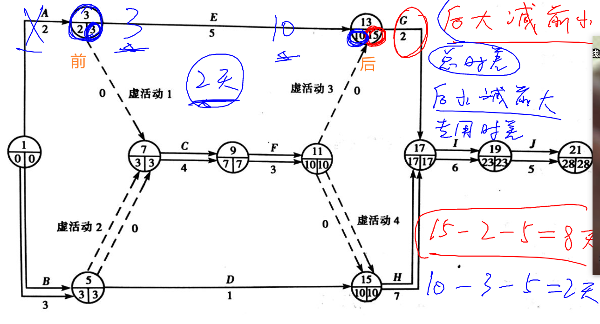

### 24.局部时差:只耽误一边

### 25.两个关键结点之间的几个活动连续相接的连线称为线段

### 26.线段时差等于线段中各个活动总时差的最长者

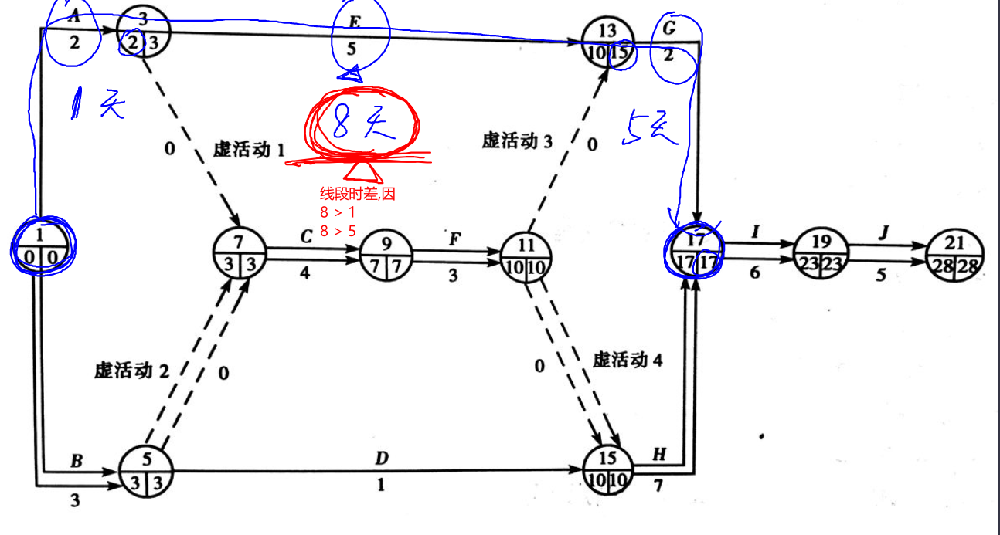

### 27.线路时差等于各个线段时差之和

### 28.时间优化目的

- 周期最短
- 成本最低

### 29.网络计划优化的内容有已下三个

- 时间优化
- 时间与资源优化
- 时间与成本优化
- 没有单纯的资源优化或成本优化

### 30.缩短工程周期的方法主要有

- 技术革新
- 做好管理工作
- 采用标准件,通用件
- 组织平行作业
- 组织交叉作业
- 多班制

### 31.时间与成本优化

- 费用
    - 直接费用:材料,直接工人工资,折旧费
    - 间接费用:管理员工资
- 时间
    - 正常时间
        - 极限费用是完成活动的最低费用
    - 极限时间:加班
        - 极限时间是完成活动的最短时间
    - 极限费用:加班费
    - 费用增长与作业时间缩短之间的比率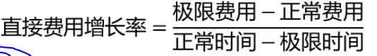

# 第八章

### 1.图的基本概念

- 图的基本要素是:点以及点之间的一些连线
- 通常用点表示我们所能要研究的对象
- 用线表示对象之间的某种特定关系
- 有向线:箭头的线叫
- 杈:线旁边表上数

### 2.连通图是网络图中所有的点相互连通(城市道路,下水道)

### 3.最小枝杈树问题

- 长度最短的连通图
    - (从起点出发到所有点,全部支线的总长度最小)
- 解决方案
    - 普赖姆法
    - 克鲁斯咯尔法

### 4.特殊的图:连通,但不含圈,称之为树(树的树线等于点数减一)

### 5.任何不连通图都不是树

### 6.最短连通图

### 7.最短路线问题

- 寻找从入口到出口所需的最少时间,最短时间或最少费用的路径问题,称做网络的路线问题

### 8.最大流量问题

- 当物体,能量或信息作为流量流过网络时,怎样使流过网络的流量最大
- 或者使流过的流量的费用或时间最小
- 设计这样的流量模型问题,叫做网络的流量问题
- 最大流量问题是企图找出在一定时期内,能在起点进入,并通过这个网络,在终点输出的最大流量
- 找到完全不同的路线,则最大流量(大于或等于)至少是这几条路线流量之和
- 起点相邻的结点流量之和,就是最多的流量(小于或等于)

# 第九章

### 1.马尔柯夫分析的数学原理

- 概率向量:任意一个向量,如果它内部的各个元素为非负数,且总和等于1,则此向量称为概率向量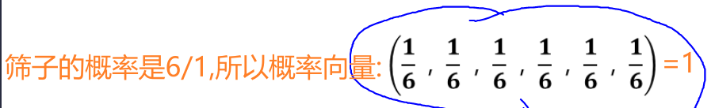
- 一个方阵中,如果其各行都是概率向量,则此方阵称之为概率矩阵或概率方阵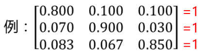
- 只要有负数就不是概率向量,如果没有负数,每行累加起来都等于1

### 3.20世纪初马尔可夫发现未来的发展或演变,往往受现状所支配

### 4.转换概率:一种状况转另一种状况,依据紧接的前项情况推算出来,这个过程又叫马尔柯夫过程(就是某个销售者保持/获得/失去的消费者的概率)

### 5.马尔柯夫锁链:一连串的马尔柯夫转换过程的整体

### 6.马尔柯夫分析:分析/观察/预测锁链或过程的未来变动的趋向

### 7.转换概率和市场份额和概率矩阵算题

### 8.确定平衡条件:经过概率矩阵算出来的市场份额和上一次的市场份额相同

# 第十章

### 1.盈亏平衡问题概述:企业的盈亏主要取决于企业产品的销售收入和产品的成本费用

### 2.利润 = 销售额 - 成本

### 3.销售额 = 单价 * 销量

### 4.成本 = 固定成本 + 可变成本

### 5.盈亏平衡分析是一种管理决策工具,它用来说明在一定销售量水平上总销售额与总成本之间的关系

### 6.盈亏平衡点就是企业经营达到了一个点时,总销售额和总成本完全相等(产量 = 销量),利润为0

### 7.产品的成本结构:根据成本费用与产品产量的关系分为固定费用(固定成本)和变动费用(可变成本)

- 固定成本:在一定时期内不随企业产量的增减而变化(车间费用和企业管理费等)
- 可变成本:随着企业产品产量的增减而变化,一般随着产量的增加,费用总额也成比例的增加(水电费,原材料等)
- 成本 = 固定成本 + 可变成本

### 8.单位可变成本是不变的

### 9.半变动费用:燃料动力费

### 10.计划性能法:预付成本和计划成本

- 计划成本:达到预期目标所需的费用(广告费),随着产量的变化成阶梯变化
- 预付成本:提供的生产能力(设备等),过去发生的行为结果,不受短期管制,在数量变化的过程中保持不变

### 11.固定成本 = 计划成本 + 预付成本

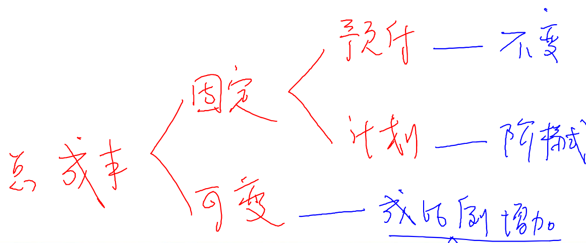

### 12.盈亏平衡图中,横轴表示产量,竖轴表示费用

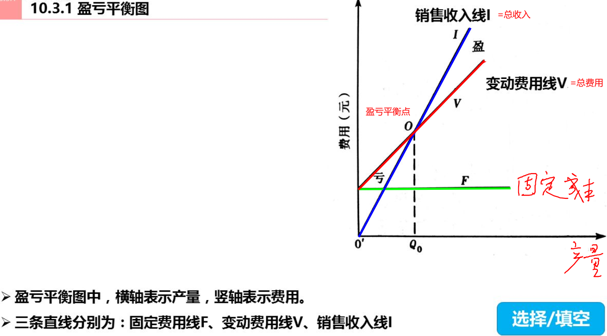

### 13.盈亏平衡点:总销售额 等于 总成本

### 14.公式总结

- 边际收益 = 单价 - 单位可变成本
- 盈亏平衡点 = 固定成本 / 边际收益(当盈亏平衡点时,利润 = 0 或 总收入 = 总成本)
- 边际收益率 = 边际收益 / 价格
  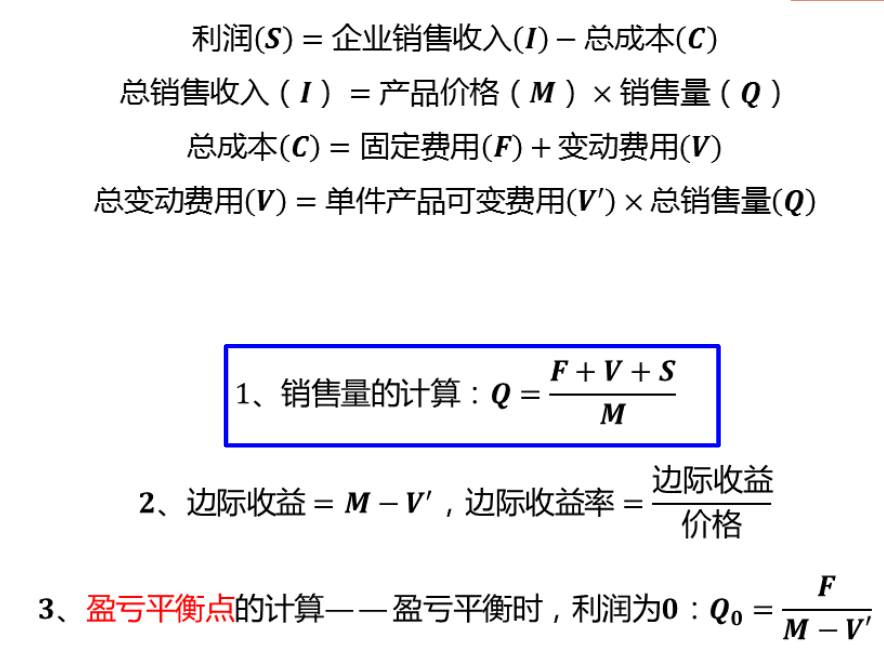

# 第十一章

### 1.概率:销售天数/总销售天数

### 2.累计概率:上次累计概率 + 当前概率 = 当前累计概率

### 3.概率分布提供了每个可能值的概率,这些概率加起来必须等于1

### 4.累计概率随机数:累计概率 * 100 - 1 = 随机数的最大数 || 最小数 = 上一次累计概率 * 100 || 最后一个格子的最大随机数是99

### 5.随机变量是是具有各种不同数值的一个变量,这些不同数值是在一次随机试验中,作为各种结果之一而出现的

### 6.如果一个随机变量允许在某个给定的范围内具有有限个数的数值,它就是一个离散的随机变量

### 7.如果一个随机变量允许在某个给定的范围具有任何个数的数值,它就是一个连续的随机变量

### 8.每一个随机变量的数值和相关的某个范围内累计频率序列数相应,这个累计频率数,称之为随机数

### 9.蒙特卡洛法是一个模拟技术,他用一系列的随机数创造发分布函数

### 10.如果构成模型的关系相当简单,那么就有可能用各种数学的方法,来取得我们感兴趣问题的精确数据,这就是分析解(数学解)

### 11.复杂的模型:必须使用模拟的方法来研究

### 12.最常用的模拟方法叫:蒙特卡洛方法 使用随机数进行模拟

### 13.使用模拟的原因

- 由于难以观察到实际环境,模拟可能是唯一可以利用的方法
- 对一个系统的实际运用和观察可能破坏性太大
- 实际观察一个可能太费钱
- 不可能有足够的时间来广泛地操作该系统

### 14.模拟地不足之处

- 模拟是不精确的,它既不是一个最优化过程,也不能得到一个答案
- 模拟是一种估算答案的时方法,但不能得出答案本身
- 并非所有的方法都可用模拟的方法来估算,只有包含不确定因素的环境才能适用,而且如果没有随即元素是,所有的模拟的实验都会产生相同的结果
- 一个良好的模拟模型可能是非常昂贵的

### 15.使用模拟的原因

- 由于难以观察到实际环境,模拟可能是唯一可以利用的方法
- 对一个系统的实际运用和观察可能破坏性太大
- 实际观察一个系统可能太费钱
- 不可能有足够的时间来广泛的操作该系统
- 不可能求出一个数学解(分析解)

### 16.在排队论中,要求顾客到达人数呈普阿松分布

### 17.服务时间呈负指数分布