随着物联网、云计算、大数据等信息技术在水利行业的广泛应用,实现水利设施和系统的智能化、信息化、自动化已成为发展方向。作为智慧水利解决方案的关键组成部分,水利现场远程监控终端发挥着重要作用。
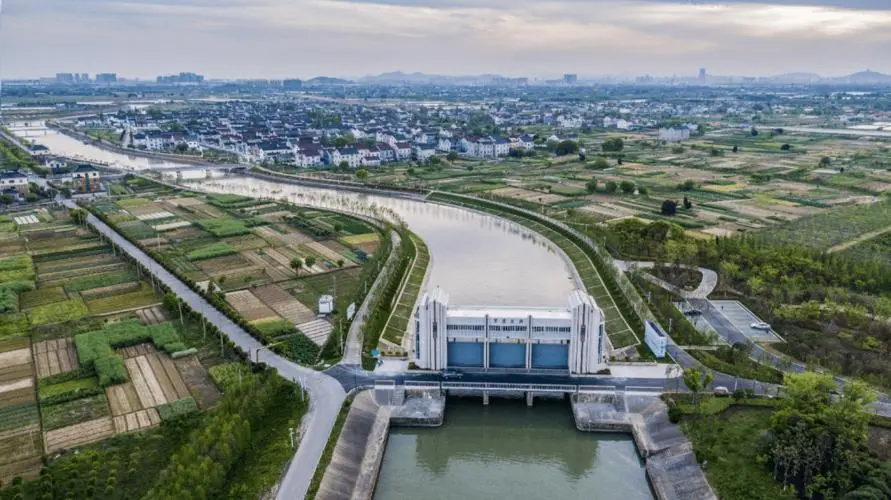

**一、智慧水利解决方案组成**

智慧水利解决方案主要由传感测量、现场数据采集、数据传输、云平台分析等子系统组成。其中,现场远程监控终端负责将各类水文、水质、运行参数数据采集汇总后有线或无线传输到远程监控中心,是连接现场与应用的关键设备。

**二、远程监控终端选型**

目前常用的水利现场远程监控终端包括:

1. DTU系列数传数据终端:具有串口、以太网、模拟量输入等接口,可连接多种水文水质检测仪表,实现数据汇聚。

2. SG500系列工业网关:提供MODBUS、OPC等协议访问功能,连接PLC、RTU、传感器等,构建现场自动化。
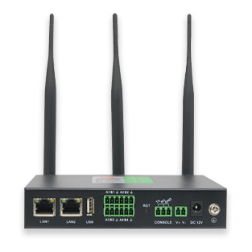

**三、典型应用案例**

某江河流域建立智慧水利管理系统,系统组态如下:

1. 在水源地、水库等设置水质水文检测仪表,通过DTU200终端采集数据。

2. 在水库闸门、抽水站配置SG500工业网关,实现对现场设备的智能化控制。

3. 通过4G公网上传各类监测数据到云平台和水利调度中心。

4. 云平台对数据进行存储分析,并下发控制指令给现场网关。

5. 水利调度中心利用系统实现水情监测、水资源调度、设备优化运行等。
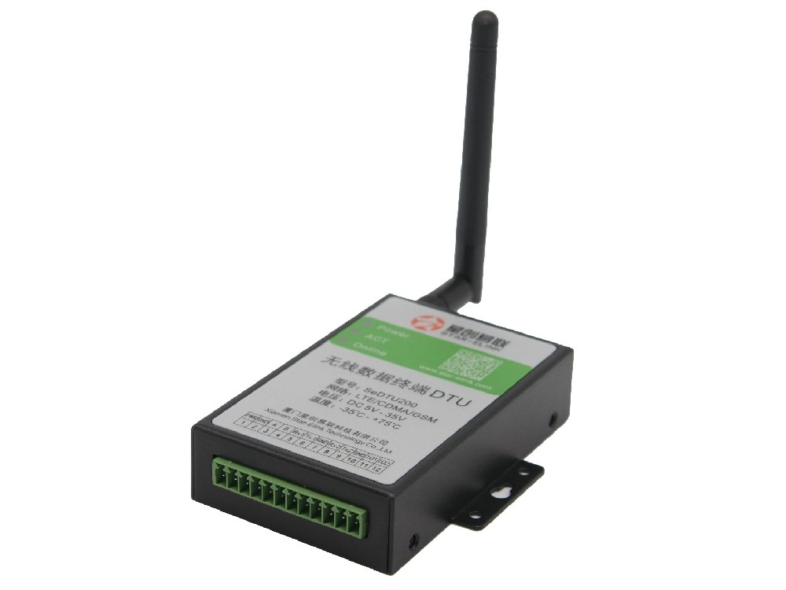

该方案充分利用了现场终端的优势,实现了对水利现场的精确采集控制,大幅提升了流域水资源管理和调度的智能化水平,显示了数字化水利建设的巨大潜力。

智慧水利目前主要由无人值守远程智能控制系统、雨情自动遥测系统、自动水位站监测系统和水利设施安防报警系统组成，可根据客户需求增加其他功能或定制开发。
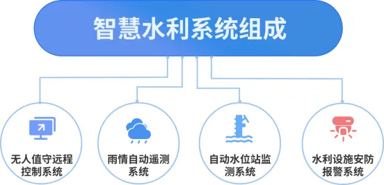

## **四、无人值守远程控制系统**

系统组成：该系统主要由水利设施环境（水位、流速流量、降雨量、温湿度、风速风向等）监测预警系统、山洪预警系统（可扩展）、远程视频监控系统、远程开关闸泵系统、太阳能供电系统（无市电供应时）、水利设施安防预警系统组成。

功能实现：使用无人值守远程智能控制系统后，我们可以在远离现场的控制室里，通过电脑或手机 APP 既可以对现场的水文信息（包括温湿度、风向风速、降雨量、水位流速流量等）实时掌握，又可以实时显示现场的视频监控图像，为合理调度水资源提供第一手数据资料。同时可以对水利设施进行远程精准控制，通过平台软件或手机 APP 就能对现场的设备进行开启、关闭和暂停等操作，极大提高了水利的信息化建设和工作效率，使水利设施的管理更便捷、高效、人性化。
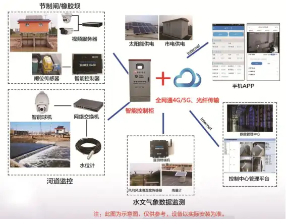

**硬件介绍**

**(一)** **智能控制器**

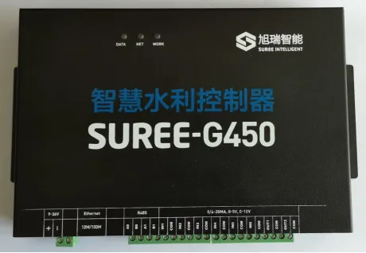

**Ø** **智能控制器实现功能**

l 可远程或现场精准控制闸泵的启停及升降；可远程数据采集

**Ø** **智能控制器技术参数**

l 支持现场校准；支持全网通4G/5G通讯；支持本地WEB升级程序；支持远程升级程序；

l 超低功耗：DC9-36V供电，电流≤500mA；标准RS232通讯接口；RS485接口：最大设备节点255个，防尘防水防雷击设计；4G/5G传输；

l 以太网接口：10MB/100MB自适应；

l 智能控制器接口：可支持2-8路开关量输出；支持多种编码器的接入；支持各种水文气象传感设备及供电信息等数据的接入；具有视频监控流媒体传输限流自控功能。

**(一)** **智能控制柜**
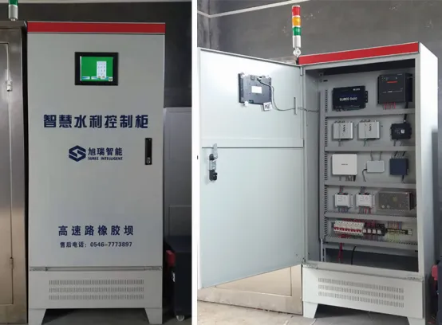

**Ø** **实现功能**

l 各项数据、视频图像实时显示、分析、保存、查询、打印

l 各设备运行状态监测

l 现场非法入侵报警

l 故障报警：太阳能故障、蓄电池电压低、过载保护等

l 水位报警

l 闸门开启故障及限位报警

l 远程自动控制、监测

l 权限登录和操作

l 可扩展性‍‍‍‍

**软件介绍**

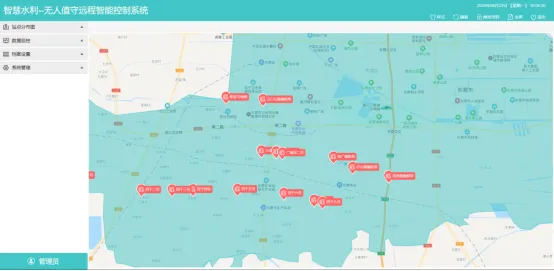

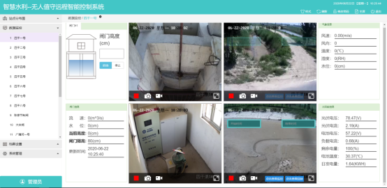

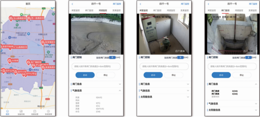

**平台软件（含手机APP)功能**

（1）基于GIS地图开发，界面更直观、易操作；

（2）含有雨情和水位遥测报警、山洪预警等多功能模块并能根据要求定制开发；

（3）软件可同时在线实时显示四个监控画面，也可单独画面放大显示；可在线实时显示节制闸和泵站状态数据等信息，并能分析、保存、查询、打印等；

（3）通过后台工作站或手机APP可远程对节制闸开闸、关闸；远程对泵站进行开泵、关泵；并根据所需调节开关闸的高度及泵站电动阀的开度；实时显示市电或太阳能的电压、电流，负载电流等；各设备运行状态监测；

（4）现场非法侵入报警；故障报警：远程自动控制、监测；权限登录和操作；

（5）数据库选用Mysql关系型数据库，实现存储海量历史数据；可扩展性；

## **五、雨情自动遥测系统**

**系统概述**

雨情自动遥测系统是基于GIS地图开发并能够实时在线显示、统计、上传降雨量的自动化遥测平台，可进行雨情统计及浏览、实时监控、雨情报警、雨情短信自动发送等功能，广泛应用于防汛、气象、城市排涝等。

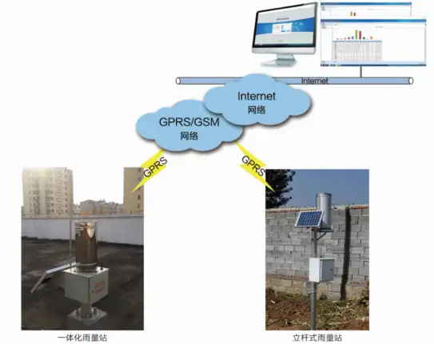

**硬件介绍**

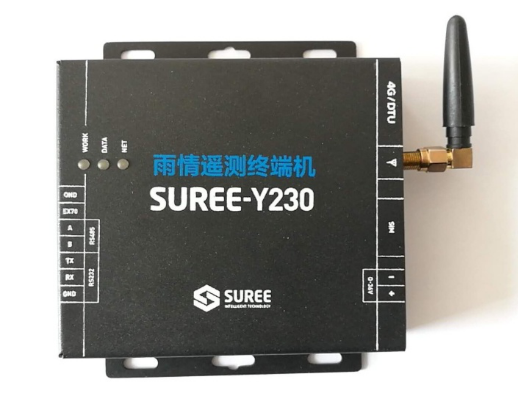

1．可外接雨量传感器；

2．4G、CDMA任意两种信道相连的接口；

3．具有定时自报和响应召测兼容的工作体制；

4．具备主备信道切换、发送确认、自动补发功能；

5．具备电源检测与管理、报警功能；

6．具备防盗开关信号接入与检测功能；

7．具备数据保护不丢失功能；

8．具备自检自诊断功能，死机自动复位；

9．具备自动同步时钟功能。

**软件界面**

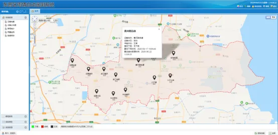

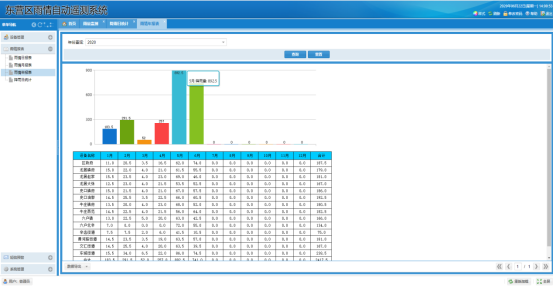

**案例展示**

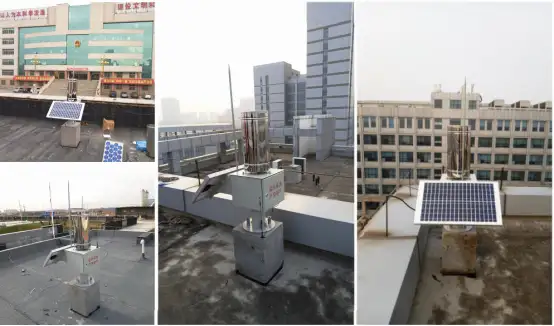

## **六、自动水位站监测系统**

该系统应用雷达或压力式水位传感器感知水位变化，设备采用太阳能供电，4G/5G无线通讯方式传输水位数据，具有水位实时采集、自动记录上传、站点档案查看、超限报警、低电量报警等功能；适用于水利或城市管理部门远程监测流域的实时水位、天气等数据，同时支持远程视频监控，为保障流域内的适度蓄水和安全度汛提供了准确、及时的现场信息，实现了河流的信息化管理，在保护人民生命、财产安全方面发挥了重大作用。

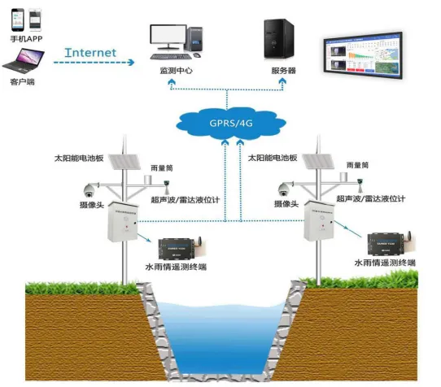

**系统功能**

**1)** **GIS地图展示**

直观显示各河流水位监测站分布位置、当前水位以及设备运行状态。

**2)** **水位实时数据**

显示各河流水位测点的实时水位和电池电压，并提供360度现场监控图像，实时展现水位动态曲线。

**3)** **报警管理**

当河流或水库水位高于设定的警戒值时，系统发出报警，并向相关责任人发送手机短信或手机APP预警等多种形式给予提示报警，责任人根据情况可及时采取应对措施并上传预警处置记录。

**4)** **天气预报**

根据具体城市定位，显示卫星云图、雷达图、分时天气预报及七日天气预报。

**软件界面**

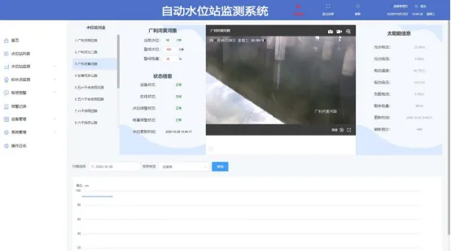

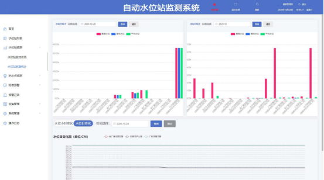

**案例展示**

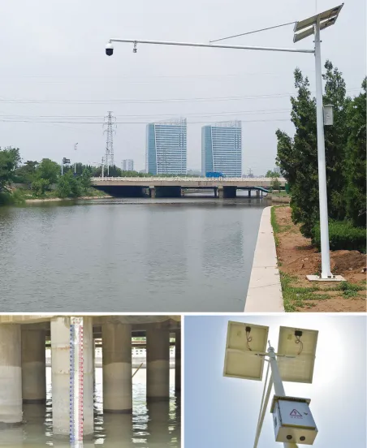

## 四、**水利设施安防报警系统**

水利设施多建设在河道和干渠上，位置偏远，设备被破坏、偷盗的现象时有发生，已严重影响水利设施的正常运行和使用，经济损失巨大。

旭瑞智能通过不断改进和完善系统性能，已较大程度的提高了设施的安全防护级别。主要措施由五大系统组成，分别是：

1、自动语音警告系统

2、远程人工喊话系统

3、门禁报警系统

4、智能分析监控系统

5、存储设备定位追回系统

**系统功能**

**(1)** **自动语音警告系统**

当现场有人非法入侵时，语音警告系统自动开启，并循环播放提前录入的语音警告，直至入侵者离开。

语音警告可实现循环播放录制的语音，配置高保真音箱。可插U盘，可选择语音。

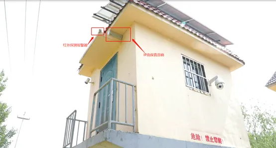

**(2)** **远程人工喊话系统**

当自动语音警告系统连续开启超过2分钟（时间可调）时，软件平台会弹出报警信息提醒，管理人员可通过电脑或手机对现场非法行为进行远程喊话，现场加装可支持双向语音对讲的呼叫装置。

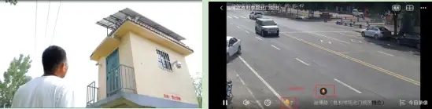

**(3)** **门禁报警系统**

当泵房或闸室的门禁系统处于布防状态，门被打开时，通过安装的门磁探测器会立即发出信号，并发送报警信息给声光报警器，同时通过4G DTU给平台发送报警信息。

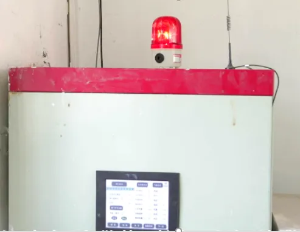

**(4)** **智能分析监控系统**

在现场安装具有AI智能分析功能的摄像机，当有人非法入侵时，可实现对入侵人脸进行抓拍、跟踪，能够在连续跟踪进程中保证抓拍到正面人脸，记录质量最高的面部图像并将录像上传。支持镜头遮挡、视频丢失等的报警功能。

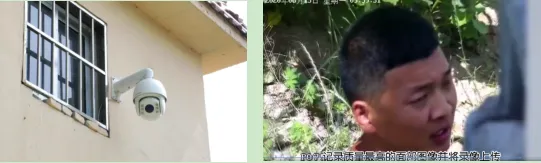

**(5)** **存储设备定位追回系统**

对现场的存储设备加装定位模块，具有电子围栏,轨迹回放,轨迹跟踪等功能。内置7800mAH电池，无外部供电时仅可实现55天正常工作。

防拆报警：可实现拆除时发送报警信息。

位移报警：可以实现设备移动时发送报警信息。

低电压报警：可实现电压低于5%时发送报警信息。

GPS+北斗定位：(定位精度：2.5m，高灵敏度：-165dBm），4G/5G通讯。

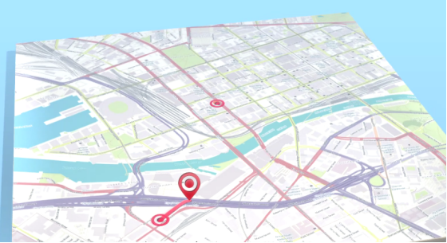
