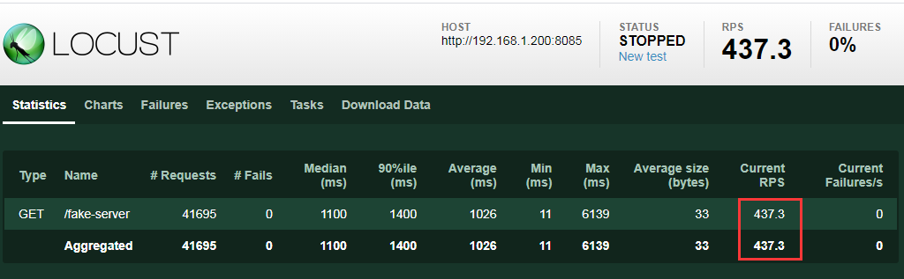
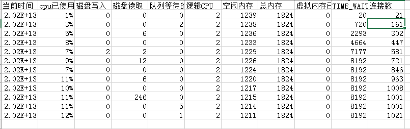
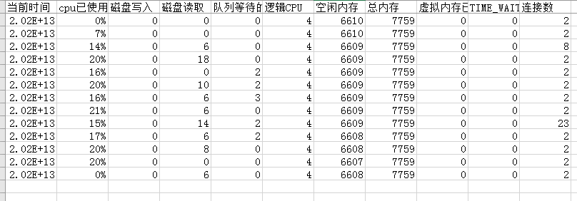
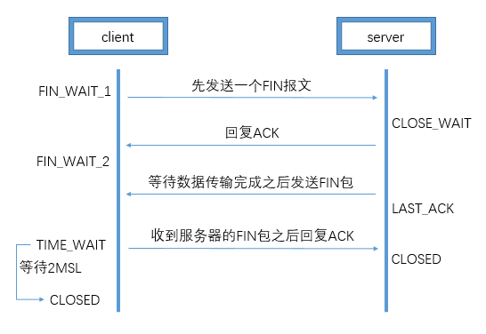

## 前言

- 测试服务器系统：ubuntu server 20.04.3
- nginx负载均衡服务器：centos 7
- 服务器上我放了一个web系统用来测试连接数：[开源的支持高并发的服务器](https://github.com/yedf/handy)
- 发出请求的是我的电脑，电脑系统：win7
- 发出请求用的是python的压测工具：locust

## TCP连接能连接多少

要想弄清楚一个服务器能接受多少连接数，就需要根据socket五元组来看，即源IP+源端口+目标IP+目标端口+类型（TCP/UDP）。只要五元组不重复，就可以新增tcp连接。不过由于测试的时候一般类型都是相同的，所有大多数都是称为四元组。  
由于服务器的IP和web系统的端口一般是固定的，每个客户端的IP又不相同，那么照这样看连接数应该基本上相当于没限制才对。其实不然，实际上每个连接还要占用一定的内存和一个文件描述符。

**那么一个TCP socket占用多少内存呢？**  
大约是3K多，当然如果有发送或者接收的缓存区文件存在则另算，在响应较快、缓存文件不大的情况下内存应该不会成为瓶颈。

**服务器又能打开多少文件描述符呢？**  
可以通过以下命令查看  
系统级：当前系统可打开的最大数量，通过 `cat /proc/sys/fs/file-max` 查看  
用户级：指定用户可打开的最大数量，通过 `cat /etc/security/limits.conf` 查看  
进程级：单个进程可打开的最大数量，通过 `cat /proc/sys/fs/nr_open` 查看

修改方式  
修改单个进程可打开的最大文件描述符为10000，即可打开10000个连接：`echo 10000 > /proc/sys/fs/nr_open`  
用户级修改：

```bash
sudo vi /etc/security/limits.conf
root soft nofile 65533
root hard nofile 65533
# root为指定修改的用户，soft为软限制，hard为硬限制，一般软限制要小于或等于硬限制
```

当然，每创建一个tcp连接，还需要消耗一个线程来处理（也可以采用IO多路复用的方式，一个线程管理多个TCP连接），所以和CPU也有关系，不能通过单纯的提高内存的方式来增加连接数。  
常用查看连接数命令：  
`netstat -nat | grep -i "8085" | wc -l # 查询指定端口的连接数`  
`netstat -n | awk '/^tcp/ {++S[$NF]} END {for(a in S) print a, S[a]}' # 查看TCP连接数及状态命令`

## 实际测试

此时是使用我的电脑向nginx负载均衡服务器发送请求，然后转发给web服务器。

### 测试1 未调整的情况下测试

**客户端情况：**  
初始：可用端口55000个，性能够用  
结果：本地性能未达瓶颈，但是设置的1000并发人数，请求数平均只有437.3。  


**nginx服务器情况：**  
初始：可用端口60000个，用户级65535，性能够用  
结果：本地性能未达瓶颈，但是出现很多TIME_WAIT数，最高时8000多。  


**服务器情况：**  
初始：用户级65535。  
结果：最高连接数23，平均2.  


### 测试1分析

先分析一下TIME_WAIT、CLOSE_WAIT出现的原因及解决方法  
分析这里，就必须要简短回顾一下四次挥手（当client发起结束请求时）  
  
简短来说：  
1、一端没有close，那么另一端将有大量的close_wait状态；  
2、主动close的一端，在量特别大的情况下将造成大量的time_wait状态（由于Linux中一般默认的2msl为60s，那么正常情况下每秒1000的请求会造成60*1000=60000个time_wait记录，几百几千问题不大）

既然主动close的一方才会有time_wait记录，那么这里就说明nginx服务器是主动关闭的一方，那nginx服务器关闭的对象又是谁呢？  
在仅修改了nginx的代理地址，未改变其他配置情况下，通过wireshark抓包得知：

- 客户端与nginx端相互通信都是http/1.1的链接，这里是nginx端先发起的fin请求；
- nginx端到服务器端的请求是http/1.0，服务器端返回的请求是http/1.1，这里是nginx端先发起的fin请求。

### 测试1优化

依上面的场景分析，如果要减少time_wait数，提高连接数，则需要从以下方面来解决

1. 调整负载均衡服务器和web服务器/etc/sysctl.conf下的net.ipv4.ip_local_port_range配置，修改成 `net.ipv4.ip_local_port_range=1024 65535`，保证至少可以使用6万个随机端口，就算保留1分钟，也能支持每秒1000的并发；
2. 加多负载均衡服务器的ip，直接翻番；
3. 负载均衡与服务器端也建立长连接，不关闭就不会有等待；
4. 扩大nginx的keep-alive超时时间，最大请求数，使得长连接不会这么早关闭；
5. 在nginx服务器上调整time_wait参数net.ipv4.tcp_tw_reuse=1，尽可能去复用连接（另外net.ipv4.tcp_tw_recycle参数在4.10以上内核中被移除了）。

另外还有一些参数可以调整，不过一般默认是够用的

```yaml
net.ipv4.tcp_syncookies = 1 #　表示开启SYN Cookies。当出现SYN等待队列溢出时，启用cookies来处理，可防范少量SYN攻击，默认为0，表示关闭；
net.ipv4.tcp_keepalive_time = 1200　#表示当keepalive起用的时候，TCP发送keepalive消息的频度。缺省是2小时，改为20分钟。
net.ipv4.tcp_max_syn_backlog = 8192　#表示SYN队列的长度，默认为1024，加大队列长度为8192，可以容纳更多等待连接的网络连接数。
net.ipv4.tcp_max_tw_buckets = 5000　#表示系统同时保持TIME_WAIT套接字的最大数量，如果超过这个数字，TIME_WAIT套接字将立刻被清除并打印警告信息。
＃默认为180000，改为5000。对于Apache、Nginx等服务器，上几行的参数可以很好地减少TIME_WAIT套接字数量，。
```

待优化测试验证